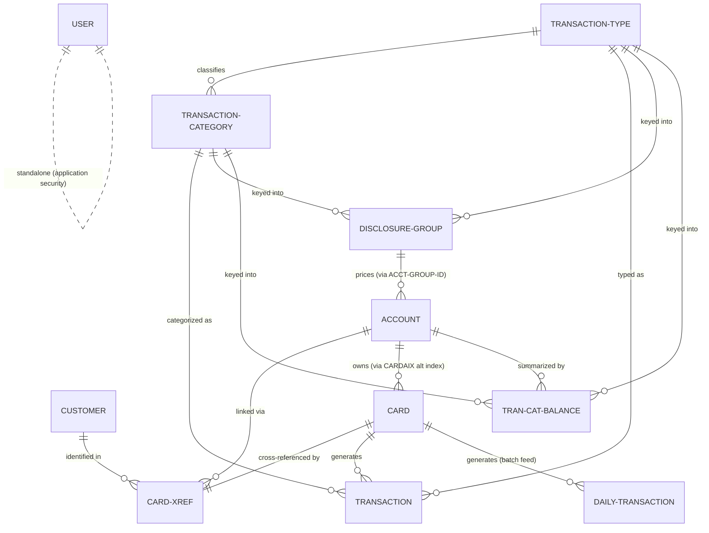

# CardDemo — Business Entity Catalog

**Repository**: ashish-019-hash/aws-card-demo-VF (branch `vorflux/migrate-carddemo-spring-react`)
**Scope analyzed**: `00.phase-1-input/` — COBOL programs (`cbl/`), copybooks (`cpy/`), VSAM catalog listing (`catlg/LISTCAT.txt`), CICS resource definitions (`csd/CARDDEMO.CSD`), batch procedures (`proc/`), and sample data (`data/`).
**Method**: Every entity below is backed by a record-layout copybook, a physical data store in the VSAM catalog or data directory, and (where applicable) program usage. Line references are to files in the working tree. Technical structures (work areas, BMS screen maps, report formatting layouts, `FILLER`) are excluded.

---

## Entity Relationship Overview

The Customer–Account relationship is **not** carried on either master record; it is realized exclusively through the CARD-XREF junction entity (ENTITY-004). The physical key structures (VSAM primary keys and alternate indexes) that prove each cardinality are cited inside each entity block.

---

### ENTITY-001: Customer

**Entity Type**: Master
**Description**: An individual credit-card customer — legal identity, mailing address, contact numbers, government identifiers, date of birth, EFT account, and FICO credit score. Maintained online through the Account View/Update functions.
**Source**: `00.phase-1-input/cpy/CVCUS01Y.cpy`, lines 4–22 (record length 500; an identical duplicate layout exists at `00.phase-1-input/cpy/CUSTREC.cpy`, lines 4–22).
**Physical store**: VSAM KSDS `AWS.M2.CARDDEMO.CUSTDATA.VSAM.KSDS` — `catlg/LISTCAT.txt:595` (KEYLEN=9, RKP=0 → key is `CUST-ID`; lines 632–633). CICS file `CUSTDAT` (`csd/CARDDEMO.CSD:50`). Sample data: `data/ASCII/custdata.txt`, `data/EBCDIC/AWS.M2.CARDDEMO.CUSTDATA.PS`.

**Business Attributes**:
- Primary Key: `CUST-ID`
- Core Attributes: name (first/middle/last), 3 address lines, state, country, ZIP, 2 phone numbers, SSN, government-issued ID, date of birth, EFT account ID, FICO credit score
- Foreign Keys: none on the record itself (linked to Account/Card through CARD-XREF, ENTITY-004)
- Status Fields: `CUST-PRI-CARD-HOLDER-IND` (primary cardholder indicator)

**Data Structure** (`cpy/CVCUS01Y.cpy:4-22`):

| Field | Data Type | Description | Key |
|---|---|---|---|
| CUST-ID | PIC 9(09) | Unique customer identifier | PK |
| CUST-FIRST-NAME | PIC X(25) | First name | — |
| CUST-MIDDLE-NAME | PIC X(25) | Middle name | — |
| CUST-LAST-NAME | PIC X(25) | Last name | — |
| CUST-ADDR-LINE-1 | PIC X(50) | Address line 1 | — |
| CUST-ADDR-LINE-2 | PIC X(50) | Address line 2 | — |
| CUST-ADDR-LINE-3 | PIC X(50) | Address line 3 (city) | — |
| CUST-ADDR-STATE-CD | PIC X(02) | US state code | — |
| CUST-ADDR-COUNTRY-CD | PIC X(03) | Country code | — |
| CUST-ADDR-ZIP | PIC X(10) | ZIP/postal code | — |
| CUST-PHONE-NUM-1 | PIC X(15) | Primary phone | — |
| CUST-PHONE-NUM-2 | PIC X(15) | Secondary phone | — |
| CUST-SSN | PIC 9(09) | Social Security Number | — |
| CUST-GOVT-ISSUED-ID | PIC X(20) | Government-issued ID | — |
| CUST-DOB-YYYY-MM-DD | PIC X(10) | Date of birth | — |
| CUST-EFT-ACCOUNT-ID | PIC X(10) | EFT (bank) account for payments | — |
| CUST-PRI-CARD-HOLDER-IND | PIC X(01) | Primary cardholder flag (Y/N) | — |
| CUST-FICO-CREDIT-SCORE | PIC 9(03) | FICO credit score | — |

**Relationships**:
- Parent: none (top-level master)
- Children: CARD-XREF (ENTITY-004) — 1 Customer : N cross-reference rows (`XREF-CUST-ID`, `cpy/CVACT03Y.cpy:6`)
- Associates: Account and Card, indirectly via CARD-XREF (M:N capable; see ENTITY-004)

**Usage Context**:
- Programs: `COACTVWC.cbl` (read `CUSTDAT` by customer ID, lines 827–828; copybook at line 254), `COACTUPC.cbl` (read line 3753–3755, update via `REWRITE FILE(LIT-CUSTFILENAME)` line 4086; copybook at line 646), `COCRDSLC.cbl`/`COCRDUPC.cbl` (layout copied at lines 240 / 359)
- Business Functions: account/customer inquiry (View Account), customer data maintenance (Update Account), customer identification for card operations

---

### ENTITY-002: Account

**Entity Type**: Master
**Description**: A credit-card account — the financial contract holding the current balance, credit limits, lifecycle dates, and current-cycle activity totals. The unit against which transactions are posted and bills are paid.
**Source**: `00.phase-1-input/cpy/CVACT01Y.cpy`, lines 4–16 (record length 300).
**Physical store**: VSAM KSDS `AWS.M2.CARDDEMO.ACCTDATA.VSAM.KSDS` — `catlg/LISTCAT.txt:22` (KEYLEN=11, RKP=0 → key is `ACCT-ID`; lines 59–60). CICS file `ACCTDAT` (`csd/CARDDEMO.CSD:1`). Sample data: `data/ASCII/acctdata.txt`, `data/EBCDIC/AWS.M2.CARDDEMO.ACCTDATA.PS`.

**Business Attributes**:
- Primary Key: `ACCT-ID`
- Core Attributes: current balance, credit limit, cash credit limit, open/expiration/reissue dates, current-cycle credit and debit totals, account ZIP
- Foreign Keys: `ACCT-GROUP-ID` → Disclosure Group (ENTITY-008, `DIS-ACCT-GROUP-ID`)
- Status Fields: `ACCT-ACTIVE-STATUS`

**Data Structure** (`cpy/CVACT01Y.cpy:4-16`):

| Field | Data Type | Description | Key |
|---|---|---|---|
| ACCT-ID | PIC 9(11) | Unique account identifier | PK |
| ACCT-ACTIVE-STATUS | PIC X(01) | Account active status (Y/N) | — |
| ACCT-CURR-BAL | PIC S9(10)V99 | Current balance | — |
| ACCT-CREDIT-LIMIT | PIC S9(10)V99 | Total credit limit | — |
| ACCT-CASH-CREDIT-LIMIT | PIC S9(10)V99 | Cash advance credit limit | — |
| ACCT-OPEN-DATE | PIC X(10) | Account open date | — |
| ACCT-EXPIRAION-DATE | PIC X(10) | Account expiration date | — |
| ACCT-REISSUE-DATE | PIC X(10) | Card reissue date | — |
| ACCT-CURR-CYC-CREDIT | PIC S9(10)V99 | Current-cycle credits total | — |
| ACCT-CURR-CYC-DEBIT | PIC S9(10)V99 | Current-cycle debits total | — |
| ACCT-ADDR-ZIP | PIC X(10) | Account ZIP code | — |
| ACCT-GROUP-ID | PIC X(10) | Pricing/disclosure group | FK |

**Relationships**:
- Parent: Disclosure Group (ENTITY-008) via `ACCT-GROUP-ID` — N Accounts : 1 group
- Children: Card (ENTITY-003) — 1 Account : N Cards (proven by non-unique alternate index `CARDAIX` over `CARD-ACCT-ID`: `catlg/LISTCAT.txt:254`, KEYLEN=11, AXRKP=16, `NONUNIQKEY` line 285); CARD-XREF (ENTITY-004) — 1 : N (non-unique AIX `CXACAIX`, `catlg/LISTCAT.txt:455`, line 488); Transaction Category Balance (ENTITY-007) — 1 : N (`TRANCAT-ACCT-ID` in composite key)
- Associates: Customer (via CARD-XREF), Transaction (via Card number)

**Usage Context**:
- Programs: `COACTVWC.cbl` (read line 777–778), `COACTUPC.cbl` (read line 3703–3705, update via `REWRITE FILE(LIT-ACCTFILENAME)` line 4066), `COBIL00C.cbl` (read-for-update lines 345–353, REWRITE lines 379–385 — bill payment pays off the current balance), `COTRN02C.cbl` (layout copied at line 89; account existence is validated via the cross-reference, lines 578–583, not by reading `ACCTDAT`)
- Business Functions: account inquiry, account/customer maintenance, bill payment (balance update), transaction add

---

### ENTITY-003: Credit Card

**Entity Type**: Master
**Description**: A physical/virtual credit card issued against an account — card number, CVV, embossed name, expiry, and active status. Managed through the card list/detail/update screens.
**Source**: `00.phase-1-input/cpy/CVACT02Y.cpy`, lines 4–10 (record length 150).
**Physical store**: VSAM KSDS `AWS.M2.CARDDEMO.CARDDATA.VSAM.KSDS` — `catlg/LISTCAT.txt:164` (KEYLEN=16, RKP=0 → key is `CARD-NUM`; lines 202–203). Alternate index `AWS.M2.CARDDEMO.CARDDATA.VSAM.AIX` on account ID — `catlg/LISTCAT.txt:254` (KEYLEN=11, AXRKP=16 → `CARD-ACCT-ID`; `NONUNIQKEY` line 285). CICS files `CARDDAT` and `CARDAIX` (`csd/CARDDEMO.CSD:25,13`). Sample data: `data/ASCII/carddata.txt`.

**Business Attributes**:
- Primary Key: `CARD-NUM`
- Core Attributes: CVV code, embossed name, expiration date
- Foreign Keys: `CARD-ACCT-ID` → Account (ENTITY-002)
- Status Fields: `CARD-ACTIVE-STATUS`

**Data Structure** (`cpy/CVACT02Y.cpy:4-10`):

| Field | Data Type | Description | Key |
|---|---|---|---|
| CARD-NUM | PIC X(16) | Card number | PK |
| CARD-ACCT-ID | PIC 9(11) | Owning account | FK |
| CARD-CVV-CD | PIC 9(03) | Card verification value | — |
| CARD-EMBOSSED-NAME | PIC X(50) | Name embossed on card | — |
| CARD-EXPIRAION-DATE | PIC X(10) | Card expiration date | — |
| CARD-ACTIVE-STATUS | PIC X(01) | Card active status (Y/N) | — |

**Relationships**:
- Parent: Account (ENTITY-002) — N Cards : 1 Account (non-unique `CARDAIX` alternate index)
- Children: Transaction (ENTITY-005) via `TRAN-CARD-NUM` — 1 Card : N Transactions; Daily Transaction (ENTITY-006) via `DALYTRAN-CARD-NUM` — 1 : N
- Associates: Customer via CARD-XREF (ENTITY-004), which carries one row per card number

**Usage Context**:
- Programs: `COCRDLIC.cbl` (browse `CARDDAT` by card number, STARTBR/READNEXT/READPREV lines 1130–1326; copybook at line 290), `COCRDSLC.cbl` (read by card number lines 742–744, read by account via `CARDAIX` path lines 783–785), `COCRDUPC.cbl` (read lines 1382–1384, read-for-update lines 1427–1430, `REWRITE FILE(LIT-CARDFILENAME)` line 1478), `COACTVWC.cbl` (layout copied at line 248)
- Business Functions: card listing (admin sees all cards, user filtered by account), card detail inquiry, card maintenance (name/expiry/status update)

---

### ENTITY-004: Card Cross-Reference (Card–Account–Customer link)

**Entity Type**: Relationship (junction)
**Description**: The junction record that binds a card number to its owning account and customer. It is the only place the Customer↔Account association exists — neither master record carries the other's key. All online paths that need "customer for this account" or "account for this card" resolve through this file.
**Source**: `00.phase-1-input/cpy/CVACT03Y.cpy`, lines 4–7 (record length 50).
**Physical store**: VSAM KSDS `AWS.M2.CARDDEMO.CARDXREF.VSAM.KSDS` — `catlg/LISTCAT.txt:365` (KEYLEN=16, RKP=0 → key is `XREF-CARD-NUM`; lines 403–404). Alternate index `AWS.M2.CARDDEMO.CARDXREF.VSAM.AIX` on account ID — `catlg/LISTCAT.txt:455` (KEYLEN=11, AXRKP=25 → `XREF-ACCT-ID`; `NONUNIQKEY` line 488). CICS files `CCXREF` (base) and `CXACAIX` (account path) — `csd/CARDDEMO.CSD:37,63`. Sample data: `data/ASCII/cardxref.txt`.

**Business Attributes**:
- Primary Key: `XREF-CARD-NUM`
- Core Attributes: none beyond the three keys (pure junction)
- Foreign Keys: `XREF-CUST-ID` → Customer (ENTITY-001); `XREF-ACCT-ID` → Account (ENTITY-002); `XREF-CARD-NUM` → Card (ENTITY-003)
- Status Fields: none

**Data Structure** (`cpy/CVACT03Y.cpy:4-7`):

| Field | Data Type | Description | Key |
|---|---|---|---|
| XREF-CARD-NUM | PIC X(16) | Card number | PK, FK |
| XREF-CUST-ID | PIC 9(09) | Customer owning the card | FK |
| XREF-ACCT-ID | PIC 9(11) | Account the card draws on | FK |

**Relationships**:
- Parent: Card (1 : 1 — card number is the unique primary key), Account (N : 1 — non-unique account AIX), Customer (N : 1)
- Children: none
- Associates: the structure supports M:N between Customer and Account; online programs that read by account (`CXACAIX`) take the first matching row to resolve the customer (e.g. `COACTVWC.cbl:728-737`, `COBIL00C.cbl:411-414`)

**Usage Context**:
- Programs: `COACTVWC.cbl` (read via `CXACAIX` by account, lines 728–731), `COACTUPC.cbl` (lines 3654–3656), `COBIL00C.cbl` (lines 411–414 — find card for bill-payment transaction), `COTRN02C.cbl` (lines 579–582 by account via `CXACAIX`, lines 612–615 by card via `CCXREF` — validate the keyed account/card before adding a transaction); batch report step `proc/TRANREPT.prc` (program `CBTRN03C` at line 57, `CARDXREF DD` at lines 65–66) uses it to resolve account IDs for the transaction report
- Business Functions: account-to-customer resolution for inquiry/update, card-to-account validation for transaction add, account-to-card resolution for bill payment, account grouping in the daily transaction report

---

### ENTITY-005: Transaction

**Entity Type**: Transactional
**Description**: A posted credit-card transaction — type, category, source, description, amount, merchant details, card used, and origination/processing timestamps. Browsed and viewed online, created online by Transaction Add and Bill Payment, and reported on in batch.
**Source**: `00.phase-1-input/cpy/CVTRA05Y.cpy`, lines 4–17 (record length 350).
**Physical store**: VSAM KSDS `AWS.M2.CARDDEMO.TRANSACT.VSAM.KSDS` — `catlg/LISTCAT.txt:3555` (KEYLEN=16, RKP=0 → key is `TRAN-ID`; lines 3593–3594). Alternate index `AWS.M2.CARDDEMO.TRANSACT.VSAM.AIX` — `catlg/LISTCAT.txt:3645` (KEYLEN=26, AXRKP=304 → `TRAN-PROC-TS`, non-unique line 3678). CICS file `TRANSACT` (`csd/CARDDEMO.CSD:76`).

**Business Attributes**:
- Primary Key: `TRAN-ID`
- Core Attributes: amount, description, source, merchant ID/name/city/ZIP, origination and processing timestamps
- Foreign Keys: `TRAN-TYPE-CD` → Transaction Type (ENTITY-009); `TRAN-CAT-CD` (with type) → Transaction Category (ENTITY-010); `TRAN-CARD-NUM` → Card (ENTITY-003)
- Status Fields: none (timestamps mark lifecycle)

**Data Structure** (`cpy/CVTRA05Y.cpy:4-17`):

| Field | Data Type | Description | Key |
|---|---|---|---|
| TRAN-ID | PIC X(16) | Unique transaction identifier | PK |
| TRAN-TYPE-CD | PIC X(02) | Transaction type code | FK |
| TRAN-CAT-CD | PIC 9(04) | Transaction category code | FK |
| TRAN-SOURCE | PIC X(10) | Origination source (e.g. POS TERM) | — |
| TRAN-DESC | PIC X(100) | Transaction description | — |
| TRAN-AMT | PIC S9(09)V99 | Transaction amount | — |
| TRAN-MERCHANT-ID | PIC 9(09) | Merchant identifier | — |
| TRAN-MERCHANT-NAME | PIC X(50) | Merchant name | — |
| TRAN-MERCHANT-CITY | PIC X(50) | Merchant city | — |
| TRAN-MERCHANT-ZIP | PIC X(10) | Merchant ZIP | — |
| TRAN-CARD-NUM | PIC X(16) | Card used | FK |
| TRAN-ORIG-TS | PIC X(26) | Origination timestamp | — |
| TRAN-PROC-TS | PIC X(26) | Processing timestamp (alt-index key) | — |

**Relationships**:
- Parent: Card (ENTITY-003) — N Transactions : 1 Card; Transaction Type (ENTITY-009) — N : 1; Transaction Category (ENTITY-010) — N : 1
- Children: none
- Associates: Account (via Card cross-reference); merchant attributes are embedded (no merchant master file exists in this codebase)

**Usage Context**:
- Programs: `COTRN00C.cbl` (browse/paging, STARTBR/READNEXT/READPREV lines 593–694), `COTRN01C.cbl` (read by ID, lines 269–273), `COTRN02C.cbl` (add: browse for highest ID lines 644–675, WRITE line 713), `COBIL00C.cbl` (bill payment: browse lines 443–503, WRITE payment transaction line 512), `CORPT00C.cbl` (layout copied at line 146; submits the `TRANREPT` batch job via TDQ `JOBS`, lines 462–531); batch `proc/REPROC.prc` + `ctl/REPROCT.ctl` (REPRO backup of `TRANSACT.VSAM.KSDS`), `proc/TRANREPT.prc` (sort by `TRAN-CARD-NUM` offset 263 / filter by `TRAN-PROC-DT` offset 305, lines 38–47; report program `CBTRN03C` step at line 57)
- Business Functions: transaction listing and inquiry, online transaction entry, bill payment posting, daily/monthly/custom transaction reporting

---

### ENTITY-006: Daily Transaction (posting feed)

**Entity Type**: Transactional (batch staging)
**Description**: The daily batch feed of incoming card transactions awaiting posting — field-for-field the same business content as Transaction (ENTITY-005) with a `DALYTRAN-` prefix. Kept as a separate physical dataset for the daily posting/validation cycle (reject GDGs `AWS.M2.CARDDEMO.DALYREJS` exist in the catalog, `catlg/LISTCAT.txt:684`).
**Source**: `00.phase-1-input/cpy/CVTRA06Y.cpy`, lines 4–17 (record length 350).
**Physical store**: Sequential dataset `AWS.M2.CARDDEMO.DALYTRAN.PS` — `catlg/LISTCAT.txt:786` (initial copy `DALYTRAN.PS.INIT`, line 801). Sample data: `data/ASCII/dailytran.txt`, `data/EBCDIC/AWS.M2.CARDDEMO.DALYTRAN.PS`.

**Business Attributes**:
- Primary Key: `DALYTRAN-ID` (unique per feed record)
- Core Attributes: amount, description, source, merchant ID/name/city/ZIP, origination/processing timestamps
- Foreign Keys: `DALYTRAN-TYPE-CD` → Transaction Type; `DALYTRAN-CAT-CD` → Transaction Category; `DALYTRAN-CARD-NUM` → Card
- Status Fields: none

**Data Structure** (`cpy/CVTRA06Y.cpy:4-17`):

| Field | Data Type | Description | Key |
|---|---|---|---|
| DALYTRAN-ID | PIC X(16) | Feed transaction identifier | PK |
| DALYTRAN-TYPE-CD | PIC X(02) | Transaction type code | FK |
| DALYTRAN-CAT-CD | PIC 9(04) | Transaction category code | FK |
| DALYTRAN-SOURCE | PIC X(10) | Origination source | — |
| DALYTRAN-DESC | PIC X(100) | Description | — |
| DALYTRAN-AMT | PIC S9(09)V99 | Amount | — |
| DALYTRAN-MERCHANT-ID | PIC 9(09) | Merchant identifier | — |
| DALYTRAN-MERCHANT-NAME | PIC X(50) | Merchant name | — |
| DALYTRAN-MERCHANT-CITY | PIC X(50) | Merchant city | — |
| DALYTRAN-MERCHANT-ZIP | PIC X(10) | Merchant ZIP | — |
| DALYTRAN-CARD-NUM | PIC X(16) | Card used | FK |
| DALYTRAN-ORIG-TS | PIC X(26) | Origination timestamp | — |
| DALYTRAN-PROC-TS | PIC X(26) | Processing timestamp | — |

**Relationships**:
- Parent: Card (N : 1), Transaction Type (N : 1), Transaction Category (N : 1)
- Children: none (records become Transactions, ENTITY-005, once posted)
- Associates: reject GDG `DALYREJS` (`catlg/LISTCAT.txt:684-786`) holds feed records that fail posting

**Usage Context**:
- Programs: none of the online programs in `cbl/` read this feed; the batch posting programs referenced by the catalog artifacts (e.g. `CBTRN*` load modules in `AWS.M2.CARDDEMO.LOADLIB`) are not present in this working tree. The copybook, catalog entries, and sample data establish the entity.
- Business Functions: daily transaction intake and posting cycle; source of balance updates and the TRANSACT file content

---

### ENTITY-007: Transaction Category Balance

**Entity Type**: Transactional (per-account summary)
**Description**: Running balance of an account's activity within one transaction type + category combination (e.g. purchases vs. cash advances). Supports cycle processing and interest calculation by category.
**Source**: `00.phase-1-input/cpy/CVTRA01Y.cpy`, lines 4–9 (record length 50).
**Physical store**: VSAM KSDS `AWS.M2.CARDDEMO.TCATBALF.VSAM.KSDS` — `catlg/LISTCAT.txt:1334` (KEYLEN=17, RKP=0 → key is the full `TRAN-CAT-KEY` = 11+2+4; lines 1371–1372). Backup GDG `TCATBALF.BKUP` (`catlg/LISTCAT.txt:1202`). Sample data: `data/ASCII/tcatbal.txt`, `data/EBCDIC/AWS.M2.CARDDEMO.TCATBALF.PS`.

**Business Attributes**:
- Primary Key: `TRAN-CAT-KEY` (composite: `TRANCAT-ACCT-ID` + `TRANCAT-TYPE-CD` + `TRANCAT-CD`)
- Core Attributes: `TRAN-CAT-BAL` (category balance)
- Foreign Keys: `TRANCAT-ACCT-ID` → Account; `TRANCAT-TYPE-CD` → Transaction Type; `TRANCAT-CD` → Transaction Category
- Status Fields: none

**Data Structure** (`cpy/CVTRA01Y.cpy:4-9`):

| Field | Data Type | Description | Key |
|---|---|---|---|
| TRANCAT-ACCT-ID | PIC 9(11) | Account | PK, FK |
| TRANCAT-TYPE-CD | PIC X(02) | Transaction type code | PK, FK |
| TRANCAT-CD | PIC 9(04) | Transaction category code | PK, FK |
| TRAN-CAT-BAL | PIC S9(09)V99 | Balance for this account/type/category | — |

**Relationships**:
- Parent: Account (ENTITY-002) — N balance rows : 1 Account; Transaction Type (ENTITY-009) and Transaction Category (ENTITY-010) — N : 1 each
- Children: none
- Associates: aggregates Transactions (ENTITY-005) by type/category

**Usage Context**:
- Programs: not read by the online programs in `cbl/`; maintained by the batch posting cycle whose load modules are catalogued (`AWS.M2.CARDDEMO.LOADLIB`) but whose source is not in this working tree
- Business Functions: category-level balance tracking per account, input to interest/cycle processing

---

### ENTITY-008: Disclosure Group (pricing / interest rates)

**Entity Type**: Configuration (business parameter / rate structure)
**Description**: The interest-rate disclosure table. For each account group and each transaction type + category combination, it defines the applicable interest rate. Accounts are assigned to a group through `ACCT-GROUP-ID`.
**Source**: `00.phase-1-input/cpy/CVTRA02Y.cpy`, lines 4–9 (record length 50).
**Physical store**: VSAM KSDS `AWS.M2.CARDDEMO.DISCGRP.VSAM.KSDS` — `catlg/LISTCAT.txt:859` (KEYLEN=16, RKP=0 → key is the full `DIS-GROUP-KEY` = 10+2+4; lines 896–897). Sample data: `data/ASCII/discgrp.txt`, `data/EBCDIC/AWS.M2.CARDDEMO.DISCGRP.PS`.

**Business Attributes**:
- Primary Key: `DIS-GROUP-KEY` (composite: `DIS-ACCT-GROUP-ID` + `DIS-TRAN-TYPE-CD` + `DIS-TRAN-CAT-CD`)
- Core Attributes: `DIS-INT-RATE` (interest rate)
- Foreign Keys: `DIS-ACCT-GROUP-ID` ← referenced by Account `ACCT-GROUP-ID`; `DIS-TRAN-TYPE-CD` → Transaction Type; `DIS-TRAN-CAT-CD` → Transaction Category
- Status Fields: none

**Data Structure** (`cpy/CVTRA02Y.cpy:4-9`):

| Field | Data Type | Description | Key |
|---|---|---|---|
| DIS-ACCT-GROUP-ID | PIC X(10) | Account pricing group | PK |
| DIS-TRAN-TYPE-CD | PIC X(02) | Transaction type code | PK, FK |
| DIS-TRAN-CAT-CD | PIC 9(04) | Transaction category code | PK, FK |
| DIS-INT-RATE | PIC S9(04)V99 | Interest rate for this group/type/category | — |

**Relationships**:
- Parent: Transaction Type (N : 1) and Transaction Category (N : 1) on the key
- Children: Account (ENTITY-002) — 1 group : N Accounts via `ACCT-GROUP-ID` (`cpy/CVACT01Y.cpy:16`)
- Associates: Transaction Category Balance (interest is computed per account/type/category)

**Usage Context**:
- Programs: not read by the online programs in `cbl/`; consumed by the batch interest-calculation cycle (load modules catalogued, source not in this working tree)
- Business Functions: interest-rate assignment and disclosure by account group and transaction classification

---

### ENTITY-009: Transaction Type

**Entity Type**: Master (reference data)
**Description**: Lookup of valid transaction type codes and their business descriptions (the top level of the transaction classification hierarchy).
**Source**: `00.phase-1-input/cpy/CVTRA03Y.cpy`, lines 4–7 (record length 60).
**Physical store**: VSAM KSDS `AWS.M2.CARDDEMO.TRANTYPE.VSAM.KSDS` — `catlg/LISTCAT.txt:3742` (KEYLEN=2, RKP=0 → key is `TRAN-TYPE`; lines 3779–3780). Sample data: `data/ASCII/trantype.txt`, `data/EBCDIC/AWS.M2.CARDDEMO.TRANTYPE.PS`.

**Business Attributes**:
- Primary Key: `TRAN-TYPE`
- Core Attributes: `TRAN-TYPE-DESC`
- Foreign Keys: none
- Status Fields: none

**Data Structure** (`cpy/CVTRA03Y.cpy:4-7`):

| Field | Data Type | Description | Key |
|---|---|---|---|
| TRAN-TYPE | PIC X(02) | Transaction type code | PK |
| TRAN-TYPE-DESC | PIC X(50) | Type description | — |

**Relationships**:
- Parent: none
- Children: Transaction Category (ENTITY-010) — 1 : N (category key embeds `TRAN-TYPE-CD`, `cpy/CVTRA04Y.cpy:6`); Transaction (ENTITY-005) — 1 : N; Daily Transaction (ENTITY-006) — 1 : N; Disclosure Group (ENTITY-008) — 1 : N; Transaction Category Balance (ENTITY-007) — 1 : N
- Associates: —

**Usage Context**:
- Programs: batch report program `CBTRN03C` reads it (`proc/TRANREPT.prc`, `TRANTYPE DD` lines 67–68) to print type descriptions; report line layout `TRAN-REPORT-TYPE-DESC` in `cpy/CVTRA07Y.cpy:22`
- Business Functions: transaction classification, report labeling

---

### ENTITY-010: Transaction Category

**Entity Type**: Master (reference data)
**Description**: Lookup of transaction categories within a transaction type (e.g. subcategories of purchases or payments) with business descriptions — the second level of the transaction classification hierarchy.
**Source**: `00.phase-1-input/cpy/CVTRA04Y.cpy`, lines 4–8 (record length 60).
**Physical store**: VSAM KSDS `AWS.M2.CARDDEMO.TRANCATG.VSAM.KSDS` — `catlg/LISTCAT.txt:1440` (KEYLEN=6, RKP=0 → key is the full `TRAN-CAT-KEY` = 2+4; lines 1475–1476). Sample data: `data/ASCII/trancatg.txt`, `data/EBCDIC/AWS.M2.CARDDEMO.TRANCATG.PS`.

**Business Attributes**:
- Primary Key: `TRAN-CAT-KEY` (composite: `TRAN-TYPE-CD` + `TRAN-CAT-CD`)
- Core Attributes: `TRAN-CAT-TYPE-DESC`
- Foreign Keys: `TRAN-TYPE-CD` → Transaction Type (ENTITY-009)
- Status Fields: none

**Data Structure** (`cpy/CVTRA04Y.cpy:4-8`):

| Field | Data Type | Description | Key |
|---|---|---|---|
| TRAN-TYPE-CD | PIC X(02) | Owning transaction type | PK, FK |
| TRAN-CAT-CD | PIC 9(04) | Category code within the type | PK |
| TRAN-CAT-TYPE-DESC | PIC X(50) | Category description | — |

**Relationships**:
- Parent: Transaction Type (ENTITY-009) — N categories : 1 type
- Children: Transaction (ENTITY-005) — 1 : N; Daily Transaction (ENTITY-006) — 1 : N; Disclosure Group (ENTITY-008) — 1 : N; Transaction Category Balance (ENTITY-007) — 1 : N
- Associates: —

**Usage Context**:
- Programs: batch report program `CBTRN03C` reads it (`proc/TRANREPT.prc`, `TRANCATG DD` lines 69–70); report line layout `TRAN-REPORT-CAT-DESC` in `cpy/CVTRA07Y.cpy:26`
- Business Functions: transaction classification, report labeling

---

### ENTITY-011: Application User (Security)

**Entity Type**: Master
**Description**: An application user of the CardDemo system — sign-on credentials, name, and role (admin vs. regular user). Drives authentication and menu routing, and is fully maintained online by the admin user-management screens. A business user (operations/security administrator) actively manages this data.
**Source**: `00.phase-1-input/cpy/CSUSR01Y.cpy`, lines 17–22 (record length 80).
**Physical store**: VSAM KSDS `AWS.M2.CARDDEMO.USRSEC.VSAM.KSDS` — `catlg/LISTCAT.txt:3846` (KEYLEN=8, RKP=0 → key is `SEC-USR-ID`; lines 3883–3884). CICS file `USRSEC` (`csd/CARDDEMO.CSD:88`). Sample data: `data/EBCDIC/AWS.M2.CARDDEMO.USRSEC.PS`.

**Business Attributes**:
- Primary Key: `SEC-USR-ID`
- Core Attributes: first name, last name, password
- Foreign Keys: none
- Status Fields: `SEC-USR-TYPE` (role: 'A' = admin, 'U' = regular user — values defined in `cpy/COCOM01Y.cpy:27-28`; sign-on routing in `cbl/COSGN00C.cbl:227-239`)

**Data Structure** (`cpy/CSUSR01Y.cpy:17-22`):

| Field | Data Type | Description | Key |
|---|---|---|---|
| SEC-USR-ID | PIC X(08) | User ID | PK |
| SEC-USR-FNAME | PIC X(20) | First name | — |
| SEC-USR-LNAME | PIC X(20) | Last name | — |
| SEC-USR-PWD | PIC X(08) | Password | — |
| SEC-USR-TYPE | PIC X(01) | User role (admin/user) | — |

**Relationships**:
- Parent: none
- Children: none (no other entity carries a user ID)
- Associates: standalone; gates access to all business functions

**Usage Context**:
- Programs: `COSGN00C.cbl` (sign-on read, lines 211–215), `COUSR00C.cbl` (user list browse, STARTBR/READNEXT/READPREV/ENDBR lines 588–689), `COUSR01C.cbl` (add user, WRITE lines 240–248), `COUSR02C.cbl` (update user, READ line 322, REWRITE line 360), `COUSR03C.cbl` (delete user, READ line 269, DELETE line 307); copied into `COADM01C.cbl:58` and `COMEN01C.cbl:58` for menu routing by role
- Business Functions: authentication/sign-on, role-based menu routing (admin vs. user), user administration (list/add/update/delete)

---

## Structures Reviewed and Excluded

These were examined and deliberately left out of the catalog per the business-vs-technical filter:

| Structure | Location | Reason excluded |
|---|---|---|
| `TRNX-RECORD` | `cpy/COSTM01.CPY` (01-level at line 20) | Re-keyed copy of Transaction (ENTITY-005) "altered layout for use in reporting" (header, line 2); not a distinct business entity and not referenced by any program in the tree |
| `REPORT-NAME-HEADER`, `TRANSACTION-DETAIL-REPORT`, totals lines | `cpy/CVTRA07Y.cpy:4-66` | Report print formatting, not stored business data |
| BMS maps and symbolic map copybooks | `bms/*.bms`, `cpy-bms/*.CPY` | Screen/display structures |
| Menu option tables | `cpy/COMEN02Y.cpy`, `cpy/COADM02Y.cpy` | Screen-navigation configuration (program/transaction routing), not business data |
| `CC-WORK-AREAS`, `WS-*` areas, `CSDAT01Y`, `CSMSG01Y/02Y`, `CSSETATY`, `CSSTRPFY`, `CSUTLDPY/WY`, `COCOM01Y`, `COTTL01Y`, `UNUSED1Y` | `cpy/` | Work areas, AID keys, messages, date-utility and COMMAREA plumbing |
| US phone area code / state / state+ZIP lookup lists | `cpy/CSLKPCDY.cpy` (01-levels at lines 24, 1012, 1071) | Reference values hard-coded as 88-level validation lists on `WS-` edit fields (used by `COACTUPC.cbl:602`); validation data, not a stored entity — documented in the validation-rules artifact |

## Notes for Modernization

- **Customer↔Account is junction-only**: no direct FK exists between the two masters; preserve the CARD-XREF (ENTITY-004) semantics or collapse it deliberately. Online code reads it non-uniquely by account (first row wins) — e.g. `COBIL00C.cbl:411-414`.
- **Transaction ID generation** is "read highest key + 1": `COTRN02C.cbl:644-675` and `COBIL00C.cbl:443-474` browse `TRANSACT` backwards to derive the next `TRAN-ID`.
- **Duplicate customer layouts**: `CUSTREC.cpy` and `CVCUS01Y.cpy` define the same 500-byte record (only the DOB field name differs: `CUST-DOB-YYYYMMDD` vs `CUST-DOB-YYYY-MM-DD`); programs in this tree copy `CVCUS01Y` only.
- **Batch-only entities**: ENTITY-006/007/008 (and the read-only reference files 009/010 online) have no online program references in this tree; their maintaining batch programs (`CBTRN*`) exist only as catalogued load modules. Their copybooks, VSAM/PS datasets, and sample data confirm they are real business data stores.
