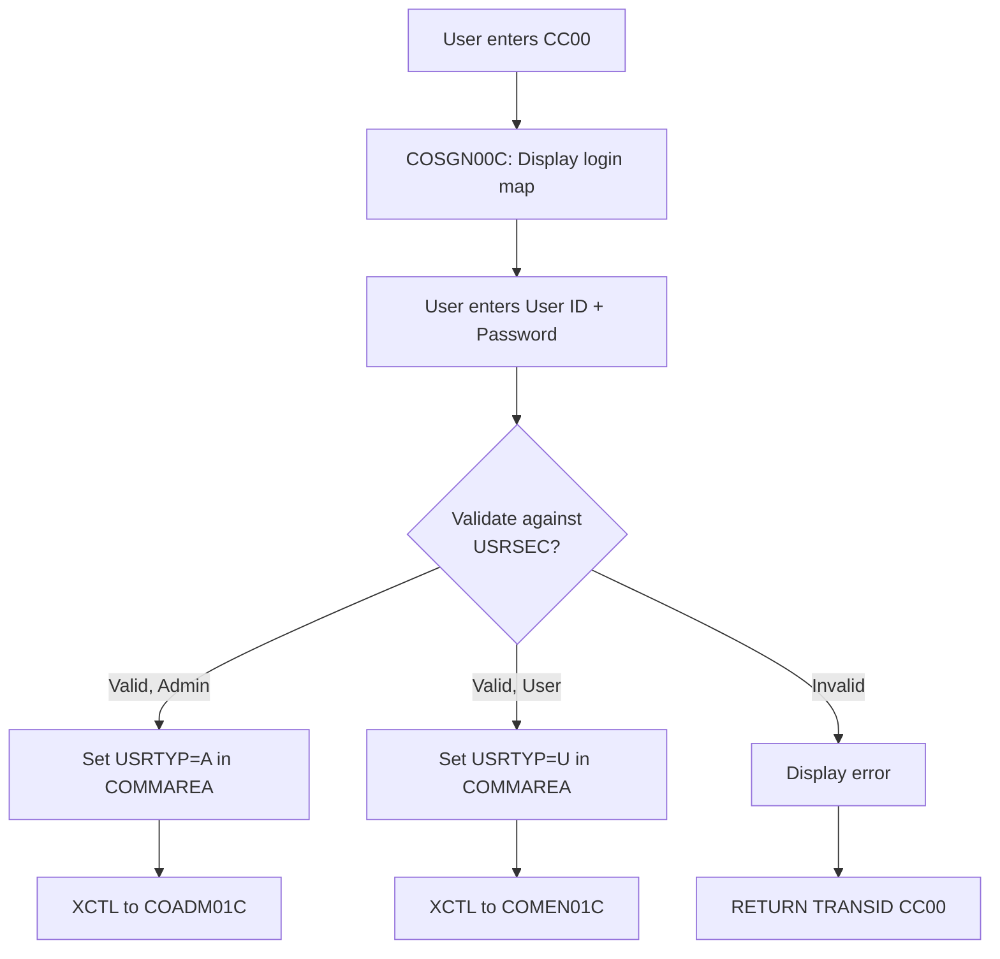
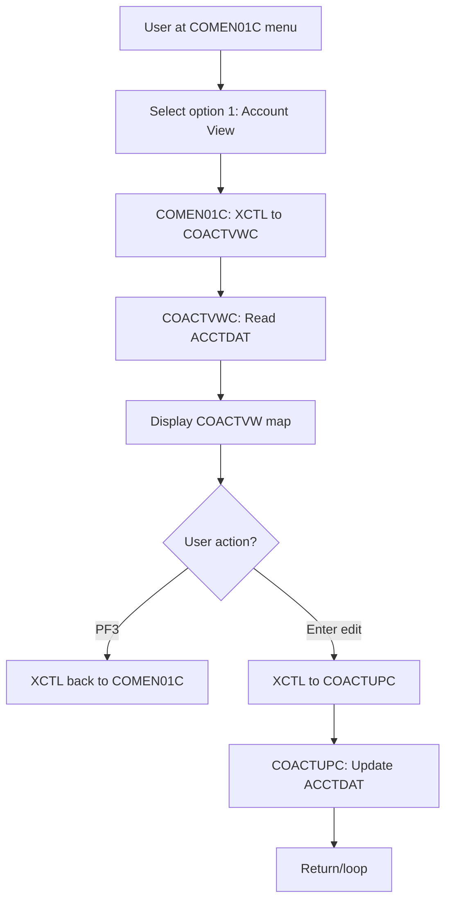
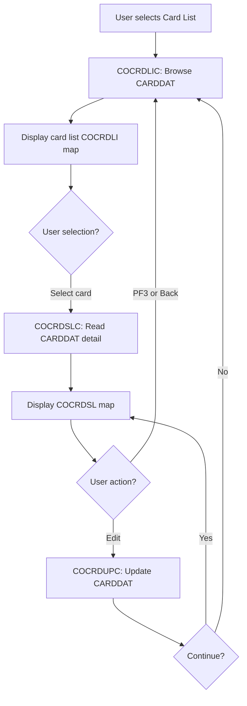

# CardDemo CICS Application — Codebase Wiki

**Version:** CardDemo_v1.0 | **Created:** 2022-07-19

---

## 1. Overview

The **CardDemo** application is a credit-card account and transaction management system built on CICS (Customer Information Control System). It provides two classes of users:

- **Admin users** (USRTYP='A'): Full access to user management (list, add, update, delete from USRSEC file)
- **Regular users** (USRTYP='U'): Access to account, card, transaction, bill payment, and reporting screens

### Primary Functions

| Area | Screens/Programs | Purpose |
|------|------------------|---------|
| **Sign-On** | COSGN00C | Login page; validates credentials against USRSEC file; routes to admin or user menu |
| **Accounts** | COACTVWC, COACTUPC | View and update account details (balance, credit limit, status) from ACCTDAT |
| **Cards** | COCRDLIC, COCRDSLC, COCRDUPC | List, search, and update credit cards; queries CARDDAT and CARDXREF (card-to-account index) |
| **Transactions** | COTRN00C, COTRN01C, COTRN02C | View transaction list, detail, and add new transactions from TRANSACT file |
| **Bill Payment** | COBIL00C | (Purpose to be confirmed in later phases) |
| **Reports** | CORPT00C | Request transaction reports; triggers TRANREPT batch job submission |
| **User Admin** | COUSR00C–COUSR03C | List, add, update, delete users (Admin menu only) from USRSEC |

[FILE:cpy/COCOM01Y.cpy:19-45] defines the communication area (COMMAREA) passed between programs, carrying user ID, program routing info, customer/account/card context.

---

## 2. Technology & Runtime

### Technology Stack

- **Language:** COBOL (fixed-form)
- **Architecture:** CICS (pseudo-conversational)
- **UI:** BMS (Basic Mapping Support) — screen forms compiled into mapsets
- **Data Access:** VSAM KSDS (Keyed Sequential Data Set) files
- **Batch Reporting:** JCL (Job Control Language) with SORT, COBOL programs
- **File System:** z/OS datasets (mainframe filesystems)

### Pseudo-Conversational Pattern

Each CICS program in CardDemo follows the **pseudo-conversational model**:

1. **Receive**: Program calls `CICS RECEIVE MAP` to fetch user input from the last screen
2. **Process**: Logic executes; reads/updates VSAM files; populates response map
3. **Send & End**: Calls `CICS SEND MAP` with the response; terminates with `CICS RETURN TRANSID` to reactivate itself on next screen input
4. **COMMAREA**: Passed via `CICS RETURN TRANSID COMMAREA(...)` to maintain session context across invocations

[FILE:csd/CARDDEMO.CSD:306-488] defines transaction IDs and their associated programs; example: transaction `CC00` → program `COSGN00C` (sign-on).

### Key CICS/BMS Concepts Used

- **COMMAREA** (COCOM01Y): 174-byte shared data structure carrying user, routing, and entity info
- **BMS Mapset**: Each program has a `.bms` file; compiled into a `MAP` (record layout) and `MAPSET` (collection of maps for a program)
- **XCTL** (Transfer Control): Explicit branch to another program without return (see [FILE:cbl/COADM01C.cbl:130+])
- **RETURN TRANSID**: Suspends execution; resumed when user enters next command; message sent to terminal; COMMAREA persists
- **PF-key handling** (DFHAID): Function keys (PF1–PF12, ENTER, CLEAR, PA1–PA3) defined in DFHAID; programs inspect `EIBAID`

---

## 3. Architecture / Program Inventory

### 3.1 COBOL Programs (18 total)

| Program ID | CICS TRANSID | BMS Map/Mapset | Purpose | Files Read | Files Written |
|-----------|------------|-----------------|---------|------------|----------------|
| COSGN00C | CC00 | COSGN00 | Sign-on; validate user against USRSEC | USRSEC | — |
| COADM01C | CA00 | COADM01 | Admin menu dispatcher | — | — |
| COACTVWC | CAVW | COACTVW | View account detail | ACCTDAT | — |
| COACTUPC | CAUP | COACTUP | Update account (balance, limits) | ACCTDAT | ACCTDAT |
| COCRDLIC | CCLI | COCRDLI | List all cards (browse) | CARDDAT, CARDXREF | — |
| COCRDSLC | CCDL | COCRDSL | Search/view card detail | CARDDAT, CARDXREF | — |
| COCRDUPC | CCUP | COCRDUP | Update card (status, etc.) | CARDDAT | CARDDAT |
| COTRN00C | CT00 | COTRN00 | List transactions (browse) | TRANSACT | — |
| COTRN01C | CT01 | COTRN01 | View transaction detail | TRANSACT | — |
| COTRN02C | CT02 | COTRN02 | Add new transaction | TRANSACT | TRANSACT |
| COBIL00C | CB00 | COBIL00 | Bill payment screen | — | TRANSACT (possibly) |
| CORPT00C | CR00 | CORPT00 | Submit transaction report request | — | JOBS (TD queue) |
| COUSR00C | CU00 | COUSR00 | List users (Admin only) | USRSEC | — |
| COUSR01C | CU01 | COUSR01 | Add user (Admin only) | USRSEC | USRSEC |
| COUSR02C | CU02 | COUSR02 | Update user (Admin only) | USRSEC | USRSEC |
| COUSR03C | CU03 | COUSR03 | Delete user (Admin only) | USRSEC | USRSEC |
| COMEN01C | CM00 | COMEN01 | Main menu (regular users) | — | — |
| CSUTLDTC | — | — | Date utility (LINK/CALL, no transid) | — | — |

[FILE:csd/CARDDEMO.CSD:173-305] - Program definitions with transaction routing.

### 3.2 Copybooks (28 total)

| Copybook | Purpose | Lines |
|----------|---------|-------|
| **COCOM01Y** [19-45] | COMMAREA structure (user, context, routing data) | 47 |
| **COADM02Y** [19-50] | Admin menu option list (4 options: user CRUD) | 51 |
| **COMEN02Y** [19-92] | Main menu option list (10 options: accounts, cards, transactions, etc.) | 95 |
| **COSGN00** | Sign-on BMS symbolic map | — |
| **COADM01** | Admin menu BMS symbolic map | — |
| **COACTVW, COACTUP** | Account view/update BMS symbolic maps | — |
| **COCRDLI, COCRDSL, COCRDUP** | Card list, search, update BMS symbolic maps | — |
| **COTRN00, COTRN01, COTRN02** | Transaction list, detail, add BMS symbolic maps | — |
| **COBIL00** | Bill payment BMS symbolic map | — |
| **CORPT00** | Report request BMS symbolic map | — |
| **COUSR00, COUSR01, COUSR02, COUSR03** | User mgmt BMS symbolic maps | — |
| **COMEN01** | Main menu BMS symbolic map | — |
| **CVACT01Y** [4-17] | Account record structure (ACCT-ID, balance, limits, dates) | 19 |
| **CVACT02Y, CVACT03Y** | Account-related structures (TBD) | — |
| **CVCRD01Y** [1-45] | Card work area (card number, account ID, customer ID, AID handling) | 46 |
| **CVCUS01Y** [4-23] | Customer record structure (name, address, SSN, FICO score) | 25 |
| **CVTRA01Y–CVTRA07Y** | Transaction record structures (7 variants) | — |
| **COTTL01Y** | Title/header line structure (program name, date, time) | — |
| **CSDAT01Y** | Date utility data (current date, formatting) | — |
| **CSMSG01Y, CSMSG02Y** | Message copybooks (error/info messages, 1 line each) | — |
| **CSSTRPFY** | PF-key handler structure | — |
| **CSUSR01Y** | User record structure (ID, name, type, password) | — |
| **CSUTLDPY** | Date validation copybook | — |
| **CSUTLDWY** | Day-of-week utility | — |
| **CSLKPCDY** | Lookup/code table structure | — |
| **CSSETTAY** | Setup/initialization data | — |
| **CUSTOM** | Placeholder/unused | — |
| **COSTM01** | Custom structure (TBD) | — |
| **UNUSED1Y** | Deliberately unused | — |

[FILE:cpy/COADM02Y.cpy:1-51], [FILE:cpy/COMEN02Y.cpy:1-95], [FILE:cpy/CVACT01Y.cpy:1-19], [FILE:cpy/CVCUS01Y.cpy:1-25].

### 3.3 BMS Maps (17 total)

| Mapset | Program | Purpose |
|--------|---------|---------|
| COSGN00 | COSGN00C | Sign-on form |
| COADM01 | COADM01C | Admin menu form |
| COACTVW | COACTVWC | Account view form |
| COACTUP | COACTUPC | Account update form |
| COCRDLI | COCRDLIC | Card list (browse table) form |
| COCRDSL | COCRDSLC | Card search/detail form |
| COCRDUP | COCRDUPC | Card update form |
| COTRN00 | COTRN00C | Transaction list form |
| COTRN01 | COTRN01C | Transaction detail form |
| COTRN02 | COTRN02C | Transaction add form |
| COBIL00 | COBIL00C | Bill payment form |
| CORPT00 | CORPT00C | Report request form |
| COUSR00 | COUSR00C | User list form (Admin) |
| COUSR01 | COUSR01C | User add form (Admin) |
| COUSR02 | COUSR02C | User update form (Admin) |
| COUSR03 | COUSR03C | User delete form (Admin) |
| COMEN01 | COMEN01C | Main menu form (users) |

All mapsets defined in [FILE:csd/CARDDEMO.CSD:100-172].

---

## 4. Data Overview

### 4.1 VSAM Files & Datasets

| File ID (CSD) | Dataset Name | Copybook | Key (Len) | Avg Reclen | Purpose | Sample Data |
|--------------|------------|----------|-----------|-----------|---------|-------------|
| ACCTDAT | AWS.M2.CARDDEMO.ACCTDATA.VSAM.KSDS | CVACT01Y | ACCT-ID (11) | 300 | Account master file | [FILE:data/ASCII/acctdata.txt] |
| CARDDAT | AWS.M2.CARDDEMO.CARDDATA.VSAM.KSDS | CVCRD01Y | Card# (16) | 150 | Credit card master | [FILE:data/ASCII/carddata.txt] |
| CARDAIX | AWS.M2.CARDDEMO.CARDDATA.VSAM.AIX.PATH | — | (alt index) | — | Alternate index to CARDDAT | — |
| CCXREF | AWS.M2.CARDDEMO.CARDXREF.VSAM.KSDS | — | Key (11) | 150 | Card-to-account cross-ref | [FILE:data/ASCII/cardxref.txt] |
| CXACAIX | AWS.M2.CARDDEMO.CARDXREF.VSAM.AIX.PATH | — | (alt index) | — | Alternate index CCXREF via account | — |
| CUSTDAT | AWS.M2.CARDDEMO.CUSTDATA.VSAM.KSDS | CVCUS01Y | CUST-ID (9) | 500 | Customer master (name, address, ID) | [FILE:data/ASCII/custdata.txt] |
| TRANSACT | AWS.M2.CARDDEMO.TRANSACT.VSAM.KSDS | CVTRA01Y–07Y | Composite (16+?) | 350 | Transaction log | [FILE:data/ASCII/dailytran.txt] |
| USRSEC | AWS.M2.CARDDEMO.USRSEC.VSAM.KSDS | CSUSR01Y | User ID (8) | 50 | User security/login | — |
| DISCGRP | AWS.M2.CARDDEMO.DISCGRP.VSAM.KSDS | — | Group code (6) | 60 | Discount group lookup | [FILE:data/ASCII/discgrp.txt] |
| TCATBAL | AWS.M2.CARDDEMO.TCATBAL.VSAM.KSDS | — | Code (16) | 50 | Transaction category balance | [FILE:data/ASCII/tcatbal.txt] |
| TRANCATG | AWS.M2.CARDDEMO.TRANCATG.VSAM.KSDS | — | Category (6) | 60 | Transaction category master | [FILE:data/ASCII/trancatg.txt] |
| TRANTYPE | AWS.M2.CARDDEMO.TRANTYPE.VSAM.KSDS | — | Tran type (16) | 50 | Transaction type lookup | [FILE:data/ASCII/trantype.txt] |

Record lengths from [FILE:catlg/LISTCAT.txt:59,177,200,286].

### 4.2 Program → File Access Matrix

```
COSGN00C  → [R] USRSEC
COADM01C  → [—] (dispatcher only)
COACTVWC  → [R] ACCTDAT
COACTUPC  → [R/W] ACCTDAT
COCRDLIC  → [R] CARDDAT, CARDXREF (browse via AIX)
COCRDSLC  → [R] CARDDAT, CARDXREF
COCRDUPC  → [W] CARDDAT
COTRN00C  → [R] TRANSACT (browse)
COTRN01C  → [R] TRANSACT
COTRN02C  → [W] TRANSACT
COBIL00C  → [?] (TBD)
CORPT00C  → [—] (submit job; no direct file access)
COUSR00C  → [R] USRSEC (browse)
COUSR01C  → [W] USRSEC
COUSR02C  → [W] USRSEC
COUSR03C  → [W] USRSEC
COMEN01C  → [—] (dispatcher only)
CSUTLDTC  → [—] (utility, date calculations)
```

### 4.3 Batch Jobs

**TRANREPT** (Transaction Report Processor) — [FILE:proc/TRANREPT.prc:1-82]

- **Steps:**
  1. Unload TRANSACT VSAM to flat file (BACKUP dataset)
  2. SORT transactions by card number; filter by date range (e.g., 2022-01-01 to 2022-07-06)
  3. Execute **CBTRN03C** program (not in CICS programs list; assumed batch-only) to read sorted transactions and produce formatted report
  
- **Inputs:** TRANSACT, CARDXREF, TRANTYPE, TRANCATG, DATEPARM
- **Output:** Formatted transaction report (TRANREPT dataset)

[FILE:proc/TRANREPT.prc:57] references `CBTRN03C` — a batch program not found in the `/cbl/` directory (gap noted in section 8).

---

## 5. Key Workflows

### 5.1 Sign-On (CC00 → COSGN00C)

**Entry Point:** User types transaction code `CC00`.

**Flow:**

1. COSGN00C displays COSGN00 map (login form)
2. User enters User ID + Password → CICS RECEIVE MAP
3. Program validates credentials against USRSEC file
4. If valid:
   - Store User ID + User Type (Admin/User) in COMMAREA [FILE:cpy/COCOM01Y.cpy:21-28]
   - If Admin (USRTYP='A'): XCTL to COADM01C (admin menu)
   - If User (USRTYP='U'): XCTL to COMEN01C (main menu)
5. If invalid: Display error, RETURN TRANSID CC00 (loop)

**Mermaid Flowchart:**



### 5.2 User Menu → Account Workflow (CM00 → COACTVWC/COACTUPC)

**Entry Point:** Logged-in regular user selects option from main menu.

**Flow:**

1. COMEN01C displays COMEN01 map with 10 menu options [FILE:cpy/COMEN02Y.cpy:19-92]
2. User selects option (e.g., "1" = Account View)
3. COMEN01C parses input; XCTL to selected program (e.g., COACTVWC) with COMMAREA
4. COACTVWC:
   - Receives COMMAREA (user context, any account ID)
   - Reads ACCTDAT using ACCT-ID as key
   - Displays COACTVW map with account details
5. User can:
   - Select PF3 → return to COMEN01C
   - Enter modifications → XCTL to COACTUPC for update
6. COACTUPC updates ACCTDAT; returns to menu or loops for re-edit

**Mermaid Flowchart:**



### 5.3 Card Management (CCLI → COCRDLIC, COCRDSLC, COCRDUPC)

**Entry Point:** User selects "Credit Card List" (option 3) from menu.

**Flow:**

1. COMEN01C XCTL to COCRDLIC (list cards)
2. COCRDLIC browses CARDDAT or uses CARDAIX (alternate index) to list all cards
3. User selects a card → search screen COCRDSLC displays detail via COCRDSLC program
4. User can:
   - View detail (read-only via COCRDSLC)
   - Edit → XCTL to COCRDUPC for update
5. COCRDUPC updates CARDDAT; returns to list or detail screen

**Mermaid Flowchart:**



### 5.4 Transaction Report Request (CR00 → CORPT00C → JOBS TD Queue)

**Entry Point:** User selects "Transaction Reports" from menu.

**Flow:**

1. COMEN01C XCTL to CORPT00C (report screen)
2. CORPT00C displays CORPT00 map; user enters report parameters (date range, etc.)
3. User submits (ENTER key)
4. CORPT00C writes job submission to CICS temporary data queue `JOBS` [FILE:csd/CARDDEMO.CSD:499-500]
5. Background processor reads JOBS queue and executes TRANREPT JCL procedure [FILE:proc/TRANREPT.prc:1-82]
6. TRANREPT steps:
   - Unload TRANSACT to backup dataset
   - SORT by card number and date filter
   - Execute CBTRN03C to format report
   - Output to report dataset
7. User notified report is ready (asynchronous)

---

## 6. Shared Utilities & Conventions

### 6.1 Date Utility (CSUTLDTC)

**Program:** CSUTLDTC.cbl [FILE:cbl/CSUTLDTC.cbl]

**Function:** Date calculations (current date, formatting, validation)

**Called via:** CICS LINK or COBOL CALL (not a transaction; no BMS)

**Copybooks:**
- CSUTLDPY: Date validation rules
- CSUTLDWY: Day-of-week calculations
- CSDAT01Y: Date formatting structures

### 6.2 Message Handling

**Copybooks:** CSMSG01Y, CSMSG02Y [FILE:cpy/CSMSG01Y.cpy:1, FILE:cpy/CSMSG02Y.cpy:1]

**Pattern:** Programs move error/info messages into a designated message field in BMS map before sending screen.

**Example** (from COADM01C [FILE:cbl/COADM01C.cbl:79-80]):
```
MOVE SPACES TO WS-MESSAGE
               ERRMSGO OF COADM1AO
```

### 6.3 PF-Key Handling (CSSTRPFY)

**Copybook:** CSSTRPFY [FILE:cpy/CSSTRPFY.cpy]

**Pattern:** All programs check `EIBAID` (Execute Interface Block Attention Identifier) for function key pressed:
- ENTER (DFHENTER): Process normal input
- PF3 (DFHPF3): Return/cancel
- Other PF keys: Application-specific

**Example** (from COADM01C [FILE:cbl/COADM01C.cbl:93-99]):
```
EVALUATE EIBAID
    WHEN DFHENTER
        PERFORM PROCESS-ENTER-KEY
    WHEN DFHPF3
        PERFORM RETURN-TO-SIGNON-SCREEN
    WHEN OTHER
        MOVE 'Y' TO WS-ERR-FLG
```

### 6.4 Title/Header Convention (COTTL01Y)

**Copybook:** COTTL01Y [FILE:cpy/COTTL01Y.cpy]

**Pattern:** Each screen includes a title bar with program name, current date, time. Maintained via COTTL01Y structure and CSDAT01Y.

### 6.5 COMMAREA Routing

All programs pass context via COCOM01Y [FILE:cpy/COCOM01Y.cpy:19-45]:

- FROM-TRANID / FROM-PROGRAM: Calling program info
- TO-TRANID / TO-PROGRAM: Next program destination
- USER-ID, USER-TYPE: Session identity
- CUSTOMER-INFO, ACCOUNT-INFO, CARD-INFO: Entity context
- PGM-CONTEXT (ENTER=0, REENTER=1): First call vs. re-entry

---

## 7. Glossary

| Term | Meaning |
|------|---------|
| **ACCTDAT** | Account data VSAM file (AWS.M2.CARDDEMO.ACCTDATA.VSAM.KSDS) |
| **AIX** | Alternate Index on a VSAM file; allows access by a secondary key |
| **BMS** | Basic Mapping Support; CICS terminal screen form definition language |
| **CARDDAT** | Credit card data VSAM file |
| **CARDXREF** | Card-to-account cross-reference (CCXREF) VSAM file |
| **CCXREF** | Card-to-account cross-reference file; alternate index via account |
| **CICS** | Customer Information Control System; IBM mainframe TP monitor |
| **COMMAREA** | Communication area; shared memory passed between CICS programs |
| **CUSTDAT** | Customer master data VSAM file |
| **EIBAID** | Execute Interface Block Attention Identifier; function key code |
| **Mapset** | Collection of BMS maps for a single program |
| **Pseudo-conversational** | CICS programming model: program ends after each screen; resumed on next user input |
| **RETURN TRANSID** | CICS command to suspend program and reactivate on next transaction |
| **Transid** | 4-character transaction ID (e.g., CC00); entered by user to start CICS program |
| **TRANSACT** | Transaction log VSAM file |
| **USRSEC** | User security/login VSAM file |
| **VSAM** | Virtual Storage Access Method; IBM mainframe indexed sequential file format |
| **XCTL** | CICS command for explicit program transfer; does not return |

---

## 8. Open Questions / Gaps

1. **Missing Batch Program CBTRN03C**
   - Referenced in TRANREPT JCL [FILE:proc/TRANREPT.prc:57]
   - Not found in `/cbl/` directory
   - Status: Assumed to be a batch-only program or external utility
   - Impact: Report request workflow incomplete until CBTRN03C location/purpose confirmed

2. **COBIL00C Bill Payment Logic**
   - Program exists but file-access pattern not yet traced
   - Unclear if it creates transactions, updates accounts, or both
   - Impact: Bill payment workflow to be documented in Phase 1 deep-dive

3. **Transaction Copybooks (CVTRA01Y–CVTRA07Y)**
   - Multiple variants exist; field-level breakdown not yet extracted
   - Unclear which variant is primary or when each is used
   - Impact: Transaction entity schema to be finalized in Phase 1

4. **Alternate Index (CARDAIX) Query Pattern**
   - Programs COCRDLIC, COCRDSLC browse cards; unclear if they use primary key or AIX
   - CXACAIX (alternate account-based index on CCXREF) not yet traced
   - Impact: Card-lookup performance characteristics to be analyzed

5. **JCL/Batch Programs**
   - `/proc/` and `/ctl/` directories contain only report procedures (TRANREPT, REPROC)
   - No data-load, backup, or initialization jobs found
   - May exist outside `/phase-1-input/` scope
   - Impact: Data load & purge workflows not yet documented

6. **COCRDSEC Program**
   - Listed in CSD [FILE:csd/CARDDEMO.CSD:211-218] with developer transaction CDV1
   - Not invoked from any menu
   - Purpose unclear (card search utility?)
   - Impact: May be development/testing tool; to be confirmed

7. **Discount Groups & Transaction Categories**
   - DISCGRP, TRANCATG, TRANTYPE, TCATBAL files referenced in TRANREPT JCL
   - No programs in cbl/ appear to maintain these lookup tables
   - Assumed loaded separately or hard-coded
   - Impact: Lookup table population strategy to be clarified

---

## Change Log

| Version | Date | Changes |
|---------|------|---------|
| 1.0 | 2022-07-19 | Initial orientation-level wiki; program inventory, data schema, workflows, utilities documented |

---

**Prepared for Phase 1 Deep-Extraction:** Business entities, business rules, validation rules, screen flows, user stories.
