# Application Screen Flow Documentation

## Summary

**Total Screens:** 17 (one additional developer/debug screen, `COCRDSEC` under transaction `CDV1`, exists in the transaction directory but is not part of the normal end-user experience and is excluded from this documentation).

**What this application does:** CardDemo is a credit-card account management system used by two kinds of people:

- **Regular users** who look up account and card information, review and add transactions, pay a bill, and request printed transaction reports.
- **Administrators** who additionally manage the list of people allowed to sign in to the system (adding, updating, deleting, and listing user accounts).

**Main user workflows:**
1. **Sign in** with a User ID and Password. The system checks the password and sends the person to the Main Menu (regular user) or the Admin Menu (administrator).
2. **Look up an account or a card**, view its details, and optionally update the account or the card.
3. **Look up, view, or add transactions** for an account, and optionally pay the account balance in full through Bill Payment.
4. **Request a printed transaction report** (for the current month, current year, or a custom date range).
5. **(Administrators only)** List, add, update, or delete the user accounts that are allowed to sign in.

Every screen in the application shares two consistent behaviors: pressing an invalid key shows the message "Invalid key pressed. Please see below..." and screens that make a change (account update, card update, bill payment, report request, user add/update/delete, transaction add) ask the person to type "Y" or "N" to confirm before the change actually happens.

## Screen Inventory

| Screen ID | BMS Map | Program | Transaction | Purpose |
|---|---|---|---|---|
| Sign-On | COSGN00 | COSGN00C | CC00 | Log in with User ID and Password |
| Main Menu | COMEN01 | COMEN01C | CM00 | Menu of options for a regular user |
| Admin Menu | COADM01 | COADM01C | CA00 | Menu of options for an administrator |
| View Account | COACTVW | COACTVWC | CAVW | Look up and view an account's details |
| Update Account | COACTUP | COACTUPC | CAUP | Look up and edit an account's details |
| List Credit Cards | COCRDLI | COCRDLIC | CCLI | Browse/search the list of credit cards |
| View Card Detail | COCRDSL | COCRDSLC | CCDL | Look up and view a single card's details |
| Update Card | COCRDUP | COCRDUPC | CCUP | Look up and edit a single card's details |
| List Transactions | COTRN00 | COTRN00C | CT00 | Browse/search the list of transactions |
| View Transaction | COTRN01 | COTRN01C | CT01 | View a single transaction's details |
| Add Transaction | COTRN02 | COTRN02C | CT02 | Add a new transaction to an account |
| Bill Payment | COBIL00 | COBIL00C | CB00 | Pay off an account's current balance in full |
| Transaction Reports | CORPT00 | CORPT00C | CR00 | Request a printed transaction report |
| List Users | COUSR00 | COUSR00C | CU00 | (Admin) Browse/search the list of sign-in users |
| Add User | COUSR01 | COUSR01C | CU01 | (Admin) Create a new sign-in user |
| Update User | COUSR02 | COUSR02C | CU02 | (Admin) Edit an existing sign-in user |
| Delete User | COUSR03 | COUSR03C | CU03 | (Admin) Remove a sign-in user |

Transaction ID-to-program mapping verified against [FILE:00.phase-1-input/csd/CARDDEMO.CSD:306-482].

## Detailed Screen Analysis

### 1. Sign-On Screen (COSGN00 / COSGN00C / CC00)

**Screen Purpose:** The first screen every person sees. It asks for a User ID and Password and, once verified, sends the person to the correct menu for their user type.

**User Interaction Flow:**
1. The system displays the sign-on screen with the User ID field ready for typing [FILE:00.phase-1-input/cbl/COSGN00C.cbl:66-70].
2. The person types their User ID and Password and presses Enter.
3. The system checks that both fields were filled in. If either is blank, it shows "Please enter User ID ..." or "Please enter Password ..." and stays on this screen [FILE:00.phase-1-input/cbl/COSGN00C.cbl:115-125].
4. The system looks up the User ID in the list of sign-in users [FILE:00.phase-1-input/cbl/COSGN00C.cbl:198-208].
5. If the User ID is not found, the system shows "User not found. Try again ..." and stays on this screen [FILE:00.phase-1-input/cbl/COSGN00C.cbl:248-251].
6. If the User ID is found but the password does not match, the system shows "Wrong Password. Try again ..." and stays on this screen [FILE:00.phase-1-input/cbl/COSGN00C.cbl:242-246].
7. If the User ID and Password both match, the system checks the person's user type: administrators are sent to the Admin Menu; everyone else is sent to the Main Menu [FILE:00.phase-1-input/cbl/COSGN00C.cbl:227-240].

**Screen Fields:**
| Field Name | Field Type | Data Source | Validation |
|---|---|---|---|
| User ID | Input | Typed by the person | Must not be blank; must match a known sign-in user |
| Password | Input (hidden while typing) | Typed by the person | Must not be blank; must match the stored password for the User ID |
| Error Message | Output | System-generated | n/a |

Source: [FILE:00.phase-1-input/bms/COSGN00.bms:1-210].

**Navigation Conditions:**
- Successful sign-on as an administrator → goes to Admin Menu.
- Successful sign-on as a regular user → goes to Main Menu.
- Blank User ID, blank Password, User ID not found, or wrong password → stays on Sign-On screen with an explanatory message.
- Pressing F3 → shows a "Thank you" message and ends the session [FILE:00.phase-1-input/cbl/COSGN00C.cbl:75-77].
- Pressing any other key → shows "Invalid key pressed. Please see below..." and stays on the Sign-On screen [FILE:00.phase-1-input/cbl/COSGN00C.cbl:79-82].

---

### 2. Main Menu (COMEN01 / COMEN01C / CM00)

**Screen Purpose:** The home screen for a regular user. It lists the things they can do and sends them to the right screen based on the number they type.

**Menu Options** (from [FILE:00.phase-1-input/cpy/COMEN02Y.cpy:19-92], all currently available to regular users):

| # | Option | Goes to Program |
|---|---|---|
| 1 | Account View | COACTVWC |
| 2 | Account Update | COACTUPC |
| 3 | Credit Card List | COCRDLIC |
| 4 | Credit Card View | COCRDSLC |
| 5 | Credit Card Update | COCRDUPC |
| 6 | Transaction List | COTRN00C |
| 7 | Transaction View | COTRN01C |
| 8 | Transaction Add | COTRN02C |
| 9 | Transaction Reports | CORPT00C |
| 10 | Bill Payment | COBIL00C |

**User Interaction Flow:**
1. The system displays the numbered list of 10 options [FILE:00.phase-1-input/bms/COMEN01.bms:1-167].
2. The person types the number of the option they want and presses Enter.
3. The system checks the number is a valid option (1-10, not blank/zero and not too large). If not, it shows "Please enter a valid option number..." and stays on this screen [FILE:00.phase-1-input/cbl/COMEN01C.cbl:127-134].
4. If the option is valid, the system sends the person to the matching screen, carrying along their user session information [FILE:00.phase-1-input/cbl/COMEN01C.cbl:143-153].

**Screen Fields:**
| Field Name | Field Type | Data Source | Validation |
|---|---|---|---|
| Menu options (1-10) | Output | System-generated list from COMEN02Y | n/a |
| Option Number | Input | Typed by the person | Must be a number between 1 and the number of listed options |
| Error Message | Output | System-generated | n/a |

Source: [FILE:00.phase-1-input/bms/COMEN01.bms:1-167].

**Navigation Conditions:**
- Valid option number → goes to the matching screen listed above.
- Blank, non-numeric, zero, or out-of-range option number → stays on Main Menu with an error message.
- Pressing F3 → returns to the Sign-On screen [FILE:00.phase-1-input/cbl/COMEN01C.cbl:93-98].
- Pressing any other key → shows "Invalid key pressed. Please see below..." and stays on the Main Menu.

*Observation:* The program has logic to block an option marked "Admin Only" for regular users [FILE:00.phase-1-input/cbl/COMEN01C.cbl:136-141], but none of the 10 current menu options are actually marked that way, so this restriction never triggers in practice today.

---

### 3. Admin Menu (COADM01 / COADM01C / CA00)

**Screen Purpose:** The home screen for an administrator. It lists user-management options.

**Menu Options** (from [FILE:00.phase-1-input/cpy/COADM02Y.cpy:19-48]):

| # | Option | Goes to Program |
|---|---|---|
| 1 | User List (Security) | COUSR00C |
| 2 | User Add (Security) | COUSR01C |
| 3 | User Update (Security) | COUSR02C |
| 4 | User Delete (Security) | COUSR03C |

**User Interaction Flow:**
1. The system displays the 4 numbered options [FILE:00.phase-1-input/bms/COADM01.bms:75-79].
2. The person types the number of the option they want and presses Enter.
3. The system checks the number is valid (1-4). If not, it shows an error and stays on this screen [FILE:00.phase-1-input/cbl/COADM01C.cbl:119-135].
4. If valid, the system sends the person to the matching user-management screen [FILE:00.phase-1-input/cbl/COADM01C.cbl:138-149].

**Screen Fields:**
| Field Name | Field Type | Data Source | Validation |
|---|---|---|---|
| Menu options (1-4) | Output | System-generated list from COADM02Y | n/a |
| Option Number | Input | Typed by the person | Must be a number between 1 and 4 |
| Error Message | Output | System-generated | n/a |

Source: [FILE:00.phase-1-input/bms/COADM01.bms:1-167].

**Navigation Conditions:**
- Valid option number → goes to the matching user-management screen.
- Invalid option number → stays on Admin Menu with an error message.
- Pressing F3 → returns to the Sign-On screen [FILE:00.phase-1-input/cbl/COADM01C.cbl:93-97].
- Pressing any other key → shows an "invalid key" message and stays on the Admin Menu.

---

### 4. View Account (COACTVW / COACTVWC / CAVW)

**Screen Purpose:** Look up an account by its ID and see all of its details (balances, credit limits, customer information) without being able to change anything.

**User Interaction Flow:**
1. The system asks for an Account ID [FILE:00.phase-1-input/bms/COACTVW.bms:1-378].
2. The person types an 11-digit Account ID and presses Enter.
3. The system checks the ID was filled in and is numeric. If not, it shows an error and stays on the screen.
4. The system looks up the account and displays all its details (status, dates, balances, credit limits, and the linked customer's name, address, phone, SSN, date of birth, FICO score, etc.) as read-only information.
5. If the account is not found, the system shows an error and stays on the screen.

**Screen Fields:**
| Field Name | Field Type | Data Source | Validation |
|---|---|---|---|
| Account ID | Input | Typed by the person | Must not be blank; must be numeric; must match an existing account |
| Account Status, Open Date, Credit Limit, Expiry Date, Cash Credit Limit, Reissue Date, Current Balance, Current Cycle Credit/Debit, Account Group | Output | Looked up from the account record | n/a (display only) |
| Customer ID, SSN, Date of Birth, FICO Score, First/Middle/Last Name, Address, City, State, Zip, Country, Phone Numbers, Government ID, EFT Account ID, Primary Card Holder flag | Output | Looked up from the linked customer record | n/a (display only) |
| Error/Info Message | Output | System-generated | n/a |

Source: [FILE:00.phase-1-input/bms/COACTVW.bms:1-378].

**Navigation Conditions:**
- Successful lookup → stays on this screen showing the account's details.
- Blank or non-numeric Account ID, or account not found → stays on this screen with an error message.
- Pressing F3 → returns to the Main Menu, or to whichever screen the person came from [FILE:00.phase-1-input/cbl/COACTVWC.cbl:326-350].
- Pressing any other key → shows an "invalid key" message and stays on this screen.

---

### 5. Update Account (COACTUP / COACTUPC / CAUP)

**Screen Purpose:** Look up an account and edit its details, with a confirmation step before the changes are actually saved.

**User Interaction Flow:**
1. The system asks for an Account ID [FILE:00.phase-1-input/bms/COACTUP.bms:1-512].
2. The person types the Account ID and presses Enter. The system looks up the account and shows all of its editable fields.
3. The person changes one or more fields (status, dates, balances, credit limits, customer name/address/phone/etc.) and presses Enter again.
4. The system checks the changed data for errors. If any field fails validation, it shows an error and lets the person fix the field.
5. If no errors are found and something actually changed, the system shows a confirmation prompt and lights up the "F5=Save" key [FILE:00.phase-1-input/cbl/COACTUPC.cbl:2562-2622].
6. The person presses F5 to save the change, or F12 to cancel and discard it.
7. If saved, the system writes the new information and shows the updated account again.

**Screen Fields:**
| Field Name | Field Type | Data Source | Validation |
|---|---|---|---|
| Account ID | Input | Typed by the person | Must not be blank; must match an existing account |
| Account Status, Open Date (Year/Month/Day), Credit Limit, Expiry Date, Cash Credit Limit, Reissue Date, Current Balance, Current Cycle Credit/Debit, Account Group | Input (editable) | Fetched from account record, then edited by the person | Field-level format/range checks (e.g. valid dates, numeric amounts) |
| Customer ID, SSN (split into 3 parts), Date of Birth, FICO Score, First/Middle/Last Name, Address, City, State, Zip, Country, Phone (split into parts), Government ID, EFT Account ID, Primary Card Holder flag | Input (editable) | Fetched from customer record, then edited by the person | Field-level format/range checks |
| Info/Error Message | Output | System-generated | n/a |
| Save/Cancel key legend (F5/F12) | Output | Shown only once changes are pending confirmation | n/a |

Source: [FILE:00.phase-1-input/bms/COACTUP.bms:1-512].

**Navigation Conditions:**
- Account ID lookup succeeds → shows the account's editable details.
- Account not found or blank Account ID → stays on this screen with an error message.
- Validation errors on any edited field → stays on this screen, field flagged.
- Changes made with no errors → shows confirmation prompt; F5 becomes usable.
- F5 pressed while a confirmed save is pending → the update is saved (unless another user already changed the same record — in that case the account is re-displayed with a message so the person can retry) [FILE:00.phase-1-input/cbl/COACTUPC.cbl:2562-2643].
- F12 pressed → the pending changes are discarded and the account is shown again unconfirmed.
- F3 pressed → returns to the Main Menu, or to whichever screen the person came from [FILE:00.phase-1-input/cbl/COACTUPC.cbl:2565-2600].
- Any other key while an update is not pending confirmation → treated as an "invalid key" and re-shows the Enter action.

---

### 6. List Credit Cards (COCRDLI / COCRDLIC / CCLI)

**Screen Purpose:** Browse or search the list of credit cards, optionally filtered by Account ID and/or Card Number, and pick one to view.

**User Interaction Flow:**
1. The system shows up to 7 cards per page, with optional Account ID / Card Number filter boxes at the top [FILE:00.phase-1-input/bms/COCRDLI.bms:1-344].
2. The person may type an Account ID and/or Card Number to filter the list, then presses Enter to search.
3. The system displays matching cards with a selection box next to each.
4. The person types a selection character next to a card and presses Enter to view its details, or presses F7/F8 to page backward/forward through the list.

**Screen Fields:**
| Field Name | Field Type | Data Source | Validation |
|---|---|---|---|
| Page Number | Output | System-generated | n/a |
| Account ID filter | Input | Typed by the person | Optional; if filled in, must be numeric |
| Card Number filter | Input | Typed by the person | Optional |
| Select (7 rows) | Input | Typed by the person | Must be a recognized selection character |
| Account Number, Card Number, Card Status (7 rows each) | Output | Looked up card records | n/a (display only) |
| Info/Error Message | Output | System-generated | n/a |

Source: [FILE:00.phase-1-input/bms/COCRDLI.bms:1-344].

**Navigation Conditions:**
- Selecting a card and pressing Enter → goes to the card's detail screen (View or Update Card, depending on entry point).
- F7 (page backward) → shows the previous page of cards, or a message if already at the first page.
- F8 (page forward) → shows the next page of cards, or a message if already at the last page.
- No matching cards for the filter → stays on this screen with an error message.
- F3 pressed → returns to the Main Menu [FILE:00.phase-1-input/cbl/COCRDLIC.cbl:392-402].

---

### 7. View Card Detail (COCRDSL / COCRDSLC / CCDL)

**Screen Purpose:** Look up a single credit card by Account ID and/or Card Number and view its name, status, and expiry — read-only.

**User Interaction Flow:**
1. The system asks for an Account ID and/or Card Number [FILE:00.phase-1-input/bms/COCRDSL.bms:1-157].
2. The person types one or both and presses Enter.
3. The system looks up the card and shows the cardholder name on the card, its active/inactive status, and its expiration month/year.
4. If nothing matches, the system shows an error and stays on the screen.

**Screen Fields:**
| Field Name | Field Type | Data Source | Validation |
|---|---|---|---|
| Account ID | Input | Typed by the person | Optional, but at least one search key needed |
| Card Number | Input | Typed by the person | Optional, but at least one search key needed |
| Cardholder Name on Card | Output | Looked up card record | n/a (display only) |
| Card Active Status | Output | Looked up card record | n/a (display only) |
| Expiry Month/Year | Output | Looked up card record | n/a (display only) |
| Info/Error Message | Output | System-generated | n/a |

Source: [FILE:00.phase-1-input/bms/COCRDSL.bms:1-157].

**Navigation Conditions:**
- Card found → stays on this screen showing the card's details.
- Card not found, or no search key entered → stays on this screen with an error message.
- F3 pressed → returns to the Main Menu, or to whichever screen the person came from [FILE:00.phase-1-input/cbl/COCRDSLC.cbl:307-332].

---

### 8. Update Card (COCRDUP / COCRDUPC / CCUP)

**Screen Purpose:** Look up a single credit card and edit its name, active status, and expiry date, with a confirmation step before saving.

**User Interaction Flow:**
1. The system asks for an Account ID (protected/display-only once fetched) and Card Number [FILE:00.phase-1-input/bms/COCRDUP.bms:75-172].
2. The person types the Card Number and presses Enter. The system looks up and shows the card's editable name, status, and expiry month/year.
3. The person edits one or more fields and presses Enter again.
4. If a field fails validation, the system shows an error and lets the person fix it.
5. If no errors are found and something actually changed, the system shows a confirmation prompt and enables F5=Save / F12=Cancel [FILE:00.phase-1-input/cbl/COCRDUPC.cbl:948-1010].
6. The person presses F5 to save, or F12 to cancel.

**Screen Fields:**
| Field Name | Field Type | Data Source | Validation |
|---|---|---|---|
| Account ID | Output (display only) | Looked up card record | n/a |
| Card Number | Input | Typed by the person | Must match an existing card |
| Cardholder Name on Card | Input (editable) | Fetched, then edited | Not blank |
| Card Active Status | Input (editable) | Fetched, then edited | Must be Y or N |
| Expiry Month / Year | Input (editable) | Fetched, then edited | Must be a valid month/year |
| Info/Error Message | Output | System-generated | n/a |
| Save/Cancel key legend (F5/F12) | Output | Shown only once changes are pending confirmation | n/a |

Source: [FILE:00.phase-1-input/bms/COCRDUP.bms:75-172].

**Navigation Conditions:**
- Card lookup succeeds → shows the card's editable details.
- Card not found → stays on this screen with an error message.
- Validation errors on any edited field → stays on this screen, field flagged.
- Changes made with no errors → shows confirmation prompt; F5 becomes usable.
- F5 pressed while a confirmed save is pending → the update is saved (unless another user already changed the same record — in that case the card is re-displayed with a message) [FILE:00.phase-1-input/cbl/COCRDUPC.cbl:985-1010].
- F12 pressed → the pending changes are discarded and the card is shown again unconfirmed [FILE:00.phase-1-input/cbl/COCRDUPC.cbl:958-967].
- F3 pressed → returns to the Main Menu, or to whichever screen the person came from.

---

### 9. List Transactions (COTRN00 / COTRN00C / CT00)

**Screen Purpose:** Browse or search the account's transactions and pick one to view its full details.

**User Interaction Flow:**
1. The system shows up to 10 transactions per page, with a "type S to view" instruction, and an optional Transaction ID search box [FILE:00.phase-1-input/bms/COTRN00.bms:1-464].
2. The person may type a Transaction ID to jump straight to a search, or type "S" next to a listed row and press Enter to view that transaction.
3. The system checks the selection character is "S". If a different character is typed, it shows "Invalid selection. Valid value is S" and stays on this screen [FILE:00.phase-1-input/cbl/COTRN00C.cbl:95-230].
4. If the Transaction ID search box has something typed that isn't numeric, the system shows "Tran ID must be Numeric ..." and stays on this screen.
5. The person can also press F7/F8 to page backward/forward through the list.

**Screen Fields:**
| Field Name | Field Type | Data Source | Validation |
|---|---|---|---|
| Page Number | Output | System-generated | n/a |
| Transaction ID search | Input | Typed by the person | Optional; if filled in, must be numeric |
| Select (10 rows) | Input | Typed by the person | Must be "S" to view a transaction |
| Transaction ID, Date, Description, Amount (10 rows each) | Output | Looked up transaction records | n/a (display only) |
| Error Message | Output | System-generated | n/a |

Source: [FILE:00.phase-1-input/bms/COTRN00.bms:1-464].

**Navigation Conditions:**
- Selecting "S" on a row and pressing Enter → goes to View Transaction with that transaction's ID carried along.
- Invalid selection character → stays on this screen with an error message.
- Non-numeric Transaction ID search → stays on this screen with an error message.
- F7 (page backward) / F8 (page forward) → shows the previous/next page of transactions.
- F3 pressed → returns to the Main Menu [FILE:00.phase-1-input/cbl/COTRN00C.cbl:119-129].

---

### 10. View Transaction (COTRN01 / COTRN01C / CT01)

**Screen Purpose:** Look up a single transaction by its ID and view its full details — read-only.

**User Interaction Flow:**
1. The system asks for a Transaction ID [FILE:00.phase-1-input/bms/COTRN01.bms:1-273].
2. The person types the Transaction ID and presses Enter.
3. The system checks the ID was filled in. If blank, it shows "Tran ID can NOT be empty..." and stays on this screen [FILE:00.phase-1-input/cbl/COTRN01C.cbl:146-153].
4. The system looks up the transaction and displays its card number, type code, category code, source, description, amount, original/processing dates, and merchant ID/name/city/zip.

**Screen Fields:**
| Field Name | Field Type | Data Source | Validation |
|---|---|---|---|
| Transaction ID | Input | Typed by the person | Must not be blank; must match an existing transaction |
| Card Number, Type Code, Category Code, Source, Description, Amount, Original Date, Processing Date, Merchant ID/Name/City/Zip | Output | Looked up transaction record | n/a (display only) |
| Error Message | Output | System-generated | n/a |

Source: [FILE:00.phase-1-input/bms/COTRN01.bms:1-273].

**Navigation Conditions:**
- Transaction found → shows its full details on this screen.
- Blank Transaction ID or transaction not found → stays on this screen with an error message.
- F3 pressed → returns to the Main Menu, or to whichever screen the person came from [FILE:00.phase-1-input/cbl/COTRN01C.cbl:114-121].
- F4 pressed → clears the screen so a new Transaction ID can be typed [FILE:00.phase-1-input/cbl/COTRN01C.cbl:123-124].
- F5 pressed → goes to the List Transactions screen to browse instead [FILE:00.phase-1-input/cbl/COTRN01C.cbl:125-126].

---

### 11. Add Transaction (COTRN02 / COTRN02C / CT02)

**Screen Purpose:** Enter the details of a brand-new transaction and add it to an account, after confirming.

**User Interaction Flow:**
1. The system asks for an Account ID or Card Number, plus the transaction's Type Code, Category Code, Source, Description, Amount, Original Date, Processing Date, and Merchant ID/Name/City/Zip [FILE:00.phase-1-input/bms/COTRN02.bms:75-296].
2. The person fills in the fields (or presses F5 to copy the details of the last transaction as a starting point) and presses Enter.
3. The system checks the entered data (Account ID or Card Number numeric and valid, dates and amount properly formatted, etc.). Any problem shows an error and keeps the person on this screen to fix it.
4. Once the data passes validation, the system asks the person to confirm by typing "Y" or "N" in the Confirm field ("You are about to add this transaction. Please confirm :") [FILE:00.phase-1-input/bms/COTRN02.bms:276-292].
5. Typing "Y" adds the transaction. Typing "N" (or leaving Confirm blank) shows "Confirm to add this transaction..." and keeps the person on the screen so they can decide [FILE:00.phase-1-input/cbl/COTRN02C.cbl:164-186].
6. Typing anything other than Y/N/blank shows "Invalid value. Valid values are (Y/N)..." [FILE:00.phase-1-input/cbl/COTRN02C.cbl:181-186].

**Screen Fields:**
| Field Name | Field Type | Data Source | Validation |
|---|---|---|---|
| Account ID | Input | Typed by the person | Must be numeric if filled in |
| Card Number | Input | Typed by the person | Account ID or Card Number needed to identify the card |
| Type Code, Category Code, Source, Description, Amount, Original Date, Processing Date, Merchant ID/Name/City/Zip | Input | Typed by the person (or copied via F5) | Field-level format checks (numeric, date format, etc.) |
| Confirm (Y/N) | Input | Typed by the person | Must be Y or N once the entered transaction data is valid |
| Error Message | Output | System-generated | n/a |

Source: [FILE:00.phase-1-input/bms/COTRN02.bms:75-296].

**Navigation Conditions:**
- Confirm = Y and no data errors → the transaction is added; the screen is cleared for the next entry.
- Confirm = N, blank, or an unrecognized value → stays on this screen with a prompt or error message and the transaction is not added.
- Data validation errors (bad Account ID, Card Number, dates, amount, etc.) → stays on this screen with a field-specific error message.
- F3 pressed → returns to the Main Menu, or to whichever screen the person came from [FILE:00.phase-1-input/cbl/COTRN02C.cbl:136-142].
- F4 pressed → clears the screen [FILE:00.phase-1-input/cbl/COTRN02C.cbl:144-145].
- F5 pressed → copies the details of the last transaction into the entry fields as a starting point [FILE:00.phase-1-input/cbl/COTRN02C.cbl:146-147].

---

### 12. Bill Payment (COBIL00 / COBIL00C / CB00)

**Screen Purpose:** Pay off an account's entire current balance in one transaction, after confirming.

**User Interaction Flow:**
1. The system asks for an Account ID [FILE:00.phase-1-input/bms/COBIL00.bms:1-141].
2. The person types the Account ID and presses Enter (or arrives here already carrying a pre-selected account from another screen).
3. The system checks the Account ID was filled in. If blank, it shows "Acct ID can NOT be empty..." and stays on this screen [FILE:00.phase-1-input/cbl/COBIL00C.cbl:95-300].
4. The system looks up the account and shows its current balance.
5. If the current balance is zero or less, the system shows "You have nothing to pay..." and does not create a payment.
6. Otherwise the system asks the person to confirm by typing "Y" or "N" ("Confirm to make a bill payment...").
7. Typing "Y" creates a new transaction for the full balance amount, subtracts it from the account's current balance (bringing the balance to zero), and shows the updated (zero) balance.
8. Typing "N" clears the screen so the person can start over. Any other value shows "Invalid value. Valid values are (Y/N)...".

**Screen Fields:**
| Field Name | Field Type | Data Source | Validation |
|---|---|---|---|
| Account ID | Input | Typed by the person, or carried over from a prior screen | Must not be blank; must match an existing account |
| Current Balance | Output | Looked up account record | n/a (display only) |
| Confirm (Y/N) | Input | Typed by the person | Must be Y or N once an account with a positive balance is shown |
| Error Message | Output | System-generated | n/a |

Source: [FILE:00.phase-1-input/bms/COBIL00.bms:1-141].

**Navigation Conditions:**
- Confirm = Y and balance is positive → payment transaction is created for the full balance; balance becomes zero.
- Confirm = N → screen is cleared for a new attempt.
- Confirm blank/unrecognized → stays on this screen with a prompt or error message.
- Balance is zero or less → stays on this screen with "You have nothing to pay..." message; no payment created.
- Blank Account ID or account not found → stays on this screen with an error message.
- F3 pressed → returns to the Main Menu, or to whichever screen the person came from.
- F4 pressed → clears the screen.

---

### 13. Transaction Reports (CORPT00 / CORPT00C / CR00)

**Screen Purpose:** Request a printed report of transactions for the current month, current year, or a custom date range, after confirming.

**User Interaction Flow:**
1. The system asks the person to pick one of three report types — Monthly (current month), Yearly (current year), or Custom (date range) — by typing a character in the matching box [FILE:00.phase-1-input/bms/CORPT00.bms:1-231].
2. If Custom is chosen, the person also fills in a start date and end date (MM/DD/YYYY).
3. The person presses Enter. The system checks that exactly one report type was chosen, and (for Custom) that the dates are valid.
4. The system then asks the person to confirm by typing "Y" or "N" ("Please confirm to print the [report] report...") [FILE:00.phase-1-input/cbl/CORPT00C.cbl:461-471].
5. Typing "Y" submits the report request for printing (the message becomes "[report] report submitted for printing ..."). Typing "N" clears the screen. Any other value shows an error that the value is not valid to confirm [FILE:00.phase-1-input/cbl/CORPT00C.cbl:474-490].

**Screen Fields:**
| Field Name | Field Type | Data Source | Validation |
|---|---|---|---|
| Monthly / Yearly / Custom selector | Input | Typed by the person | Exactly one must be chosen |
| Start Date (MM/DD/YYYY) | Input | Typed by the person | Required if Custom is chosen; must be a valid date |
| End Date (MM/DD/YYYY) | Input | Typed by the person | Required if Custom is chosen; must be a valid date, on or after Start Date |
| Confirm (Y/N) | Input | Typed by the person | Must be Y or N once a valid report request is ready |
| Error Message | Output | System-generated | n/a |

Source: [FILE:00.phase-1-input/bms/CORPT00.bms:1-231].

**Navigation Conditions:**
- Confirm = Y and request is valid → report request is submitted for printing (behind the scenes, the request is queued for the batch report job); screen shows a success message.
- Confirm = N → screen is cleared for a new attempt [FILE:00.phase-1-input/cbl/CORPT00C.cbl:477-480].
- Confirm blank or an unrecognized value → stays on this screen with a prompt or error message.
- No report type chosen, more than one chosen, or invalid custom dates → stays on this screen with an error message.
- Submission fails behind the scenes → shows "Unable to Write TDQ (JOBS)..." and stays on this screen [FILE:00.phase-1-input/cbl/CORPT00C.cbl:517-529].
- F3 pressed → returns to the Main Menu.

---

### 14. List Users (COUSR00 / COUSR00C / CU00) — Administrator only

**Screen Purpose:** Browse or search the list of people allowed to sign in, and pick one to update or delete.

**User Interaction Flow:**
1. The system shows up to 10 users per page, with an optional User ID search box [FILE:00.phase-1-input/bms/COUSR00.bms:1-463].
2. The administrator may type a User ID to filter the list, then presses Enter.
3. The system displays matching users (ID, First Name, Last Name, Type) with a selection box next to each row.
4. Typing "U" next to a row and pressing Enter goes to Update User for that person; typing "D" goes to Delete User [FILE:00.phase-1-input/cbl/COUSR00C.cbl:187-215].
5. The administrator can also press F7/F8 to page backward/forward through the list.

**Screen Fields:**
| Field Name | Field Type | Data Source | Validation |
|---|---|---|---|
| Page Number | Output | System-generated | n/a |
| User ID search | Input | Typed by the administrator | Optional |
| Select (10 rows) | Input | Typed by the administrator | Must be "U" (update) or "D" (delete) |
| User ID, First Name, Last Name, Type (10 rows each) | Output | Looked up user records | n/a (display only) |
| Error Message | Output | System-generated | n/a |

Source: [FILE:00.phase-1-input/bms/COUSR00.bms:1-463].

**Navigation Conditions:**
- Selecting "U" on a row and pressing Enter → goes to Update User with that User ID carried along.
- Selecting "D" on a row and pressing Enter → goes to Delete User with that User ID carried along.
- Selecting a character other than U/D → stays on this screen with an error message [FILE:00.phase-1-input/cbl/COUSR00C.cbl:210-215].
- F7 (page backward) / F8 (page forward) → shows the previous/next page of users.
- F3 pressed → returns to the Admin Menu [FILE:00.phase-1-input/cbl/COUSR00C.cbl:126-128].

---

### 15. Add User (COUSR01 / COUSR01C / CU01) — Administrator only

**Screen Purpose:** Create a new person who is allowed to sign in.

**User Interaction Flow:**
1. The system asks for First Name, Last Name, User ID, Password, and User Type ("A"=Admin or "U"=User) [FILE:00.phase-1-input/bms/COUSR01.bms:75-159].
2. The administrator fills in the fields and presses Enter.
3. The system checks all required fields are filled in and the User Type is A or U. Any problem shows an error and keeps the administrator on this screen.
4. If everything checks out, the new user is created and the screen is cleared, ready to add another user.

**Screen Fields:**
| Field Name | Field Type | Data Source | Validation |
|---|---|---|---|
| First Name | Input | Typed by the administrator | Required |
| Last Name | Input | Typed by the administrator | Required |
| User ID | Input | Typed by the administrator | Required; up to 8 characters; must not already exist |
| Password | Input (hidden while typing) | Typed by the administrator | Required; up to 8 characters |
| User Type | Input | Typed by the administrator | Must be A or U |
| Error Message | Output | System-generated | n/a |

Source: [FILE:00.phase-1-input/bms/COUSR01.bms:75-159].

**Navigation Conditions:**
- All fields valid → the new user is created and the screen is cleared for the next entry.
- Missing/invalid fields → stays on this screen with an error message.
- F3 pressed → returns to the Admin Menu [FILE:00.phase-1-input/cbl/COUSR01C.cbl:93-95].
- F4 pressed → clears the screen [FILE:00.phase-1-input/cbl/COUSR01C.cbl:96-97].
- *Note:* the on-screen key legend advertises "F12=Exit" [FILE:00.phase-1-input/bms/COUSR01.bms:155-159], but the program does not actually handle the F12 key — pressing it is treated the same as any other unrecognized key (an "invalid key" message).

---

### 16. Update User (COUSR02 / COUSR02C / CU02) — Administrator only

**Screen Purpose:** Look up an existing sign-in user by User ID and edit their name, password, or user type.

**User Interaction Flow:**
1. The system asks for a User ID [FILE:00.phase-1-input/bms/COUSR02.bms:75-164].
2. The administrator types the User ID and presses Enter. The system looks up and shows the user's First Name, Last Name, Password, and User Type for editing.
3. The administrator edits one or more fields.
4. Pressing F5 (Save) saves the change immediately and re-displays the updated user [FILE:00.phase-1-input/cbl/COUSR02C.cbl:120-122].
5. Pressing F3 (Save & Exit) saves the change and then returns to the Admin Menu (or the prior screen) [FILE:00.phase-1-input/cbl/COUSR02C.cbl:111-119].
6. Pressing F12 (Cancel) discards any unsaved changes and returns to the Admin Menu without saving [FILE:00.phase-1-input/cbl/COUSR02C.cbl:123-125].

**Screen Fields:**
| Field Name | Field Type | Data Source | Validation |
|---|---|---|---|
| User ID | Input | Typed by the administrator | Must not be blank; must match an existing user |
| First Name, Last Name | Input (editable) | Fetched, then edited | Required |
| Password | Input (editable, hidden while typing) | Fetched, then edited | Required |
| User Type | Input (editable) | Fetched, then edited | Must be A or U |
| Error Message | Output | System-generated | n/a |

Source: [FILE:00.phase-1-input/bms/COUSR02.bms:75-164].

**Navigation Conditions:**
- User ID lookup succeeds → shows the user's editable details.
- User not found or blank User ID → stays on this screen with an error message.
- F5 pressed → saves the changes and stays on this screen showing the saved result.
- F3 pressed → saves the changes, then returns to the Admin Menu, or to whichever screen the administrator came from.
- F12 pressed → discards changes and returns to the Admin Menu (or prior screen) without saving.
- F4 pressed → clears the screen.

*Note:* Unlike the other confirm-gated update screens (Update Account, Update Card), Update User has no separate Y/N confirmation step — pressing F3 or F5 saves immediately.

---

### 17. Delete User (COUSR03 / COUSR03C / CU03) — Administrator only

**Screen Purpose:** Look up an existing sign-in user by User ID and remove them.

**User Interaction Flow:**
1. The system asks for a User ID [FILE:00.phase-1-input/bms/COUSR03.bms:75-148].
2. The administrator types the User ID and presses Enter. The system looks up and shows the user's First Name, Last Name, and User Type (read-only, for confirmation of identity).
3. The administrator presses F5 to actually delete the user.

**Screen Fields:**
| Field Name | Field Type | Data Source | Validation |
|---|---|---|---|
| User ID | Input | Typed by the administrator | Must not be blank; must match an existing user |
| First Name, Last Name, User Type | Output | Looked up user record | n/a (display only) |
| Error Message | Output | System-generated | n/a |

Source: [FILE:00.phase-1-input/bms/COUSR03.bms:75-148].

**Navigation Conditions:**
- User ID lookup succeeds → shows the user's details, ready for deletion.
- User not found or blank User ID → stays on this screen with an error message.
- F5 pressed → the user is deleted [FILE:00.phase-1-input/cbl/COUSR03C.cbl:121-122].
- F3 pressed → returns to the Admin Menu, or to whichever screen the administrator came from [FILE:00.phase-1-input/cbl/COUSR03C.cbl:111-119].
- F12 pressed → returns to the Admin Menu directly [FILE:00.phase-1-input/cbl/COUSR03C.cbl:123-125].
- F4 pressed → clears the screen.

*Note:* Delete User has no separate Y/N confirmation field on screen — the F5 key itself is the "delete" action, and the displayed name/type act as a visual double-check before the administrator presses it.

---

## Global Navigation Rules

These apply consistently across all 17 screens, in addition to the screen-specific rules above:

- **F3** almost always means "go back" — either to the Main Menu / Admin Menu, or to whichever screen the person came from if they arrived via a menu selection or a cross-reference from another screen.
- **Any unrecognized key press** shows the message "Invalid key pressed. Please see below..." and keeps the person on the same screen.
- Screens that change data (Update Account, Update Card, Bill Payment, Transaction Reports, Add Transaction) require the change to be validated first; only after validation passes does the system ask for confirmation (Y/N or a dedicated Save key) before the change takes effect.
- List screens (List Credit Cards, List Transactions, List Users) support paging through long lists with **F7** (backward) and **F8** (forward).

## Overall Application Flow Diagram

```mermaid
flowchart TD
    Start([Person opens the application]) --> SignOn[Sign-On: enter User ID and Password]
    SignOn -->|Wrong password or User ID not found| SignOn
    SignOn -->|F3 Exit| End([Session ends])
    SignOn -->|Valid Admin login| AdminMenu[Admin Menu]
    SignOn -->|Valid regular user login| MainMenu[Main Menu]

    MainMenu -->|Option 1| ViewAccount[View Account]
    MainMenu -->|Option 2| UpdateAccount[Update Account]
    MainMenu -->|Option 3| ListCards[List Credit Cards]
    MainMenu -->|Option 4| ViewCard[View Card Detail]
    MainMenu -->|Option 5| UpdateCard[Update Card]
    MainMenu -->|Option 6| ListTrans[List Transactions]
    MainMenu -->|Option 7| ViewTrans[View Transaction]
    MainMenu -->|Option 8| AddTrans[Add Transaction]
    MainMenu -->|Option 9| Reports[Transaction Reports]
    MainMenu -->|Option 10| BillPay[Bill Payment]
    MainMenu -->|F3 Back| SignOn

    ViewAccount -->|F3 Back| MainMenu
    UpdateAccount -->|Confirm save with F5| UpdateAccount
    UpdateAccount -->|F12 Cancel or F3 Back| MainMenu

    ListCards -->|Select a card| ViewCard
    ListCards -->|F7 or F8 Page| ListCards
    ListCards -->|F3 Back| MainMenu

    ViewCard -->|F3 Back| MainMenu

    UpdateCard -->|Confirm save with F5| UpdateCard
    UpdateCard -->|F12 Cancel or F3 Back| MainMenu

    ListTrans -->|Type S then Enter| ViewTrans
    ListTrans -->|F7 or F8 Page| ListTrans
    ListTrans -->|F3 Back| MainMenu

    ViewTrans -->|F5 Browse list| ListTrans
    ViewTrans -->|F3 Back| MainMenu

    AddTrans -->|Confirm Y| AddTrans
    AddTrans -->|F5 Copy last transaction| AddTrans
    AddTrans -->|F3 Back| MainMenu

    BillPay -->|Confirm Y and balance greater than zero| BillPay
    BillPay -->|Confirm N or balance is zero| BillPay
    BillPay -->|F3 Back| MainMenu

    Reports -->|Confirm Y submits report request| Reports
    Reports -->|Confirm N clears form| Reports
    Reports -->|F3 Back| MainMenu

    AdminMenu -->|Option 1| ListUsers[List Users]
    AdminMenu -->|Option 2| AddUser[Add User]
    AdminMenu -->|Option 3| UpdateUser[Update User]
    AdminMenu -->|Option 4| DeleteUser[Delete User]
    AdminMenu -->|F3 Back| SignOn

    ListUsers -->|Type U then Enter| UpdateUser
    ListUsers -->|Type D then Enter| DeleteUser
    ListUsers -->|F7 or F8 Page| ListUsers
    ListUsers -->|F3 Back| AdminMenu

    AddUser -->|Valid data saved| AddUser
    AddUser -->|F3 Back| AdminMenu

    UpdateUser -->|F5 Save| UpdateUser
    UpdateUser -->|F3 Save and Exit or F12 Cancel| AdminMenu

    DeleteUser -->|F5 Delete| AdminMenu
    DeleteUser -->|F3 Back or F12| AdminMenu
```

