# Application Screen Flow Documentation

## Summary

- **Total screens analyzed:** 17 BMS screens. Each has a BMS source, generated BMS copybook, and matching COBOL controller.
- **Application purpose:** CardDemo is a terminal application for signing in, viewing and maintaining credit-card accounts and cards, browsing and adding transactions, producing transaction reports, paying a balance, and administering user accounts.
- **Main user workflows:**
  - Sign on → user main menu → account, card, transaction, report, or bill-payment work.
  - Sign on as an administrator → administration menu → user list, add, update, or delete.
  - Credit-card list → selected card detail or selected card update.
  - Transaction list → selected transaction detail.
- **Important scope finding — missing `COCRDSEC` source:** The CSD defines program `COCRDSEC` as **CREDIT CARD SEARCH** and transaction `CDV1` invokes it, but the checked-in source has no `cbl/COCRDSEC.cbl`, `bms/COCRDSEC.bms`, or `cpy-bms/COCRDSEC.CPY`. Therefore, it is not represented as a screen below and no fields, behavior, or routes have been inferred for it. [CSD: `00.phase-1-input/csd/CARDDEMO.CSD:211-218`, `:388-398`; source inventory: `00.phase-1-input/cbl/`, `bms/`, and `cpy-bms/`]

### Evidence and reading conventions

- Every listed map has a generated map copybook with the same base name: `bms/<MAP>.bms` → `cpy-bms/<MAP>.CPY`. The COBOL controllers `COPY` those generated layouts and send/receive the named BMS map. [BMS/copybook pairs: `00.phase-1-input/bms/`; `00.phase-1-input/cpy-bms/`; representative controller use: `cbl/COSGN00C.cbl:110-115,151-157`]
- Field names below are the BMS names. **Input** means the user can type/select it; **Output** means it is displayed; **Both** means it accepts a lookup key and later displays the resolved value. Standard headers (`TRNNAME`, `TITLE01`, `CURDATE`, `PGMNAME`, `TITLE02`, `CURTIME`) are output from the controller/current system date and time on all maps and are condensed in the field tables.
- “Stays here” includes validation, lookup, data-access, unsupported-key, paging-boundary, and confirmation paths that redisplay the same map.
- CSD transactions are the configured entry points, not necessarily the route used when one program transfers internally to another.

## Screen Inventory

| Screen ID | BMS Map / generated copybook | COBOL program | CSD transaction | Purpose |
|---|---|---|---|---|
| SCREEN-001 | `COSGN00` / `COSGN00.CPY` (`COSGN0A`) | `COSGN00C` | `CC00` | Sign on |
| SCREEN-002 | `COMEN01` / `COMEN01.CPY` (`COMEN1A`) | `COMEN01C` | `CM00` | Standard-user main menu |
| SCREEN-003 | `COADM01` / `COADM01.CPY` (`COADM1A`) | `COADM01C` | `CA00` | Administrator menu |
| SCREEN-004 | `COACTVW` / `COACTVW.CPY` (`CACTVWA`) | `COACTVWC` | `CAVW` | Account viewer |
| SCREEN-005 | `COACTUP` / `COACTUP.CPY` (`CACTUPA`) | `COACTUPC` | `CAUP` | Account update |
| SCREEN-006 | `COCRDLI` / `COCRDLI.CPY` (`CCRDLIA`) | `COCRDLIC` | `CCLI` | Credit-card list, paging, and selection |
| SCREEN-007 | `COCRDSL` / `COCRDSL.CPY` (`CCRDSLA`) | `COCRDSLC` | `CCDL` | Credit-card detail viewer |
| SCREEN-008 | `COCRDUP` / `COCRDUP.CPY` (`CCRDUPA`) | `COCRDUPC` | `CCUP` | Credit-card update |
| SCREEN-009 | `COTRN00` / `COTRN00.CPY` (`COTRN0A`) | `COTRN00C` | `CT00` | Transaction list, paging, and selection |
| SCREEN-010 | `COTRN01` / `COTRN01.CPY` (`COTRN1A`) | `COTRN01C` | `CT01` | Transaction viewer |
| SCREEN-011 | `COTRN02` / `COTRN02.CPY` (`COTRN2A`) | `COTRN02C` | `CT02` | Add transaction |
| SCREEN-012 | `CORPT00` / `CORPT00.CPY` (`CORPT0A`) | `CORPT00C` | `CR00` | Request transaction report |
| SCREEN-013 | `COBIL00` / `COBIL00.CPY` (`COBIL0A`) | `COBIL00C` | `CB00` | Bill payment |
| SCREEN-014 | `COUSR00` / `COUSR00.CPY` (`COUSR0A`) | `COUSR00C` | `CU00` | User list, paging, and selection |
| SCREEN-015 | `COUSR01` / `COUSR01.CPY` (`COUSR1A`) | `COUSR01C` | `CU01` | Add user |
| SCREEN-016 | `COUSR02` / `COUSR02.CPY` (`COUSR2A`) | `COUSR02C` | `CU02` | Update user |
| SCREEN-017 | `COUSR03` / `COUSR03.CPY` (`COUSR3A`) | `COUSR03C` | `CU03` | Delete user |

**Inventory sources:** mapsets `CARDDEMO.CSD:100-171`; programs `:173-305`; transactions `:306-488`. BMS map names are defined in the corresponding BMS `DFHMDI` statements; generated input/output layouts are in the same-named `cpy-bms` copybooks.

## Detailed Screen Analysis

### SCREEN-001: Sign On (`COSGN00` / `COSGN0A`)

**Screen purpose:** Authenticate a user and select the appropriate menu based on the stored user type. [BMS: `bms/COSGN00.bms:156-197`; controller: `cbl/COSGN00C.cbl:207-257`]

**User interaction flow:**
1. User starts transaction `CC00` → the sign-on screen displays with the cursor on User ID.
2. User enters User ID and password → the system requires both values, converts them to uppercase, and checks the user-security record.
3. Valid administrator credentials → the Administrator Menu opens; valid non-administrator credentials → the Main Menu opens.
4. Missing credentials, unknown user, wrong password, or a user-security lookup failure → an explanatory message is displayed and the user remains on Sign On.
5. PF3 ends the interaction with a thank-you message; any other key is rejected and redisplays Sign On. [Controller: `cbl/COSGN00C.cbl:80-102,108-140,221-257`]

**Screen fields:**

| Field name | Type | Data source | Description / validation |
|---|---|---|---|
| `USERID` | Input | User entry; lookup key for USRSEC | Required. |
| `PASSWD` | Input | User entry; compared with USRSEC password | Required; display is dark/masked. |
| `APPLID`, `SYSID` | Output | Current CICS environment | Application and system identifiers. |
| Standard header and `ERRMSG` | Output | Controller/system | Title, transaction/program identity, date/time, and sign-on feedback. |

Source: BMS fields `bms/COSGN00.bms:34-197`; generated layout `cpy-bms/COSGN00.CPY`; field processing `cbl/COSGN00C.cbl:110-157,179-204`.

**Navigation conditions:**
- `COSGN00 → Enter with valid administrator → COADM01`.
- `COSGN00 → Enter with valid standard user → COMEN01`.
- `COSGN00 → Enter with missing/invalid credentials or lookup problem → COSGN00`.
- `COSGN00 → PF3 → Exit (thank-you text)`.
- `COSGN00 → Any other key → COSGN00`.

### SCREEN-002: Main Menu (`COMEN01` / `COMEN1A`)

**Screen purpose:** Let a signed-in standard user select one of ten application functions. The option list and destination programs come from navigation table `COMEN02Y`. The controller contains an administrator-only rejection branch and a `DUMMY`/“coming soon” branch, but both are configuration-dependent and **currently unreachable with the supplied table**: every one of the ten configured options has user type `U` and a real program name. [Navigation table: `cpy/COMEN02Y.cpy:19-92`; active entries: `:25-84`; controller branches: `cbl/COMEN01C.cbl:136-165`]

**User interaction flow:**
1. Signed-in non-administrator arrives → the menu builds and displays options 1–10.
2. User enters an option and presses Enter → the system requires a numeric option between 1 and 10.
3. Each of the ten supplied configured options transfers to its function.
4. If a future configuration marks an option administrator-only, a standard user is denied; if it names a `DUMMY` program, the menu displays “coming soon.” Neither branch is reachable from the supplied ten-entry table, whose entries all have user type `U` and real program names.
5. Invalid option or unsupported key → an error is shown and the menu remains displayed.
6. PF3 returns to Sign On. [Controller: `cbl/COMEN01C.cbl:82-110,117-177,182-277`; supplied configuration: `cpy/COMEN02Y.cpy:21-84`]

**Screen fields:**

| Field name | Type | Data source | Description / validation |
|---|---|---|---|
| `OPTN001`–`OPTN012` | Output | `COMEN02Y` navigation table | Display lines; this table supplies ten active options. |
| `OPTION` | Input | User entry | Numeric option, valid from 1 through 10. |
| `ERRMSG` and standard header | Output | Controller/system | Selection and access feedback plus standard header. |

Source: BMS `bms/COMEN01.bms:34-158`; generated layout `cpy-bms/COMEN01.CPY`; table `cpy/COMEN02Y.cpy:21-84`; build/validation `cbl/COMEN01C.cbl:117-165,182-277`.

**Navigation conditions:**
- `COMEN01 → Option 1 → COACTVW` (Account View).
- `COMEN01 → Option 2 → COACTUP` (Account Update).
- `COMEN01 → Option 3 → COCRDLI` (Credit Card List).
- `COMEN01 → Option 4 → COCRDSL` (Credit Card View).
- `COMEN01 → Option 5 → COCRDUP` (Credit Card Update).
- `COMEN01 → Option 6 → COTRN00` (Transaction List).
- `COMEN01 → Option 7 → COTRN01` (Transaction View).
- `COMEN01 → Option 8 → COTRN02` (Transaction Add).
- `COMEN01 → Option 9 → CORPT00` (Transaction Reports).
- `COMEN01 → Option 10 → COBIL00` (Bill Payment).
- `COMEN01 → Invalid option or unsupported key → COMEN01`.
- `COMEN01 → Administrator-only option (configuration-dependent; no such supplied entry) → COMEN01`.
- `COMEN01 → DUMMY option (configuration-dependent; no such supplied entry) → COMEN01` ("coming soon").
- `COMEN01 → PF3 → COSGN00`.

### SCREEN-003: Administrator Menu (`COADM01` / `COADM1A`)

**Screen purpose:** Let a signed-in administrator choose a user-security function. [Navigation table: `cpy/COADM02Y.cpy:19-48`; controller: `cbl/COADM01C.cbl:115-155`]

**User interaction flow:**
1. Administrator arrives after authentication → four user-security options are built and displayed.
2. User selects a number 1–4 and presses Enter → the selected user function opens.
3. A blank, nonnumeric, zero, out-of-range value, unsupported key, or placeholder selection produces feedback and stays on the menu.
4. PF3 returns to Sign On. [Controller: `cbl/COADM01C.cbl:82-110,117-167,172-263`]

**Screen fields:**

| Field name | Type | Data source | Description / validation |
|---|---|---|---|
| `OPTN001`–`OPTN010` | Output | `COADM02Y` navigation table | Display lines; table has four active options. |
| `OPTION` | Input | User entry | Numeric option, valid from 1 through 4. |
| `ERRMSG` and standard header | Output | Controller/system | Feedback and standard header. |

Source: BMS `bms/COADM01.bms:34-158`; generated layout `cpy-bms/COADM01.CPY`; table `cpy/COADM02Y.cpy:20-48`.

**Navigation conditions:**
- `COADM01 → Option 1 → COUSR00` (User List).
- `COADM01 → Option 2 → COUSR01` (User Add).
- `COADM01 → Option 3 → COUSR02` (User Update).
- `COADM01 → Option 4 → COUSR03` (User Delete).
- `COADM01 → Invalid option or unsupported key → COADM01`.
- `COADM01 → PF3 → COSGN00`.

### SCREEN-004: Account Viewer (`COACTVW` / `CACTVWA`)

**Screen purpose:** Find an account and display account and associated customer information. [BMS: `bms/COACTVW.bms:84-365`; controller: `cbl/COACTVWC.cbl:321-391,460-535`]

**User interaction flow:**
1. User enters an account number → the system validates it and looks up account, account-card cross-reference, and customer data.
2. A successful lookup → account status, limits, balances, dates, and customer details appear.
3. No input, malformed/non-zero-invalid account number, missing linked account/customer, or data access error → message and corrected cursor are shown on the same screen.
4. PF3 returns to the caller, or Main Menu when no caller was recorded. Other keys act like Enter and redisplay the viewer. [Controller: `cbl/COACTVWC.cbl:306-389,460-535`]

**Screen fields:**

| Field name(s) | Type | Data source | Description / validation |
|---|---|---|---|
| `ACCTSID` | Input | User entry → account-card cross-reference/account master | Required lookup key; non-zero 11-digit numeric account number. |
| `ACSTTUS`, `ADTOPEN`, `ACRDLIM`, `AEXPDT`, `ACSHLIM`, `AREISDT`, `ACURBAL`, `ACRCYCR`, `AADDGRP`, `ACRCYDB` | Output | Account master | Account status, dates, limits, balances, cycle totals, group. |
| `ACSTNUM`, `ACSTSSN`, `ACSTDOB`, `ACSTFCO`, `ACSFNAM`, `ACSMNAM`, `ACSLNAM` | Output | Customer master | Customer ID, formatted SSN, birth date, score, and name. |
| `ACSADL1`, `ACSADL2`, `ACSSTTE`, `ACSZIPC`, `ACSCITY`, `ACSCTRY`, `ACSPHN1`, `ACSGOVT`, `ACSPHN2`, `ACSEFTC`, `ACSPFLG` | Output | Customer master | Address, phones, government ID, EFT account, primary-cardholder indicator. |
| `INFOMSG`, `ERRMSG`, standard header | Output | Controller/system | Prompt, lookup feedback, and header. |

Source: BMS / generated layout `bms/COACTVW.bms:34-369`, `cpy-bms/COACTVW.CPY`; data population `cbl/COACTVWC.cbl:460-535`; validations/messages `:118-136`.

**Navigation conditions:**
- `COACTVW → Enter with valid account → COACTVW` (details display).
- `COACTVW → Enter with absent/invalid/not-found account or data failure → COACTVW`.
- `COACTVW → PF3 → Calling screen; otherwise COMEN01`.
- `COACTVW → Other key → COACTVW` (treated as Enter).

### SCREEN-005: Account Update (`COACTUP` / `CACTUPA`)

**Screen purpose:** Look up an account, edit account and customer details, validate changes, and save only after confirmation. [BMS: `bms/COACTUP.bms:84-503`; controller: `cbl/COACTUPC.cbl:901-1033,2563-2634`]

**User interaction flow:**
1. User initially supplies account search information → the application fetches the account and linked customer details.
2. User edits permitted account/customer fields and presses Enter → the application validates field formats and detects whether anything changed.
3. Valid changes → a message asks the user to press PF5 to save.
4. PF5 after successful validation saves; success/failure returns the user to a fresh search state. PF12 can retrieve details again while details are present.
5. Any invalid input, no search input, missing account/customer, no changes, or lock/data failure → message and relevant field focus, staying on Account Update.
6. PF3 returns to the caller or Main Menu. [Controller: `cbl/COACTUPC.cbl:464-526,921-1004,2563-2634`]

**Screen fields:**

| Field name(s) | Type | Data source | Description / validation |
|---|---|---|---|
| `ACCTSID` | Input | User entry → account/card cross-reference | Account search key; required numeric account. |
| `ACSTTUS`, `OPNYEAR`/`OPNMON`/`OPNDAY`, `ACRDLIM`, `EXPYEAR`/`EXPMON`/`EXPDAY`, `ACSHLIM`, `RISYEAR`/`RISMON`/`RISDAY`, `ACURBAL`, `ACRCYCR`, `AADDGRP`, `ACRCYDB` | Both | Account master | Editable status, dates, limits, balances, totals, and group; dates/numbers are edited. |
| `ACSTNUM`, `ACTSSN1`–`ACTSSN3`, `DOBYEAR`/`DOBMON`/`DOBDAY`, `ACSTFCO`, `ACSFNAM`, `ACSMNAM`, `ACSLNAM` | Both | Customer master | Customer identification, birth date, score, and name. |
| `ACSADL1`, `ACSADL2`, `ACSSTTE`, `ACSZIPC`, `ACSCITY`, `ACSCTRY`, `ACSPH1A`–`ACSPH1C`, `ACSGOVT`, `ACSPH2A`–`ACSPH2C`, `ACSEFTC`, `ACSPFLG` | Both | Customer master | Address/contact/payment details; primary cardholder is Y/N. |
| `INFOMSG`, `ERRMSG`, `FKEY05`, `FKEY12`, standard header | Output | Controller/system | Search/save/retrieve instructions and feedback. |

Source: BMS / generated layout `bms/COACTUP.bms:34-503`, `cpy-bms/COACTUP.CPY`; input validation declarations `cbl/COACTUPC.cbl:57-351`; interaction states `:921-1004,2563-2634`.

**Navigation conditions:**
- `COACTUP → Enter valid search → COACTUP` (details shown).
- `COACTUP → Enter valid edits → COACTUP` (validated; prompts PF5).
- `COACTUP → PF5 after validated changes → COACTUP` (save, then fresh search state).
- `COACTUP → PF12 with fetched details → COACTUP` (retrieve details again).
- `COACTUP → Invalid/no-change/not-found/lock/save error → COACTUP`.
- `COACTUP → PF3 → Calling screen; otherwise COMEN01`.

### SCREEN-006: Credit Card List (`COCRDLI` / `CCRDLIA`)

**Screen purpose:** List cards matching account/card filters, page through them, and select a row for view (`S`) or update (`U`). [BMS: `bms/COCRDLI.bms:82-335`; controller: `cbl/COCRDLIC.cbl:360-619`]

**User interaction flow:**
1. User enters optional account and/or card filter → matching cards display in up to seven rows.
2. User enters `S` in a row → the card detail screen opens with that row’s account/card identifiers.
3. User enters `U` in a row → the card update screen opens with that row’s account/card identifiers.
4. PF7/PF8 move backward/forward through results. At a boundary or with invalid filter/selection, a message appears and the list stays visible.
5. PF3 returns to Main Menu in the list’s normal context; after a card-screen return it resets/re-displays the list context. [Controller: `cbl/COCRDLIC.cbl:382-619,897-918`]

**Screen fields:**

| Field name(s) | Type | Data source | Description / validation |
|---|---|---|---|
| `PAGENO` | Output | List paging state | Current results page. |
| `ACCTSID`, `CARDSID` | Input | User entry → card/account cross-reference | Account/card filters. |
| `CRDSEL1`–`CRDSEL7` | Input | User entry | Row action: `S` view or `U` update. |
| `ACCTNO1`–`ACCTNO7`, `CRDNUM1`–`CRDNUM7`, `CRDSTS1`–`CRDSTS7` | Output | Card and account data | Listed account, card number, and status. |
| `INFOMSG`, `ERRMSG`, standard header | Output | Controller/system | Result count/paging/selection feedback. |

Source: BMS / generated layout `bms/COCRDLI.bms:82-335`, `cpy-bms/COCRDLI.CPY`; paging and transfers `cbl/COCRDLIC.cbl:486-582,897-918`.

**Navigation conditions:**
- `COCRDLI → Enter/S in selected row → COCRDSL`.
- `COCRDLI → Enter/U in selected row → COCRDUP`.
- `COCRDLI → PF7 with previous page → COCRDLI`.
- `COCRDLI → PF8 with next page → COCRDLI`.
- `COCRDLI → PF7 at first page, PF8 at final page, bad filter, bad selection, or unsupported key → COCRDLI`.
- `COCRDLI → PF3 → COMEN01` (or refreshes its list context after return from another program). 

### SCREEN-007: Credit Card Detail Viewer (`COCRDSL` / `CCRDSLA`)

**Screen purpose:** Look up and display a card’s name, status, and expiry date by account/card identifiers, or display a selected list-row’s card. [BMS: `bms/COCRDSL.bms:84-148`; controller: `cbl/COCRDSLC.cbl:285-390`]

**User interaction flow:**
1. User arrives from the card list → selected account/card identifiers are used and details display; otherwise the user enters search keys.
2. Enter with valid keys → card details are retrieved and displayed.
3. Bad/missing lookup input or failed lookup → an error is displayed and the screen remains ready for correction.
4. PF3 returns to the caller (normally Card List) or Main Menu. Other keys are treated as Enter. [Controller: `cbl/COCRDSLC.cbl:292-390`]

**Screen fields:**

| Field name(s) | Type | Data source | Description / validation |
|---|---|---|---|
| `ACCTSID`, `CARDSID` | Input | User entry or selected Card List row → card data | Lookup identifiers. |
| `CRDNAME`, `CRDSTCD`, `EXPMON`, `EXPYEAR` | Output | Card master | Cardholder name, status, expiry month/year. |
| `INFOMSG`, `ERRMSG`, `FKEYS`, standard header | Output | Controller/system | Guidance and lookup feedback. |

Source: BMS / generated layout `bms/COCRDSL.bms:84-148`, `cpy-bms/COCRDSL.CPY`; controller `cbl/COCRDSLC.cbl:304-390,506-570`.

**Navigation conditions:**
- `COCRDSL → Enter with valid keys → COCRDSL` (details shown).
- `COCRDSL → Invalid/missing/not-found keys or unsupported key → COCRDSL`.
- `COCRDSL → PF3 → COCRDLI when called from list; otherwise calling screen or COMEN01`.

### SCREEN-008: Credit Card Update (`COCRDUP` / `CCRDUPA`)

**Screen purpose:** Find a card, edit its name/status/expiry, validate changes, and save after the user confirms. [BMS: `bms/COCRDUP.bms:84-163`; controller: `cbl/COCRDUPC.cbl:413-542,949-1020`]

**User interaction flow:**
1. User arrives from the list with a selected card, or enters card search identifiers.
2. The system retrieves card details; the user edits permitted fields.
3. Enter validates changes and asks for confirmation when ready. PF5 saves only when changes are valid and awaiting confirmation.
4. PF12 re-fetches selected-list details. After a completed or failed update, the screen resets to accept a fresh search.
5. Errors (lookup, validation, unchanged data, or save failure) remain on this screen; PF3 returns to the caller/Main Menu. [Controller: `cbl/COCRDUPC.cbl:429-542,949-1020`]

**Screen fields:**

| Field name(s) | Type | Data source | Description / validation |
|---|---|---|---|
| `ACCTSID` | Output | Selected/search account context | Protected account identifier. |
| `CARDSID` | Both | User entry or selected Card List row → card master | Card lookup identifier. |
| `CRDNAME`, `CRDSTCD`, `EXPMON`, `EXPYEAR` | Both | Card master | Editable cardholder name, status, expiry month/year. |
| `EXPDAY` | Output | Card master | Protected expiry-day value. |
| `INFOMSG`, `ERRMSG`, `FKEYS`, `FKEYSC`, standard header | Output | Controller/system | Search/save/retrieve instructions and feedback. |

Source: BMS / generated layout `bms/COCRDUP.bms:84-163`, `cpy-bms/COCRDUP.CPY`; state branches `cbl/COCRDUPC.cbl:413-542`; action validation/save `:949-1020`.

**Navigation conditions:**
- `COCRDUP → Enter with valid card search/edit → COCRDUP`.
- `COCRDUP → PF5 after validated changes → COCRDUP` (save then fresh search).
- `COCRDUP → PF12 from Card List context → COCRDUP` (reload selected card).
- `COCRDUP → Invalid/unchanged/not-found/save-failure input → COCRDUP`.
- `COCRDUP → PF3 → COCRDLI when called from list; otherwise calling screen or COMEN01`.

### SCREEN-009: Transaction List (`COTRN00` / `COTRN0A`)

**Screen purpose:** Browse up to ten transactions per page, optionally begin at a transaction ID, and select a transaction for detail. [BMS: `bms/COTRN00.bms:85-454`; controller: `cbl/COTRN00C.cbl:107-326`]

**User interaction flow:**
1. The list opens at the first matching transactions; user may enter a numeric Transaction ID to start from a particular point.
2. The user can enter `S` on one of ten rows → Transaction Viewer opens for that transaction.
3. PF7/PF8 page backward/forward. If already at top/bottom, an explanatory message is shown and the list remains.
4. Non-numeric Transaction ID, invalid row action, unsupported key, or list/data error → feedback appears and the list stays displayed.
5. PF3 returns to Main Menu. [Controller: `cbl/COTRN00C.cbl:107-229,232-326`]

**Screen fields:**

| Field name(s) | Type | Data source | Description / validation |
|---|---|---|---|
| `PAGENUM` | Output | Paging state | Current transaction-results page. |
| `TRNIDIN` | Input | User entry → transaction file | Optional numeric start ID. |
| `SEL0001`–`SEL0010` | Input | User entry | Row action; only `S` is accepted. |
| `TRNID01`–`TRNID10`, `TDATE01`–`TDATE10`, `TDESC01`–`TDESC10`, `TAMT001`–`TAMT010` | Output | Transaction file | Each row’s identifier, date, description, and amount. |
| `ERRMSG`, standard header | Output | Controller/system | Paging and validation feedback. |

Source: BMS / generated layout `bms/COTRN00.bms:85-454`, `cpy-bms/COTRN00.CPY`; selection/paging logic `cbl/COTRN00C.cbl:146-326`.

**Navigation conditions:**
- `COTRN00 → Enter/S in selected row → COTRN01`.
- `COTRN00 → PF7/PF8 with available page → COTRN00`.
- `COTRN00 → PF7 at top, PF8 at bottom, invalid transaction ID/selection, unsupported key → COTRN00`.
- `COTRN00 → PF3 → COMEN01`.

### SCREEN-010: Transaction Viewer (`COTRN01` / `COTRN1A`)

**Screen purpose:** Look up and display complete transaction and merchant details. [BMS: `bms/COTRN01.bms:85-263`; controller: `cbl/COTRN01C.cbl:94-208,265-326`]

**User interaction flow:**
1. User arrives from Transaction List with a selected ID, or enters a Transaction ID.
2. Enter reads the transaction and displays its financial, timing, source, and merchant details.
3. Blank or unknown transaction ID, lookup issue, or unsupported key → a message appears and the screen remains.
4. PF4 clears the screen; PF5 returns to Transaction List; PF3 returns to the caller or Main Menu. [Controller: `cbl/COTRN01C.cbl:94-192,265-326`]

**Screen fields:**

| Field name(s) | Type | Data source | Description / validation |
|---|---|---|---|
| `TRNIDIN` | Input | User entry or Transaction List selection → transaction file | Required lookup ID. |
| `TRNID`, `CARDNUM`, `TTYPCD`, `TCATCD`, `TRNSRC`, `TDESC`, `TRNAMT`, `TORIGDT`, `TPROCDT` | Output | Transaction file | Transaction identity, card, type/category, source, description, amount, original/processed times. |
| `MID`, `MNAME`, `MCITY`, `MZIP` | Output | Transaction file | Merchant identifier and location. |
| `ERRMSG`, standard header | Output | Controller/system | Lookup feedback. |

Source: BMS / generated layout `bms/COTRN01.bms:85-263`, `cpy-bms/COTRN01.CPY`; lookup/population `cbl/COTRN01C.cbl:146-192,265-326`.

**Navigation conditions:**
- `COTRN01 → Enter with valid ID → COTRN01` (details shown).
- `COTRN01 → PF4 → COTRN01` (clear).
- `COTRN01 → PF5 → COTRN00`.
- `COTRN01 → Blank/not-found/error ID or unsupported key → COTRN01`.
- `COTRN01 → PF3 → Calling screen; otherwise COMEN01`.

### SCREEN-011: Add Transaction (`COTRN02` / `COTRN2A`)

**Screen purpose:** Add a transaction for an account/card after validating all transaction and merchant information and explicit confirmation. [BMS: `bms/COTRN02.bms:85-297`; controller: `cbl/COTRN02C.cbl:115-188,193-330`]

**User interaction flow:**
1. User enters either Account ID or Card Number; the other identifier is derived from the cross-reference.
2. User supplies type, category, source, description, amount, original/processed dates, and merchant data.
3. Enter validates required/numeric/date values and asks for `Y` confirmation.
4. `Y` writes the transaction; blank/`N` asks for confirmation; any other confirmation value or invalid field shows an error and stays on screen.
5. PF4 clears. PF5 copies the last transaction's fields **and then runs the same Enter/add processing path**. Consequently, PF5 may immediately write a new transaction when `CONFIRM` is already `Y`; otherwise it follows the normal confirmation/validation outcome. PF3 returns to caller/Main Menu. [Key dispatch: `cbl/COTRN02C.cbl:132-152`; PF5 routine: `:469-495`; Enter/add decision: `:164-188`; write construction: `:440-466`]

**Screen fields:**

| Field name(s) | Type | Data source | Description / validation |
|---|---|---|---|
| `ACTIDIN`, `CARDNIN` | Both | User entry → card/account cross-reference | One is required; numeric; successful lookup derives the other. |
| `TTYPCD`, `TCATCD`, `TRNSRC`, `TDESC`, `TRNAMT` | Input | User entry → new transaction record | Required; code and amount must meet numeric/edit checks. |
| `TORIGDT`, `TPROCDT` | Input | User entry → new transaction record | Required dates; validation applied. |
| `MID`, `MNAME`, `MCITY`, `MZIP` | Input | User entry → new transaction record | Required merchant details. |
| `CONFIRM` | Input | User entry | `Y` writes; blank/`N` prompts; any other value rejected. |
| `ERRMSG`, standard header | Output | Controller/system | Validation and completion feedback. |

Source: BMS / generated layout `bms/COTRN02.bms:85-297`, `cpy-bms/COTRN02.CPY`; confirmation `cbl/COTRN02C.cbl:164-188`; key/data validation `:193-330`.

**Navigation conditions:**
- `COTRN02 → Enter valid data, confirmation Y → COTRN02` (transaction added/feedback).
- `COTRN02 → Enter valid data, blank/N confirmation → COTRN02` (prompt for confirmation).
- `COTRN02 → Invalid/absent key or data, invalid confirmation, lookup/write failure → COTRN02`.
- `COTRN02 → PF4 → COTRN02` (clear).
- `COTRN02 → PF5 → COTRN02` (copies latest transaction data, then executes the Enter/add path; writes a new transaction if `CONFIRM` is already `Y`, otherwise follows its confirmation/validation path). [Controller: `cbl/COTRN02C.cbl:469-495,164-188,440-466`]
- `COTRN02 → PF3 → Calling screen; otherwise COMEN01`.

### SCREEN-012: Transaction Report Request (`CORPT00` / `CORPT0A`)

**Screen purpose:** Request a monthly, yearly, or custom-period transaction report. The report is not submitted until the user explicitly confirms it with `Y`. [BMS: `bms/CORPT00.bms:80-222`; report confirmation gate: `cbl/CORPT00C.cbl:460-510`]

**User interaction flow:**
1. User selects Monthly, Yearly, or Custom. Monthly derives the current month's range; Yearly derives the current calendar-year range; Custom requires all start/end month, day, and year values. [Controller: `cbl/CORPT00C.cbl:208-255,256-303`]
2. For Custom, the application checks each required value, numeric month/day/year limits (month ≤12; day ≤31), and calls `CSUTLDTC` for start/end calendar-date validation. A missing/invalid value puts the cursor at the offending input and redisplays this screen. [Controller: `cbl/CORPT00C.cbl:258-435`]
3. Once a valid report period is prepared, the confirmation gate applies: blank `CONFIRM` prompts “Please confirm”; `Y`/`y` permits submission; `N`/`n` clears the form and redisplays it; any other value is rejected with the cursor on `CONFIRM`. [Controller: `cbl/CORPT00C.cbl:462-494`]
4. Only `Y`/`y` writes the generated report job records to the `JOBS` queue. A queue-write failure stays on this screen with feedback. On a successful submission, fields are cleared and the screen confirms that the named report was submitted. [Controller: `cbl/CORPT00C.cbl:496-535,445-456`]
5. No report type, missing/invalid custom dates, blank/invalid/`N` confirmation, queue failure, or unsupported key → the user stays on Transaction Report Request. PF3 returns to Main Menu. [Controller: `cbl/CORPT00C.cbl:184-202,437-456,462-535,540-552`]

**Screen fields:**

| Field name(s) | Type | Data source | Description / validation |
|---|---|---|---|
| `MONTHLY`, `YEARLY`, `CUSTOM` | Input | User entry | Report-period selection. |
| `SDTMM`, `SDTDD`, `SDTYYYY` | Input | User entry | Required custom start month/day/year; numeric/date validated. |
| `EDTMM`, `EDTDD`, `EDTYYYY` | Input | User entry | Required custom end month/day/year; numeric/date validated. |
| `CONFIRM` | Input | User entry | Required submission gate after a valid period: `Y`/`y` submits; blank prompts; `N`/`n` clears; any other value is rejected. [Controller: `cbl/CORPT00C.cbl:462-494`] |
| `ERRMSG`, standard header | Output | Controller/system | Report-request feedback. |

Source: BMS / generated layout `bms/CORPT00.bms:80-222`, `cpy-bms/CORPT00.CPY`; period handling/custom-date validation `cbl/CORPT00C.cbl:208-456`; confirmation/submission gate `:460-535`.

**Navigation conditions:**
- `CORPT00 → Enter Monthly/Yearly valid selection + CONFIRM Y/y → CORPT00` (report submitted, confirmation shown, fields cleared).
- `CORPT00 → Enter Custom valid range + CONFIRM Y/y → CORPT00` (report submitted, confirmation shown, fields cleared).
- `CORPT00 → Valid period + blank CONFIRM → CORPT00` (confirmation prompt).
- `CORPT00 → Valid period + CONFIRM N/n → CORPT00` (form cleared; no submission).
- `CORPT00 → Valid period + invalid CONFIRM → CORPT00` (confirmation-value error).
- `CORPT00 → No report type; missing/non-numeric/out-of-range/invalid custom date; queue-write failure; or unsupported key → CORPT00`.
- `CORPT00 → PF3 → COMEN01`. [Controller: `cbl/CORPT00C.cbl:184-202,258-456,462-535,540-552`]

### SCREEN-013: Bill Payment (`COBIL00` / `COBIL0A`)

**Screen purpose:** Display an account balance and, after confirmation, add a bill-payment transaction and reduce the balance. [BMS: `bms/COBIL00.bms:85-131`; controller: `cbl/COBIL00C.cbl:107-244`]

**User interaction flow:**
1. User enters an Account ID → account data is read and the balance displays.
2. User enters `Y` confirmation → the system writes a “BILL PAYMENT - ONLINE” transaction and reduces the account balance by that payment amount.
3. Blank confirmation prompts the user; `N` clears the current screen; invalid confirmation, missing account ID, account problem, or non-positive balance shows feedback and stays on Bill Payment.
4. PF4 clears; PF3 returns to caller or Main Menu. [Controller: `cbl/COBIL00C.cbl:107-244,271-314`]

**Screen fields:**

| Field name | Type | Data source | Description / validation |
|---|---|---|---|
| `ACTIDIN` | Input | User entry → account master | Required account ID. |
| `CURBAL` | Output | Account master | Current account balance. |
| `CONFIRM` | Input | User entry | `Y` executes payment; `N` clears; blank prompts; other values rejected. |
| `ERRMSG`, standard header | Output | Controller/system | Validation/payment feedback. |

Source: BMS / generated layout `bms/COBIL00.bms:85-131`, `cpy-bms/COBIL00.CPY`; processing `cbl/COBIL00C.cbl:154-244`.

**Navigation conditions:**
- `COBIL00 → Enter account / display balance → COBIL00`.
- `COBIL00 → Enter confirmation Y with positive balance → COBIL00` (payment completed/feedback).
- `COBIL00 → Enter N or PF4 → COBIL00` (clear).
- `COBIL00 → Missing account, invalid confirmation, no balance, lookup/write failure, unsupported key → COBIL00`.
- `COBIL00 → PF3 → Calling screen; otherwise COMEN01`.

### SCREEN-014: User List (`COUSR00` / `COUSR0A`)

**Screen purpose:** Browse security users in pages of ten, then select a row to update (`U`) or delete (`D`). [BMS: `bms/COUSR00.bms:85-453`; controller: `cbl/COUSR00C.cbl:110-330`]

**User interaction flow:**
1. The list opens with user records, optionally beginning from entered User ID.
2. User enters `U` for a row → User Update opens for that user; `D` → User Delete opens.
3. PF7/PF8 page backward/forward. At a boundary, the system explains that the user is already at top/bottom and remains on the list.
4. Invalid selection or unsupported key produces feedback and remains on the list.
5. PF3 returns to Administrator Menu. [Controller: `cbl/COUSR00C.cbl:110-228,235-329`]

**Screen fields:**

| Field name(s) | Type | Data source | Description / validation |
|---|---|---|---|
| `PAGENUM` | Output | Paging state | Current users page. |
| `USRIDIN` | Input | User entry → user-security file | Optional start User ID. |
| `SEL0001`–`SEL0010` | Input | User entry | Row action: `U` update or `D` delete. |
| `USRID01`–`USRID10`, `FNAME01`–`FNAME10`, `LNAME01`–`LNAME10`, `UTYPE01`–`UTYPE10` | Output | User-security file | Listed user identity, names, and type. |
| `ERRMSG`, standard header | Output | Controller/system | Paging/selection feedback. |

Source: BMS / generated layout `bms/COUSR00.bms:85-453`, `cpy-bms/COUSR00.CPY`; row selection/paging `cbl/COUSR00C.cbl:149-330`.

**Navigation conditions:**
- `COUSR00 → Enter/U in selected row → COUSR02`.
- `COUSR00 → Enter/D in selected row → COUSR03`.
- `COUSR00 → PF7/PF8 with an available page → COUSR00`.
- `COUSR00 → PF7 at top, PF8 at bottom, invalid selection, unsupported key → COUSR00`.
- `COUSR00 → PF3 → COADM01`.

### SCREEN-015: Add User (`COUSR01` / `COUSR1A`)

**Screen purpose:** Create a user-security record. [BMS: `bms/COUSR01.bms:84-155`; controller: `cbl/COUSR01C.cbl:83-160,238-295`]

**User interaction flow:**
1. User enters first name, last name, user ID, password, and user type.
2. Enter requires every field and creates the record.
3. Successful creation clears inputs and confirms success; duplicate user ID or a write failure displays an error and stays on Add User.
4. PF4 clears the form; PF3 returns to Administrator Menu. [Controller: `cbl/COUSR01C.cbl:83-160,238-295`]

**Screen fields:**

| Field name(s) | Type | Data source | Description / validation |
|---|---|---|---|
| `FNAME`, `LNAME`, `USERID`, `PASSWD`, `USRTYPE` | Input | User entry → user-security file | Every field required; user ID must be unique. Password field is dark/masked. |
| `ERRMSG`, standard header | Output | Controller/system | Completion/validation feedback. |

Source: BMS / generated layout `bms/COUSR01.bms:84-155`, `cpy-bms/COUSR01.CPY`; validation/write outcome `cbl/COUSR01C.cbl:115-160,238-295`.

**Navigation conditions:**
- `COUSR01 → Enter valid, unique user → COUSR01` (user added and fields cleared).
- `COUSR01 → Missing field, duplicate ID, write failure, unsupported key → COUSR01`.
- `COUSR01 → PF4 → COUSR01` (clear).
- `COUSR01 → PF3 → COADM01`.

### SCREEN-016: Update User (`COUSR02` / `COUSR2A`)

**Screen purpose:** Retrieve a user, edit name/password/type fields, and save only an actual change. [BMS: `bms/COUSR02.bms:85-159`; controller: `cbl/COUSR02C.cbl:90-245,356-390`]

**User interaction flow:**
1. User enters User ID, or arrives from User List with the selected user prefilled → user details display.
2. User changes first/last name, password, or user type.
3. PF5 saves the changed record. PF3 saves first, then returns to the caller/Administrator Menu; PF12 returns to Administrator Menu without the save call in this key branch.
4. Missing/not-found user, missing edited fields, no actual change, update failure, or unsupported key displays feedback and stays here.
5. PF4 clears fields. [Controller: `cbl/COUSR02C.cbl:90-245,334-390`]

**Screen fields:**

| Field name(s) | Type | Data source | Description / validation |
|---|---|---|---|
| `USRIDIN` | Input | User entry or User List selection → user-security file | Required lookup key. |
| `FNAME`, `LNAME`, `PASSWD`, `USRTYPE` | Both | User-security file | Displayed after lookup and editable; all required to save. |
| `ERRMSG`, standard header | Output | Controller/system | Lookup/change/save feedback. |

Source: BMS / generated layout `bms/COUSR02.bms:85-159`, `cpy-bms/COUSR02.CPY`; lookup/update and key behavior `cbl/COUSR02C.cbl:90-245,334-390`.

**Navigation conditions:**
- `COUSR02 → Enter valid User ID → COUSR02` (details shown).
- `COUSR02 → PF5 with valid changed details → COUSR02` (update success/feedback).
- `COUSR02 → Missing/not-found/no-change/invalid/update-failure/unsupported key → COUSR02`.
- `COUSR02 → PF4 → COUSR02` (clear).
- `COUSR02 → PF3 → Calling screen; otherwise COADM01` (attempts update first).
- `COUSR02 → PF12 → COADM01`.

### SCREEN-017: Delete User (`COUSR03` / `COUSR3A`)

**Screen purpose:** Retrieve a user for review and delete the user-security record after PF5. [BMS: `bms/COUSR03.bms:85-144`; controller: `cbl/COUSR03C.cbl:90-192,267-332`]

**User interaction flow:**
1. User enters User ID, or arrives from User List with it prefilled → the system displays first name, last name, and user type and asks the user to press PF5 to delete.
2. PF5 rechecks the user and deletes the record.
3. Successful deletion clears fields and confirms it; missing user, lookup/delete failure, blank User ID, or unsupported key shows feedback and stays here.
4. PF4 clears; PF3 returns to the caller/Administrator Menu; PF12 returns to Administrator Menu. [Controller: `cbl/COUSR03C.cbl:90-192,267-332`]

**Screen fields:**

| Field name(s) | Type | Data source | Description / validation |
|---|---|---|---|
| `USRIDIN` | Input | User entry or User List selection → user-security file | Required lookup key. |
| `FNAME`, `LNAME`, `USRTYPE` | Output | User-security file | Details shown before deletion. |
| `ERRMSG`, standard header | Output | Controller/system | Delete instruction/completion/error feedback. |

Source: BMS / generated layout `bms/COUSR03.bms:85-144`, `cpy-bms/COUSR03.CPY`; lookup/delete outcome `cbl/COUSR03C.cbl:90-192,267-332`.

**Navigation conditions:**
- `COUSR03 → Enter valid User ID → COUSR03` (details and PF5 instruction shown).
- `COUSR03 → PF5 valid user → COUSR03` (user deleted; form cleared).
- `COUSR03 → Missing/not-found/delete failure/unsupported key → COUSR03`.
- `COUSR03 → PF4 → COUSR03` (clear).
- `COUSR03 → PF3 → Calling screen; otherwise COADM01`.
- `COUSR03 → PF12 → COADM01`.

## Complete Application Flow Diagram

```mermaid
flowchart TD
    SIGNON["COSGN00\nSign On"]
    MENU["COMEN01\nMain Menu"]
    ADMIN["COADM01\nAdministrator Menu"]

    AV["COACTVW\nAccount Viewer"]
    AU["COACTUP\nAccount Update"]
    CL["COCRDLI\nCredit Card List"]
    CD["COCRDSL\nCredit Card Detail"]
    CU["COCRDUP\nCredit Card Update"]
    TL["COTRN00\nTransaction List"]
    TV["COTRN01\nTransaction Viewer"]
    TA["COTRN02\nAdd Transaction"]
    RP["CORPT00\nReport Request"]
    BP["COBIL00\nBill Payment"]
    UL["COUSR00\nUser List"]
    UA["COUSR01\nAdd User"]
    UU["COUSR02\nUpdate User"]
    UD["COUSR03\nDelete User"]
    EXIT([Exit])

    SIGNON -->|"valid standard user"| MENU
    SIGNON -->|"valid administrator"| ADMIN
    SIGNON -->|"missing/bad credentials or invalid key"| SIGNON
    SIGNON -->|"PF3"| EXIT

    MENU -->|"1"| AV
    MENU -->|"2"| AU
    MENU -->|"3"| CL
    MENU -->|"4"| CD
    MENU -->|"5"| CU
    MENU -->|"6"| TL
    MENU -->|"7"| TV
    MENU -->|"8"| TA
    MENU -->|"9"| RP
    MENU -->|"10"| BP
    MENU -->|"invalid/unsupported; or future admin-only/DUMMY configuration"| MENU
    MENU -->|"PF3"| SIGNON

    ADMIN -->|"1"| UL
    ADMIN -->|"2"| UA
    ADMIN -->|"3"| UU
    ADMIN -->|"4"| UD
    ADMIN -->|"invalid/unsupported"| ADMIN
    ADMIN -->|"PF3"| SIGNON

    AV -->|"valid lookup, invalid lookup, or other key"| AV
    AV -->|"PF3"| MENU
    AU -->|"search/edit/save/retrieve/error"| AU
    AU -->|"PF3"| MENU

    CL -->|"S selected row"| CD
    CL -->|"U selected row"| CU
    CL -->|"paging/invalid/boundary"| CL
    CL -->|"PF3"| MENU
    CD -->|"lookup/error"| CD
    CD -->|"PF3"| CL
    CU -->|"retrieve/edit/save/error"| CU
    CU -->|"PF3"| CL

    TL -->|"S selected row"| TV
    TL -->|"paging/invalid/boundary"| TL
    TL -->|"PF3"| MENU
    TV -->|"lookup/error/PF4"| TV
    TV -->|"PF5"| TL
    TV -->|"PF3"| MENU
    TA -->|"add/confirmation/error/PF4; PF5 copies then enters add path"| TA
    TA -->|"PF3"| MENU
    RP -->|"validated period + Y submits; blank/N/invalid confirmation or error stays"| RP
    RP -->|"PF3"| MENU
    BP -->|"payment/error/PF4"| BP
    BP -->|"PF3"| MENU

    UL -->|"U selected row"| UU
    UL -->|"D selected row"| UD
    UL -->|"paging/invalid/boundary"| UL
    UL -->|"PF3"| ADMIN
    UA -->|"add/error/PF4"| UA
    UA -->|"PF3"| ADMIN
    UU -->|"lookup/save/error/PF4"| UU
    UU -->|"PF3/PF12"| ADMIN
    UD -->|"lookup/delete/error/PF4"| UD
    UD -->|"PF3/PF12"| ADMIN
```

### Flow-source notes

- Menu edges are controlled by `COMEN02Y` and `COADM02Y`, then transferred by the menu controllers. The Main Menu's administrator-only and `DUMMY` branches are code-supported configuration branches, but the supplied `COMEN02Y` table has ten `U` entries with real program names, so neither is currently reachable. [Main table: `cpy/COMEN02Y.cpy:21-84`; code branches: `cbl/COMEN01C.cbl:136-165`; admin table: `cpy/COADM02Y.cpy:20-42`; admin controller: `cbl/COADM01C.cbl:127-155`]
- Card-list row transfers are explicit: `S` routes to `COCRDSLC`; `U` routes to `COCRDUPC`. [Controller: `cbl/COCRDLIC.cbl:515-569`]
- Transaction-list selected-row transfer goes to `COTRN01C`; user-list `U`/`D` transfers go to `COUSR02C`/`COUSR03C`. [Controllers: `cbl/COTRN00C.cbl:183-203`; `cbl/COUSR00C.cbl:187-215`]
- Return targets can use the recorded caller rather than the diagram’s default menu edge. The diagram shows the normal menu/list route and labels this behavior within each screen’s navigation conditions. [Examples: `cbl/COACTVWC.cbl:324-352`; `cbl/COTRN01C.cbl:115-127`; `cbl/COUSR03C.cbl:111-125`]

## CSD Transaction and Source Completeness Notes

| CSD item | What the CSD establishes | Documentation treatment |
|---|---|---|
| 17 mapsets | All analyzed mapsets are enabled in group `CARDDEMO`. | Each has a corresponding BMS and generated copybook in the repository. [CSD: `CARDDEMO.CSD:100-171`] |
| 17 controllers | CSD registers the 17 COBOL controllers behind the analyzed maps. | Mapped in Screen Inventory. [CSD: `:173-210,219-305`] |
| 17 analyzed transactions | `CAUP`, `CAVW`, `CA00`, `CB00`, `CCDL`, `CCLI`, `CCUP`, `CC00`, `CM00`, `CR00`, `CT00`, `CT01`, `CT02`, `CU00`, `CU01`, `CU02`, `CU03`. | Mapped in Screen Inventory. [CSD: `:306-387,399-488`] |
| `COCRDSEC` / `CDV1` | CSD enables a developer transaction for a Credit Card Search program. | Excluded from detailed screen analysis because all implementation/map sources are missing; no assumed workflow. [CSD: `:211-218,388-398`] |
| CSD metadata inconsistency | Program definitions for `COCRDLIC` and `COSGN00C` include `TRANSID(CC00)`, while transaction definitions configure `CCLI → COCRDLIC` and `CC00 → COSGN00C`. | Inventory uses the explicit `DEFINE TRANSACTION` mapping; the difference is recorded rather than normalized or inferred. [CSD: `:203-210,249-256,357-387`] |
