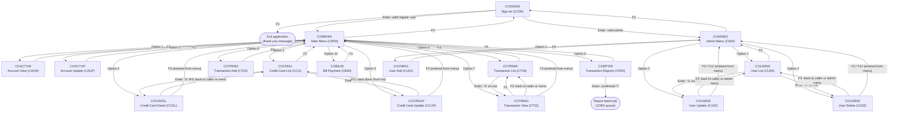

# Application Screen Flow Documentation

CardDemo — Credit Card Management Application (CICS/COBOL, 3270 screens)

All facts below were verified against the BMS map definitions in `00.phase-1-input/bms/` and the CICS COBOL programs in `00.phase-1-input/cbl/` on the checked-out working tree. Source citations use `path:line` or `path:start-end` form.

## Summary

- **Total screens analyzed**: 17
- **Application purpose**: CardDemo lets bank staff and administrators sign on, look up and maintain customer accounts and credit cards, browse and record card transactions, pay account bills, request transaction reports, and (for administrators) manage the application's user accounts.
- **Main user workflows**:
  1. **Sign-on and routing** — Sign-on Screen (COSGN00) → Main Menu (COMEN01) for regular users or Admin Menu (COADM01) for administrators.
  2. **Account servicing** — Main Menu → Account View (COACTVW) or Account Update (COACTUP).
  3. **Credit card servicing** — Main Menu → Credit Card List (COCRDLI) → Credit Card Detail (COCRDSL) or Credit Card Update (COCRDUP); the detail and update screens can also be opened directly from the menu.
  4. **Transactions** — Main Menu → Transaction List (COTRN00) → Transaction View (COTRN01); Transaction Add (COTRN02); Bill Payment (COBIL00); Transaction Reports (CORPT00).
  5. **User administration (admin only)** — Admin Menu → User List (COUSR00) → User Update (COUSR02) or User Delete (COUSR03); User Add (COUSR01).

### Common screen elements

Every screen shares the same header, built by each program's `POPULATE-HEADER-INFO` (or `1100-SCREEN-INIT`) paragraph. To avoid repetition, these fields are listed once here and omitted from the per-screen field tables:

| Field Name | Type | Data Source | Description |
|------------|------|-------------|-------------|
| TITLE01 / TITLE02 | Output | COTTL01Y copybook (`cpy/COTTL01Y.cpy`) | Application title lines |
| TRNNAME | Output | Program constant (e.g. `WS-TRANID`) | 4-character transaction code of the current screen |
| PGMNAME | Output | Program constant (`WS-PGMNAME`) | Name of the program serving the screen |
| CURDATE / CURTIME | Output | System date/time (CSDAT01Y copybook) | Current date (mm/dd/yy) and time (hh:mm:ss) |
| ERRMSG | Output | Program working storage (`WS-MESSAGE` / `WS-RETURN-MSG`) | Error, warning, or confirmation message line |
| INFOMSG / FKEYS | Output | BMS map literal / program | Informational text and the list of valid function keys (on screens that have them) |

Example: `cbl/COSGN00C.cbl:177-204`, `bms/COSGN00.bms`.

### How screens connect (shared mechanics, in plain language)

- Each screen remembers who called it. Pressing **F3** returns to the calling screen when one is recorded, otherwise to the default shown in each screen's navigation list (communication area fields `CDEMO-FROM-PROGRAM` / `CDEMO-TO-PROGRAM` in `cpy/COCOM01Y.cpy:21-36`).
- If any screen is started without sign-on context (empty communication area), the user is sent back to the Sign-on Screen (e.g. `cbl/COTRN00C.cbl:107-109`, `cbl/COBIL00C.cbl:107-109`, `cbl/COMEN01C.cbl:82-84`).
- Pressing a key a screen does not support keeps the user on the same screen with the message "Invalid key pressed. Please see below..." (`cpy/CSMSG01Y.cpy:20`, e.g. `cbl/COMEN01C.cbl:99-102`). The five account/card screens (COACTVW, COACTUP, COCRDLI, COCRDSL, COCRDUP) instead silently treat an unsupported key as Enter (e.g. `cbl/COACTVWC.cbl:306-314`, `cbl/COCRDLIC.cbl:370-380`).

## Screen Inventory

| Screen ID | BMS Mapset (Map) | Program | Transaction | Purpose |
|-----------|------------------|---------|-------------|---------|
| SCREEN-01 | COSGN00 (COSGN0A) | COSGN00C | CC00 | Sign-on — user ID / password entry |
| SCREEN-02 | COMEN01 (COMEN1A) | COMEN01C | CM00 | Main Menu — regular user navigation |
| SCREEN-03 | COADM01 (COADM1A) | COADM01C | CA00 | Admin Menu — administrator navigation |
| SCREEN-04 | COACTVW (CACTVWA) | COACTVWC | CAVW | Account View — display account + customer details |
| SCREEN-05 | COACTUP (CACTUPA) | COACTUPC | CAUP | Account Update — edit account + customer details |
| SCREEN-06 | COCRDLI (CCRDLIA) | COCRDLIC | CCLI | Credit Card List — browse/select cards |
| SCREEN-07 | COCRDSL (CCRDSLA) | COCRDSLC | CCDL | Credit Card Detail — view one card |
| SCREEN-08 | COCRDUP (CCRDUPA) | COCRDUPC | CCUP | Credit Card Update — edit one card |
| SCREEN-09 | COTRN00 (COTRN0A) | COTRN00C | CT00 | Transaction List — browse/select transactions |
| SCREEN-10 | COTRN01 (COTRN1A) | COTRN01C | CT01 | Transaction View — view one transaction |
| SCREEN-11 | COTRN02 (COTRN2A) | COTRN02C | CT02 | Transaction Add — record a new transaction |
| SCREEN-12 | CORPT00 (CORPT0A) | CORPT00C | CR00 | Transaction Reports — request monthly/yearly/custom report |
| SCREEN-13 | COBIL00 (COBIL0A) | COBIL00C | CB00 | Bill Payment — pay off account balance |
| SCREEN-14 | COUSR00 (COUSR0A) | COUSR00C | CU00 | User List (Security) — browse/select users |
| SCREEN-15 | COUSR01 (COUSR1A) | COUSR01C | CU01 | User Add (Security) — create a user |
| SCREEN-16 | COUSR02 (COUSR2A) | COUSR02C | CU02 | User Update (Security) — edit a user |
| SCREEN-17 | COUSR03 (COUSR3A) | COUSR03C | CU03 | User Delete (Security) — remove a user |

Sources: map/mapset names from `bms/*.bms`; transaction codes from `cbl/*.cbl` working-storage constants (`cbl/COSGN00C.cbl:37`, `cbl/COMEN01C.cbl:37`, `cbl/COADM01C.cbl:37`, `cbl/COACTVWC.cbl:144-150`, `cbl/COACTUPC.cbl:534-540`, `cbl/COCRDLIC.cbl:179-186`, `cbl/COCRDSLC.cbl:164-170`, `cbl/COCRDUPC.cbl:220-226`, `cbl/COBIL00C.cbl:38`, `cbl/CORPT00C.cbl:38`, `cbl/COTRN00C.cbl:37`, `cbl/COTRN01C.cbl:37`, `cbl/COTRN02C.cbl:37`, `cbl/COUSR00C.cbl:37`, `cbl/COUSR01C.cbl:37`, `cbl/COUSR02C.cbl:37`, `cbl/COUSR03C.cbl:37`).

---

## Detailed Screen Analysis

### SCREEN-01: Sign-on (COSGN00)

**Screen Purpose**: Application entry point. The user proves who they are; the system decides whether they see the regular Main Menu or the Admin Menu.
Source: `cbl/COSGN00C.cbl`, `bms/COSGN00.bms`.

**User Interaction Flow**:
1. User starts the application → System shows the sign-on screen with the cursor on User ID (`cbl/COSGN00C.cbl:80-83`).
2. User types User ID and Password, presses Enter → System checks that both are filled in (`cbl/COSGN00C.cbl:117-130`).
3. System looks the user up in the user security file and compares the password (`cbl/COSGN00C.cbl:209-257`).
4. If the user is an administrator → Admin Menu opens; otherwise → Main Menu opens (`cbl/COSGN00C.cbl:230-240`).
5. If anything is wrong (missing field, unknown user, wrong password) → the sign-on screen is redisplayed with a message and the cursor on the field to fix.
6. User presses F3 → session ends with the message "Thank you for using CCDA application..." (`cbl/COSGN00C.cbl:88-90`, `cpy/CSMSG01Y.cpy:18-19`).

**Screen Fields**:
| Field Name | Type | Data Source | Description |
|------------|------|-------------|-------------|
| USERID | Input | User entry; checked against USRSEC file | 8-char user ID; required; converted to upper case (`cbl/COSGN00C.cbl:118-122,132-134`) |
| PASSWD | Input | User entry; compared to `SEC-USR-PWD` in USRSEC | 8-char password; required; dark (non-display) field (`bms/COSGN00.bms:175-180`, `cbl/COSGN00C.cbl:123-127,223`) |
| APPLID | Output | CICS region identity (`EXEC CICS ASSIGN APPLID`) | Application region ID (`cbl/COSGN00C.cbl:198-200`) |
| SYSID | Output | CICS region identity (`EXEC CICS ASSIGN SYSID`) | System ID (`cbl/COSGN00C.cbl:202-204`) |

**Navigation Conditions**:
- COSGN00 → Enter, valid admin credentials (`SEC-USR-TYPE` = admin) → COADM01 Admin Menu (`cbl/COSGN00C.cbl:230-234`)
- COSGN00 → Enter, valid regular-user credentials → COMEN01 Main Menu (`cbl/COSGN00C.cbl:235-239`)
- COSGN00 → Enter, User ID blank → stays; "Please enter User ID ..." (`cbl/COSGN00C.cbl:118-122`)
- COSGN00 → Enter, Password blank → stays; "Please enter Password ..." (`cbl/COSGN00C.cbl:123-127`)
- COSGN00 → Enter, wrong password → stays; "Wrong Password. Try again ..." (`cbl/COSGN00C.cbl:241-246`)
- COSGN00 → Enter, user not in security file → stays; "User not found. Try again ..." (`cbl/COSGN00C.cbl:247-251`)
- COSGN00 → Enter, security file unavailable → stays; "Unable to verify the User ..." (`cbl/COSGN00C.cbl:252-256`)
- COSGN00 → F3 → Exit application (plain-text thank-you message, session ends) (`cbl/COSGN00C.cbl:88-90,162-172`)
- COSGN00 → Any other key → stays; invalid-key message (`cbl/COSGN00C.cbl:91-94`)

---

### SCREEN-02: Main Menu (COMEN01)

**Screen Purpose**: Navigation hub for regular users — ten numbered options covering accounts, cards, transactions, reports, and bill payment.
Source: `cbl/COMEN01C.cbl`, `bms/COMEN01.bms`, options table `cpy/COMEN02Y.cpy`.

**User Interaction Flow**:
1. User signs on (or returns from a function screen) → System lists options 1-10 with the cursor on the option field (`cbl/COMEN01C.cbl:87-90`, option list built from `cpy/COMEN02Y.cpy:19-88`).
2. User types an option number and presses Enter → System checks it is a number between 1 and 10 (`cbl/COMEN01C.cbl:127-134`).
3. System checks access: options flagged admin-only are refused for regular users ("No access - Admin Only option... ") — in the current option table all ten options are open to regular users (`cbl/COMEN01C.cbl:136-143`, `cpy/COMEN02Y.cpy` user-type flags all `'U'`).
4. System transfers the user to the chosen screen (`cbl/COMEN01C.cbl:145-156`).
5. User presses F3 → back to the Sign-on screen (`cbl/COMEN01C.cbl:96-98`).

**Menu options** (`cpy/COMEN02Y.cpy:25-88`):
| Option | Function | Target screen |
|--------|----------|---------------|
| 1 | Account View | COACTVW |
| 2 | Account Update | COACTUP |
| 3 | Credit Card List | COCRDLI |
| 4 | Credit Card View | COCRDSL |
| 5 | Credit Card Update | COCRDUP |
| 6 | Transaction List | COTRN00 |
| 7 | Transaction View | COTRN01 |
| 8 | Transaction Add | COTRN02 |
| 9 | Transaction Reports | CORPT00 |
| 10 | Bill Payment | COBIL00 |

**Screen Fields**:
| Field Name | Type | Data Source | Description |
|------------|------|-------------|-------------|
| OPTN001-OPTN012 | Output | `CDEMO-MENU-OPT-NAME` table in `cpy/COMEN02Y.cpy` | Numbered option descriptions (10 used) |
| OPTION | Input | User entry | Selected option number (1-10); must be numeric and within range (`cbl/COMEN01C.cbl:127-134`) |

**Navigation Conditions**:
- COMEN01 → Enter, option 1 → COACTVW; option 2 → COACTUP; option 3 → COCRDLI; option 4 → COCRDSL; option 5 → COCRDUP; option 6 → COTRN00; option 7 → COTRN01; option 8 → COTRN02; option 9 → CORPT00; option 10 → COBIL00 (`cbl/COMEN01C.cbl:145-156`, `cpy/COMEN02Y.cpy`)
- COMEN01 → Enter, non-numeric / zero / out-of-range option → stays; "Please enter a valid option number..." (`cbl/COMEN01C.cbl:127-134`)
- COMEN01 → Enter, admin-only option as regular user → stays; "No access - Admin Only option... " (`cbl/COMEN01C.cbl:136-143`)
- COMEN01 → Enter, option mapped to a placeholder ("DUMMY") program → stays; "This option … is coming soon ..." (`cbl/COMEN01C.cbl:146,157-164`)
- COMEN01 → F3 → COSGN00 Sign-on (`cbl/COMEN01C.cbl:96-98,170-177`)
- COMEN01 → Any other key → stays; invalid-key message (`cbl/COMEN01C.cbl:99-102`)

---

### SCREEN-03: Admin Menu (COADM01)

**Screen Purpose**: Navigation hub for administrators — user-security maintenance functions.
Source: `cbl/COADM01C.cbl`, `bms/COADM01.bms`, options table `cpy/COADM02Y.cpy`.

**User Interaction Flow**:
1. Administrator signs on → System lists admin options 1-4 (`cbl/COADM01C.cbl:87-90`, options from `cpy/COADM02Y.cpy:20-40`).
2. Administrator types an option number and presses Enter → System validates it (1-4) and opens the chosen user-security screen (`cbl/COADM01C.cbl:127-146`).
3. Administrator presses F3 → back to the Sign-on screen (`cbl/COADM01C.cbl:96-98`).

**Menu options** (`cpy/COADM02Y.cpy:20-40`):
| Option | Function | Target screen |
|--------|----------|---------------|
| 1 | User List (Security) | COUSR00 |
| 2 | User Add (Security) | COUSR01 |
| 3 | User Update (Security) | COUSR02 |
| 4 | User Delete (Security) | COUSR03 |

**Screen Fields**:
| Field Name | Type | Data Source | Description |
|------------|------|-------------|-------------|
| OPTN001-OPTN012 | Output | `CDEMO-ADMIN-OPT-NAME` table in `cpy/COADM02Y.cpy` | Numbered option descriptions (4 used) |
| OPTION | Input | User entry | Selected option number (1-4) (`cbl/COADM01C.cbl:127-134`) |

**Navigation Conditions**:
- COADM01 → Enter, option 1 → COUSR00; option 2 → COUSR01; option 3 → COUSR02; option 4 → COUSR03 (`cbl/COADM01C.cbl:137-146`, `cpy/COADM02Y.cpy`)
- COADM01 → Enter, non-numeric / zero / out-of-range option → stays; "Please enter a valid option number..." (`cbl/COADM01C.cbl:127-134`)
- COADM01 → Enter, placeholder option → stays; "This option is coming soon ..." (`cbl/COADM01C.cbl:138,147-154`)
- COADM01 → F3 → COSGN00 Sign-on (`cbl/COADM01C.cbl:96-98,160-167`)
- COADM01 → Any other key → stays; invalid-key message (`cbl/COADM01C.cbl:99-102`)

---

### SCREEN-04: Account View (COACTVW)

**Screen Purpose**: Look up one account by number and see its full picture — status, limits, balances, dates, and the owning customer's personal details.
Source: `cbl/COACTVWC.cbl`, `bms/COACTVW.bms`.

**User Interaction Flow**:
1. User picks "Account View" on the Main Menu → System shows an empty search screen asking for an account number (`cbl/COACTVWC.cbl:353-360`).
2. User types an 11-digit account number and presses Enter → System validates the number (must be an 11-digit number, not all zeroes) (`cbl/COACTVWC.cbl:361-375`, edit routine at `cbl/COACTVWC.cbl:622-686`).
3. System finds the account's customer link in the card cross-reference file, then reads the account and customer records (`cbl/COACTVWC.cbl:719-860`).
4. System fills the screen with account and customer details → user reviews them.
5. If the account number is invalid or not on file → same screen redisplays with an error message (`cbl/COACTVWC.cbl:363-368,386-391`).
6. User presses F3 → back to the Main Menu (or whichever screen sent the user here) (`cbl/COACTVWC.cbl:324-352`).

**Screen Fields** (business fields; map `bms/COACTVW.bms`):
| Field Name | Type | Data Source | Description |
|------------|------|-------------|-------------|
| ACCTSID | Input | User entry; key into CXACAIX/ACCTDAT | Account number (11 digits, required, numeric) |
| ACSTTUS | Output | ACCTDAT `ACCT-ACTIVE-STATUS` | Account active flag (Y/N) |
| ADTOPEN / AEXPDT / AREISDT | Output | ACCTDAT open/expiry/reissue dates | Account date fields |
| ACRDLIM / ACSHLIM | Output | ACCTDAT credit/cash limits | Credit limit, cash credit limit |
| ACURBAL / ACRCYCR / ACRCYDB | Output | ACCTDAT balances | Current balance, current-cycle credit and debit |
| AADDGRP | Output | ACCTDAT `ACCT-GROUP-ID` | Account group |
| ACSTNUM | Output | CUSTDAT `CUST-ID` (via card cross-reference) | Customer number |
| ACSTSSN / ACSTDOB / ACSTFCO | Output | CUSTDAT | Customer SSN, date of birth, FICO score |
| ACSFNAM / ACSMNAM / ACSLNAM | Output | CUSTDAT names | Customer first/middle/last name |
| ACSADL1 / ACSADL2 / ACSCITY / ACSSTTE / ACSZIPC / ACSCTRY | Output | CUSTDAT address | Customer address |
| ACSPHN1 / ACSPHN2 | Output | CUSTDAT phones | Customer phone numbers |
| ACSGOVT | Output | CUSTDAT government ID | Government-issued ID |
| ACSEFTC / ACSPFLG | Output | CUSTDAT | EFT account ID, primary-cardholder flag |

Data reads: cross-reference via account path `CXACAIX` (`cbl/COACTVWC.cbl:724-730`), account master `ACCTDAT` (`cbl/COACTVWC.cbl:773-780`), customer master `CUSTDAT` (`cbl/COACTVWC.cbl:823-830`).

**Navigation Conditions**:
- COACTVW → Enter, valid account number on file → stays; details displayed (`cbl/COACTVWC.cbl:361-375`)
- COACTVW → Enter, blank / non-numeric / zero account number → stays; error message, cursor on account field (`cbl/COACTVWC.cbl:622-686`)
- COACTVW → Enter, account not found in cross-reference or master file → stays; "Account … not found" style file-lookup error (`cbl/COACTVWC.cbl:731-767,781-820`)
- COACTVW → F3 → calling screen if recorded, otherwise COMEN01 Main Menu (`cbl/COACTVWC.cbl:324-352`)
- COACTVW → Any other key → treated as Enter (screen redisplays) (`cbl/COACTVWC.cbl:306-314`)

---

### SCREEN-05: Account Update (COACTUP)

**Screen Purpose**: Fetch an account (with its customer record) and change its details — status, limits, dates, customer name, address, phones, etc. — with validation and an explicit save confirmation.
Source: `cbl/COACTUPC.cbl`, `bms/COACTUP.bms`.

**User Interaction Flow**:
1. User picks "Account Update" on the Main Menu → System shows a search screen asking for the account number (`cbl/COACTUPC.cbl:961-974`).
2. User enters an 11-digit account number and presses Enter → System reads the account and customer records and shows every detail in editable fields (`cbl/COACTUPC.cbl:2562-2569`, reads at `cbl/COACTUPC.cbl:3651-3800`).
3. User overtypes any fields and presses Enter → System validates every changed field (dates, amounts, phone parts, SSN parts, state, ZIP, etc.). If anything fails → same screen with a specific error message; nothing is saved (`cbl/COACTUPC.cbl:2582-2595`, edits at `cbl/COACTUPC.cbl:1429-2560`).
4. If all edits pass and something actually changed → System asks the user to confirm: "F5=Save" is offered (`cbl/COACTUPC.cbl:2585-2590`, F-key hint fields FKEY05/FKEY12 in `bms/COACTUP.bms:498-507`).
5. User presses F5 → System locks and rewrites the account and customer records (`cbl/COACTUPC.cbl:2601-2616`, rewrite at `cbl/COACTUPC.cbl:4060-4090`). Outcomes:
   - Success → confirmation shown; the next Enter starts a fresh search (`cbl/COACTUPC.cbl:2627-2635,977-990`).
   - Another user changed the data meanwhile → details are re-shown for review (`cbl/COACTUPC.cbl:2611-2612`).
   - Record could not be locked / update failed → failure message; the next interaction starts a fresh search (`cbl/COACTUPC.cbl:2607-2610,977-990`).
6. User presses F12 (after details fetched) → changes are discarded and the original details are re-read and re-shown (`cbl/COACTUPC.cbl:2568-2580`).
7. User presses F3 → back to the Main Menu (or caller); any uncommitted work is dropped (`cbl/COACTUPC.cbl:921-959`).

**Screen Fields** (business fields; map `bms/COACTUP.bms`; every field below is editable — Type "Both": shown from the file and accepted back as input):
| Field Name | Type | Data Source | Description |
|------------|------|-------------|-------------|
| ACCTSID | Input | User entry; key into CXACAIX/ACCTDAT | Account number to fetch (11 digits, required) |
| ACSTTUS | Both | ACCTDAT `ACCT-ACTIVE-STATUS` | Active Y/N |
| OPNYEAR/OPNMON/OPNDAY | Both | ACCTDAT open date | Account open date (split year/month/day) |
| EXPYEAR/EXPMON/EXPDAY | Both | ACCTDAT expiry date | Expiry date |
| RISYEAR/RISMON/RISDAY | Both | ACCTDAT reissue date | Reissue date |
| ACRDLIM / ACSHLIM | Both | ACCTDAT | Credit limit / cash credit limit (money amounts) |
| ACURBAL / ACRCYCR / ACRCYDB | Both | ACCTDAT | Current balance, cycle credit, cycle debit |
| AADDGRP | Both | ACCTDAT `ACCT-GROUP-ID` | Account group |
| ACSTNUM | Output | CUSTDAT `CUST-ID` | Customer number (display) |
| ACTSSN1/ACTSSN2/ACTSSN3 | Both | CUSTDAT SSN | SSN in three parts |
| DOBYEAR/DOBMON/DOBDAY | Both | CUSTDAT date of birth | Date of birth (split) |
| ACSTFCO | Both | CUSTDAT FICO score | FICO credit score (300-850 edit) |
| ACSFNAM/ACSMNAM/ACSLNAM | Both | CUSTDAT names | First/middle/last name |
| ACSADL1/ACSADL2/ACSCITY/ACSSTTE/ACSZIPC/ACSCTRY | Both | CUSTDAT address | Address lines, city, state, ZIP, country |
| ACSPH1A/B/C, ACSPH2A/B/C | Both | CUSTDAT phones | Phone 1 and phone 2 in area/exchange/line parts |
| ACSGOVT | Both | CUSTDAT | Government-issued ID |
| ACSEFTC / ACSPFLG | Both | CUSTDAT | EFT account ID / primary-card-holder flag |

**Navigation Conditions**:
- COACTUP → Enter, valid account number → stays; editable details shown (`cbl/COACTUPC.cbl:2562-2569`)
- COACTUP → Enter, invalid account number / not found → stays; error message (account edit at `cbl/COACTUPC.cbl:1429-1500`, read errors `cbl/COACTUPC.cbl:3651-3800`)
- COACTUP → Enter, field validation error on changed data → stays; field-specific error message (`cbl/COACTUPC.cbl:2582-2595`)
- COACTUP → Enter, valid changes → stays; confirmation requested (F5=Save) (`cbl/COACTUPC.cbl:2585-2590`)
- COACTUP → F5 with confirmed changes → stays; records saved and result message shown (success / lock error / update failure / data-changed-by-other-user) (`cbl/COACTUPC.cbl:2601-2616`)
- COACTUP → F12 after details fetched → stays; edits discarded, original data re-shown (`cbl/COACTUPC.cbl:2568-2580`)
- COACTUP → F3 → calling screen if recorded, otherwise COMEN01 Main Menu (`cbl/COACTUPC.cbl:921-959`)
- COACTUP → Any other key → treated as Enter (`cbl/COACTUPC.cbl:905-916`)

---

### SCREEN-06: Credit Card List (COCRDLI)

**Screen Purpose**: Browse credit cards seven per page, optionally filtered by account number and/or card number, and jump to the detail or update screen for one card.
Source: `cbl/COCRDLIC.cbl`, `bms/COCRDLI.bms`.

**User Interaction Flow**:
1. User picks "Credit Card List" on the Main Menu → System shows the first page of cards from the card file (`cbl/COCRDLIC.cbl:336-343,565-585`).
2. User may type an account number and/or card number filter and press Enter → System validates the filters (account: 11-digit number; card: 16-digit number) and redisplays the list from the first matching card (`cbl/COCRDLIC.cbl:951-1000` input edits, read loop `cbl/COCRDLIC.cbl:1120-1380`).
3. User types `S` next to a card and presses Enter → Credit Card Detail screen opens for that card (`cbl/COCRDLIC.cbl:515-545`).
4. User types `U` next to a card and presses Enter → Credit Card Update screen opens for that card (`cbl/COCRDLIC.cbl:546-573`).
5. User presses F8 → next page (if one exists); F7 → previous page (if not already on the first page) (`cbl/COCRDLIC.cbl:487-514`).
6. User presses F3 → back to the Main Menu (`cbl/COCRDLIC.cbl:384-406`).

**Screen Fields** (map `bms/COCRDLI.bms`):
| Field Name | Type | Data Source | Description |
|------------|------|-------------|-------------|
| PAGENO | Output | Program page counter | Current page number |
| ACCTSID | Input | User entry; filter on CARDDAT (account path CARDAIX) | Account number filter (optional; 11-digit numeric when present) |
| CARDSID | Input | User entry; filter on CARDDAT | Card number filter (optional; 16-digit numeric when present) |
| CRDSEL1-CRDSEL7 | Input | User entry | Row action code: `S` = view, `U` = update (`cbl/COCRDLIC.cbl:77-79`) |
| ACCTNO1-ACCTNO7 | Output | CARDDAT `CARD-ACCT-ID` | Account number per listed card |
| CRDNUM1-CRDNUM7 | Output | CARDDAT `CARD-NUM` | Card number per row |
| CRDSTS1-CRDSTS7 | Output | CARDDAT `CARD-ACTIVE-STATUS` | Active status per row |

**Navigation Conditions**:
- COCRDLI → Enter, `S` typed on a row → COCRDSL Credit Card Detail (selected account/card passed along) (`cbl/COCRDLIC.cbl:515-545`)
- COCRDLI → Enter, `U` typed on a row → COCRDUP Credit Card Update (selected account/card passed along) (`cbl/COCRDLIC.cbl:546-573`)
- COCRDLI → Enter, invalid filter (non-numeric account/card) or invalid action code → stays; error message, list redisplayed (`cbl/COCRDLIC.cbl:418-445,951-1000`)
- COCRDLI → F8, another page exists → stays; next page shown (`cbl/COCRDLIC.cbl:487-498`)
- COCRDLI → F8, already on last page → stays; "NO MORE PAGES TO DISPLAY" message (`cbl/COCRDLIC.cbl:905-909`)
- COCRDLI → F7, not on first page → stays; previous page shown (`cbl/COCRDLIC.cbl:500-514`)
- COCRDLI → F7, already on first page → stays; list redisplayed from the top with "NO PREVIOUS PAGES TO DISPLAY" (`cbl/COCRDLIC.cbl:440-455,901-904`)
- COCRDLI → F3 → COMEN01 Main Menu (`cbl/COCRDLIC.cbl:384-406`)
- COCRDLI → Any other key → treated as Enter; list refreshed (`cbl/COCRDLIC.cbl:370-380,574-585`)

---

### SCREEN-07: Credit Card Detail (COCRDSL)

**Screen Purpose**: Show one credit card's details (embossed name, status, expiry) for a chosen account/card combination.
Source: `cbl/COCRDSLC.cbl`, `bms/COCRDSL.bms`.

**User Interaction Flow**:
1. User arrives from the Credit Card List with a card already selected → System immediately reads that card and shows its details (`cbl/COCRDSLC.cbl:339-349`).
2. Or the user arrives from the Main Menu → System shows an empty search screen; user types account number and card number and presses Enter (`cbl/COCRDSLC.cbl:350-357`).
3. System validates the keys (account: 11-digit number; card: 16-digit number) and reads the card file (`cbl/COCRDSLC.cbl:358-371`, edits at `cbl/COCRDSLC.cbl:582-700`, read at `cbl/COCRDSLC.cbl:736-780`).
4. If the card is found → details are displayed; if not → the screen stays with "Did not find this account/card combination" style message (`cbl/COCRDSLC.cbl:752-776`).
5. User presses F3 → back to the Credit Card List (if it was the caller) or the Main Menu (`cbl/COCRDSLC.cbl:303-335`).

**Screen Fields** (map `bms/COCRDSL.bms`):
| Field Name | Type | Data Source | Description |
|------------|------|-------------|-------------|
| ACCTSID | Input | User entry (or passed from card list); validated vs CARDDAT | Account number (11 digits, required) |
| CARDSID | Input | User entry (or passed from card list); key into CARDDAT | Card number (16 digits, required) |
| CRDNAME | Output | CARDDAT `CARD-EMBOSSED-NAME` | Name embossed on the card |
| CRDSTCD | Output | CARDDAT `CARD-ACTIVE-STATUS` | Card active Y/N |
| EXPMON / EXPYEAR | Output | CARDDAT expiry date | Card expiry month and year |

**Navigation Conditions**:
- COCRDSL → Enter, valid account + card on file → stays; card details displayed (`cbl/COCRDSLC.cbl:358-371`)
- COCRDSL → Enter, blank/invalid account or card number → stays; field error message (`cbl/COCRDSLC.cbl:582-700`)
- COCRDSL → Enter, combination not found → stays; not-found message (`cbl/COCRDSLC.cbl:752-776`)
- COCRDSL → F3 → calling screen (Credit Card List when invoked from it), otherwise COMEN01 Main Menu (`cbl/COCRDSLC.cbl:303-335`)
- COCRDSL → Any other key → treated as Enter (`cbl/COCRDSLC.cbl:291-299`)

---

### SCREEN-08: Credit Card Update (COCRDUP)

**Screen Purpose**: Fetch one credit card and change its embossed name, active status, or expiry date, with validation and an explicit save confirmation.
Source: `cbl/COCRDUPC.cbl`, `bms/COCRDUP.bms`.

**User Interaction Flow**:
1. User arrives from the Credit Card List with a card selected → System reads and shows the card's details ready for editing (`cbl/COCRDUPC.cbl:478-500`). Arriving from the Main Menu instead shows an empty search screen for account + card number (`cbl/COCRDUPC.cbl:501-513`).
2. User overtypes name / status / expiry and presses Enter → System validates the inputs (name alphabetic, status Y/N, expiry month 1-12, year plausible). Errors keep the user on the screen with a message (`cbl/COCRDUPC.cbl:536-545`, edit paragraphs starting at `cbl/COCRDUPC.cbl:641`).
3. If the edits pass → System shows the proposed changes and asks for confirmation (F5=Save shown in the key legend) (`cbl/COCRDUPC.cbl:414-420` valid-key rule, map legend `bms/COCRDUP.bms:158-167`).
4. User presses F5 → System rewrites the card record (`cbl/COCRDUPC.cbl:1470-1490`). Success or failure is reported; if the user originally came from the card list, completion returns them to the Credit Card List (`cbl/COCRDUPC.cbl:434-477`).
5. User presses F12 → pending changes are discarded and the original card data is re-fetched (`cbl/COCRDUPC.cbl:484-500`).
6. User presses F3 → back to the caller (Credit Card List) or the Main Menu (`cbl/COCRDUPC.cbl:433-477`).

**Screen Fields** (map `bms/COCRDUP.bms`):
| Field Name | Type | Data Source | Description |
|------------|------|-------------|-------------|
| ACCTSID | Input | User entry (or passed from list); CARDDAT | Account number (11 digits, required) |
| CARDSID | Input | User entry (or passed from list); key into CARDDAT | Card number (16 digits, required) |
| CRDNAME | Both | CARDDAT `CARD-EMBOSSED-NAME` | Name on card (editable) |
| CRDSTCD | Both | CARDDAT `CARD-ACTIVE-STATUS` | Card active Y/N (editable) |
| EXPMON / EXPYEAR / EXPDAY | Both | CARDDAT expiry date | Expiry month/year (editable) |

**Navigation Conditions**:
- COCRDUP → Enter, valid keys → stays; card details shown for editing (`cbl/COCRDUPC.cbl:478-500`)
- COCRDUP → Enter, invalid keys or card not found → stays; error message (`cbl/COCRDUPC.cbl:641-1000`)
- COCRDUP → Enter, validation error on changed fields → stays; field error message (`cbl/COCRDUPC.cbl:536-545`)
- COCRDUP → Enter, valid changes → stays; confirmation requested (F5=Save) (`cbl/COCRDUPC.cbl:414-420`)
- COCRDUP → F5 with pending confirmed changes → stays (or returns to list — next line); card saved, result reported (`cbl/COCRDUPC.cbl:1470-1490`)
- COCRDUP → Save completed (or failed) when entered from Credit Card List → COCRDLI Credit Card List (`cbl/COCRDUPC.cbl:435-440,467-477`)
- COCRDUP → F12 after fetch → stays; edits discarded, original data re-shown (`cbl/COCRDUPC.cbl:484-500`)
- COCRDUP → F3 → calling screen (Credit Card List) if recorded, otherwise COMEN01 Main Menu (`cbl/COCRDUPC.cbl:433-477`)
- COCRDUP → Any other key → treated as Enter (`cbl/COCRDUPC.cbl:413-425`)

---

### SCREEN-09: Transaction List (COTRN00)

**Screen Purpose**: Browse card transactions ten per page, optionally starting from a typed transaction ID, and open one transaction for viewing.
Source: `cbl/COTRN00C.cbl`, `bms/COTRN00.bms`.

**User Interaction Flow**:
1. User picks "Transaction List" on the Main Menu → System shows the first page of transactions (`cbl/COTRN00C.cbl:112-117`).
2. User may type a transaction ID and press Enter → list repositions to that ID (must be numeric) (`cbl/COTRN00C.cbl:207-219`).
3. User types `S` next to a transaction and presses Enter → Transaction View opens for that transaction (`cbl/COTRN00C.cbl:183-195`).
4. User presses F8 / F7 → next / previous page, with "already at the top/bottom" messages at the ends (`cbl/COTRN00C.cbl:240-280`).
5. User presses F3 → back to the Main Menu (`cbl/COTRN00C.cbl:122-124`).

**Screen Fields** (map `bms/COTRN00.bms`):
| Field Name | Type | Data Source | Description |
|------------|------|-------------|-------------|
| PAGENUM | Output | Program page counter | Page number |
| TRNIDIN | Input | User entry; start key into TRANSACT | Transaction ID to position the list (numeric) |
| SEL0001-SEL0010 | Input | User entry | Row selection code; only `S` is valid (`cbl/COTRN00C.cbl:186-203`) |
| TRNID01-TRNID10 | Output | TRANSACT `TRAN-ID` | Transaction ID per row |
| TDATE01-TDATE10 | Output | TRANSACT `TRAN-ORIG-TS` | Transaction date per row |
| TDESC01-TDESC10 | Output | TRANSACT `TRAN-DESC` | Description per row |
| TAMT001-TAMT010 | Output | TRANSACT `TRAN-AMT` | Amount per row |

**Navigation Conditions**:
- COTRN00 → Enter, `S` on a row → COTRN01 Transaction View (selected transaction ID passed along) (`cbl/COTRN00C.cbl:183-195`)
- COTRN00 → Enter, any other selection character → stays; "Invalid selection. Valid value is S" (`cbl/COTRN00C.cbl:196-203`)
- COTRN00 → Enter, non-numeric transaction ID filter → stays; "Tran ID must be Numeric ..." (`cbl/COTRN00C.cbl:207-219`)
- COTRN00 → F8, more records → stays; next page (`cbl/COTRN00C.cbl:260-280`)
- COTRN00 → F8, at bottom → stays; "You are already at the bottom of the page..." (`cbl/COTRN00C.cbl:268-272`)
- COTRN00 → F7, not at top → stays; previous page (`cbl/COTRN00C.cbl:240-258`)
- COTRN00 → F7, at top → stays; "You are already at the top of the page..." (`cbl/COTRN00C.cbl:246-250`)
- COTRN00 → F3 → COMEN01 Main Menu (`cbl/COTRN00C.cbl:122-124`)
- COTRN00 → Any other key → stays; invalid-key message (`cbl/COTRN00C.cbl:129-133`)

---

### SCREEN-10: Transaction View (COTRN01)

**Screen Purpose**: Show every stored detail of a single transaction — card, type, category, source, amount, timestamps, and merchant information.
Source: `cbl/COTRN01C.cbl`, `bms/COTRN01.bms`.

**User Interaction Flow**:
1. User arrives from the Transaction List with a transaction selected → System immediately shows its details (`cbl/COTRN01C.cbl:99-109`). Arriving from the Main Menu shows an empty screen instead.
2. User types a transaction ID and presses Enter → System reads the transaction file and displays the record (`cbl/COTRN01C.cbl:145-199`, read at `cbl/COTRN01C.cbl:264-295`).
3. If the ID is blank or not found → same screen with an error message (`cbl/COTRN01C.cbl:148-153,281-294`).
4. User presses F4 → screen is cleared for a fresh lookup; F5 → jump to the Transaction List; F3 → back to the caller or Main Menu (`cbl/COTRN01C.cbl:113-128`).

**Screen Fields** (map `bms/COTRN01.bms`):
| Field Name | Type | Data Source | Description |
|------------|------|-------------|-------------|
| TRNIDIN | Input | User entry (or passed from list); key into TRANSACT | Transaction ID to look up (required) |
| TRNID | Output | TRANSACT `TRAN-ID` | Transaction ID |
| CARDNUM | Output | TRANSACT `TRAN-CARD-NUM` | Card number |
| TTYPCD / TCATCD | Output | TRANSACT type/category codes | Transaction type and category |
| TRNSRC | Output | TRANSACT `TRAN-SOURCE` | Source (e.g. POS) |
| TDESC | Output | TRANSACT `TRAN-DESC` | Description |
| TRNAMT | Output | TRANSACT `TRAN-AMT` | Amount |
| TORIGDT / TPROCDT | Output | TRANSACT original/processing timestamps | Transaction dates |
| MID / MNAME / MCITY / MZIP | Output | TRANSACT merchant fields | Merchant ID, name, city, ZIP |

**Navigation Conditions**:
- COTRN01 → Enter, transaction found → stays; details displayed (`cbl/COTRN01C.cbl:155-199`)
- COTRN01 → Enter, blank transaction ID → stays; "Tran ID can NOT be empty..." (`cbl/COTRN01C.cbl:148-153`)
- COTRN01 → Enter, transaction not found / read error → stays; lookup error message (`cbl/COTRN01C.cbl:281-294`)
- COTRN01 → F3 → calling screen (Transaction List when invoked from it), otherwise COMEN01 Main Menu (`cbl/COTRN01C.cbl:115-122`)
- COTRN01 → F4 → stays; all fields cleared (`cbl/COTRN01C.cbl:123-124`)
- COTRN01 → F5 → COTRN00 Transaction List (`cbl/COTRN01C.cbl:125-127`)
- COTRN01 → Any other key → stays; invalid-key message (`cbl/COTRN01C.cbl:128-131`)

---

### SCREEN-11: Transaction Add (COTRN02)

**Screen Purpose**: Record a new card transaction by account or card number, with full field validation and a Y/N confirmation before writing.
Source: `cbl/COTRN02C.cbl`, `bms/COTRN02.bms`.

**User Interaction Flow**:
1. User picks "Transaction Add" on the Main Menu → System shows an empty entry form (`cbl/COTRN02C.cbl:120-131`).
2. User enters either an account number or a card number → System cross-references the other value automatically (account → card via CXACAIX; card → account via CCXREF) (`cbl/COTRN02C.cbl:166-230`).
3. User fills in type code, category code, source, description, amount, dates, and merchant details, then presses Enter → System validates every field (numeric checks, amount format `-99999999.99`, date format `YYYY-MM-DD` with a date-utility check) (`cbl/COTRN02C.cbl:237-400`).
4. System asks "Confirm to add this transaction..." → user types `Y` and presses Enter → System generates the next transaction ID and writes the record; typing `N` (or leaving blank) keeps the data on screen unconfirmed (`cbl/COTRN02C.cbl:164-189`, add at `cbl/COTRN02C.cbl:442-470,700-750`).
5. On success → confirmation message with the new transaction ID; the form resets (`cbl/COTRN02C.cbl:442-470,720-734`).
6. User presses F4 → clear the form; F5 → copy the most recent transaction's data into the form as a starting point; F3 → back to the caller or Main Menu (`cbl/COTRN02C.cbl:134-148`).

**Screen Fields** (map `bms/COTRN02.bms`):
| Field Name | Type | Data Source | Description |
|------------|------|-------------|-------------|
| ACTIDIN | Input | User entry; validated via CXACAIX | Account number (numeric; either this or card number required) |
| CARDNIN | Input | User entry; validated via CCXREF | Card number (numeric; either this or account required) |
| TTYPCD / TCATCD | Input | User entry | Transaction type / category codes (required, numeric) |
| TRNSRC | Input | User entry | Transaction source (required) |
| TDESC | Input | User entry | Description (required) |
| TRNAMT | Input | User entry | Amount, format -99999999.99 (`cbl/COTRN02C.cbl:300-320`) |
| TORIGDT / TPROCDT | Input | User entry | Original / processing dates, format YYYY-MM-DD (`cbl/COTRN02C.cbl:322-379`) |
| MID / MNAME / MCITY / MZIP | Input | User entry | Merchant ID (numeric), name, city, ZIP (required) |
| CONFIRM | Input | User entry | Y/N confirmation before the write (`cbl/COTRN02C.cbl:164-189`) |

**Navigation Conditions**:
- COTRN02 → Enter, neither account nor card entered → stays; "Account or Card Number must be entered..." (`cbl/COTRN02C.cbl:224-229`)
- COTRN02 → Enter, non-numeric account/card, or not found in cross-reference → stays; field error message (`cbl/COTRN02C.cbl:166-230,575-640`)
- COTRN02 → Enter, any data field missing/invalid → stays; specific error message per field (`cbl/COTRN02C.cbl:237-400`)
- COTRN02 → Enter, valid data, confirmation blank or `N` → stays; "Confirm to add this transaction..." (`cbl/COTRN02C.cbl:170-182`)
- COTRN02 → Enter, confirmation not Y/N → stays; "Invalid value. Valid values are (Y/N)..." (`cbl/COTRN02C.cbl:183-189`)
- COTRN02 → Enter, confirmation `Y` → stays; transaction written, success message, form cleared (`cbl/COTRN02C.cbl:166-168,442-470`)
- COTRN02 → F3 → calling screen if recorded, otherwise COMEN01 Main Menu (`cbl/COTRN02C.cbl:136-143`)
- COTRN02 → F4 → stays; form cleared (`cbl/COTRN02C.cbl:144-145`)
- COTRN02 → F5 → stays; fields pre-filled by copying the latest transaction on file (`cbl/COTRN02C.cbl:146-147,471-498`)
- COTRN02 → Any other key → stays; invalid-key message (`cbl/COTRN02C.cbl:148-152`)

---

### SCREEN-12: Transaction Reports (CORPT00)

**Screen Purpose**: Request a printed transaction report — current month, current year, or a custom date range — which is produced by a background batch job.
Source: `cbl/CORPT00C.cbl`, `bms/CORPT00.bms`.

**User Interaction Flow**:
1. User picks "Transaction Reports" on the Main Menu → System shows the report-selection form (`cbl/CORPT00C.cbl:177-181`).
2. User marks Monthly, Yearly, or Custom. For Custom, the user also types a start and end date (MM/DD/YYYY) (`cbl/CORPT00C.cbl:212-260`).
3. User presses Enter → For Custom, System checks each date part is present, numeric, and in range, and verifies both dates with the date-validation utility CSUTLDTC (`cbl/CORPT00C.cbl:262-430`).
4. System asks "Please confirm to print the … report..." → user types `Y` and presses Enter → System writes the report batch job to the job queue ("JOBS" queue) for background execution; `N` cancels and resets the form (`cbl/CORPT00C.cbl:464-498,513-530`).
5. On success → green message "… report submitted for printing ..." and the form resets (`cbl/CORPT00C.cbl:446-456`).
6. User presses F3 → back to the Main Menu (`cbl/CORPT00C.cbl:187-189`).

**Screen Fields** (map `bms/CORPT00.bms`):
| Field Name | Type | Data Source | Description |
|------------|------|-------------|-------------|
| MONTHLY | Input | User entry | Mark to request current-month report |
| YEARLY | Input | User entry | Mark to request current-year report |
| CUSTOM | Input | User entry | Mark to request custom date-range report |
| SDTMM/SDTDD/SDTYYYY | Input | User entry | Custom start date month/day/year (validated) |
| EDTMM/EDTDD/EDTYYYY | Input | User entry | Custom end date month/day/year (validated) |
| CONFIRM | Input | User entry | Y/N confirmation before the job is submitted |

**Navigation Conditions**:
- CORPT00 → Enter, no report type marked → stays; "Select a report type to print report..." (`cbl/CORPT00C.cbl:438-443`)
- CORPT00 → Enter, Custom with missing/invalid/non-real date → stays; specific date error message (`cbl/CORPT00C.cbl:262-430`)
- CORPT00 → Enter, valid request, confirmation blank → stays; "Please confirm to print the … report..." (`cbl/CORPT00C.cbl:464-474`)
- CORPT00 → Enter, confirmation `N` → stays; form reset (`cbl/CORPT00C.cbl:480-483`)
- CORPT00 → Enter, confirmation not Y/N → stays; "… is not a valid value to confirm..." (`cbl/CORPT00C.cbl:484-493`)
- CORPT00 → Enter, confirmation `Y` → stays; batch job queued, "… report submitted for printing ..." (`cbl/CORPT00C.cbl:477-479,496-530,446-456`)
- CORPT00 → F3 → COMEN01 Main Menu (`cbl/CORPT00C.cbl:187-189`)
- CORPT00 → Any other key → stays; invalid-key message (`cbl/CORPT00C.cbl:190-194`)

---

### SCREEN-13: Bill Payment (COBIL00)

**Screen Purpose**: Pay off an account's full current balance. The payment is recorded as a transaction and the account balance is set to zero.
Source: `cbl/COBIL00C.cbl`, `bms/COBIL00.bms`.

**User Interaction Flow**:
1. User picks "Bill Payment" on the Main Menu → System shows the payment screen with the cursor on the account ID (`cbl/COBIL00C.cbl:111-122`).
2. User types an account ID and presses Enter → System reads the account and displays its current balance (`cbl/COBIL00C.cbl:158-196`, read at `cbl/COBIL00C.cbl:340-375`).
3. System prompts "Confirm to make a bill payment..." → user types `Y` and presses Enter (`cbl/COBIL00C.cbl:238-241`).
4. System finds the account's card, generates the next transaction ID, writes a "BILL PAYMENT - ONLINE" transaction for the full balance, and sets the account balance to zero (`cbl/COBIL00C.cbl:210-237`).
5. Typing `N` clears the screen; an invalid confirmation value shows an error (`cbl/COBIL00C.cbl:178-191`).
6. User presses F4 → clear the screen; F3 → back to the caller or Main Menu (`cbl/COBIL00C.cbl:128-137`).

**Screen Fields** (map `bms/COBIL00.bms`):
| Field Name | Type | Data Source | Description |
|------------|------|-------------|-------------|
| ACTIDIN | Input | User entry; key into ACCTDAT | Account ID (required) |
| CURBAL | Output | ACCTDAT `ACCT-CURR-BAL` | Current balance to be paid |
| CONFIRM | Input | User entry | Y/N payment confirmation |

**Navigation Conditions**:
- COBIL00 → Enter, blank account ID → stays; "Acct ID can NOT be empty..." (`cbl/COBIL00C.cbl:159-165`)
- COBIL00 → Enter, account not found → stays; lookup error message (`cbl/COBIL00C.cbl:357-370`)
- COBIL00 → Enter, balance is zero or less → stays; "You have nothing to pay..." (`cbl/COBIL00C.cbl:198-207`)
- COBIL00 → Enter, valid account, confirmation blank → stays; balance shown, "Confirm to make a bill payment..." (`cbl/COBIL00C.cbl:182-184,193-196,238-241`)
- COBIL00 → Enter, confirmation `Y` → stays; payment transaction written, balance zeroed, result shown (`cbl/COBIL00C.cbl:210-237`)
- COBIL00 → Enter, confirmation `N` → stays; screen cleared (`cbl/COBIL00C.cbl:178-181`)
- COBIL00 → Enter, confirmation not Y/N → stays; "Invalid value. Valid values are (Y/N)..." (`cbl/COBIL00C.cbl:185-191`)
- COBIL00 → F3 → calling screen if recorded, otherwise COMEN01 Main Menu (`cbl/COBIL00C.cbl:128-135`)
- COBIL00 → F4 → stays; screen cleared (`cbl/COBIL00C.cbl:136-137`)
- COBIL00 → Any other key → stays; invalid-key message (`cbl/COBIL00C.cbl:138-141`)

---

### SCREEN-14: User List — Security (COUSR00)

**Screen Purpose**: Administrator browses application users ten per page and picks one to update or delete.
Source: `cbl/COUSR00C.cbl`, `bms/COUSR00.bms`.

**User Interaction Flow**:
1. Administrator picks "User List" on the Admin Menu → System shows the first page of users from the security file (`cbl/COUSR00C.cbl:115-119`).
2. Administrator may type a user ID and press Enter → list repositions to that ID (`cbl/COUSR00C.cbl:232-240`).
3. Administrator types `U` next to a user and presses Enter → User Update screen opens for that user; `D` → User Delete screen opens (`cbl/COUSR00C.cbl:186-215`).
4. F8 / F7 page through the list with "already at the top/bottom" messages at the ends (`cbl/COUSR00C.cbl:243-283`).
5. F3 returns to the Admin Menu (`cbl/COUSR00C.cbl:125-127`).

**Screen Fields** (map `bms/COUSR00.bms`):
| Field Name | Type | Data Source | Description |
|------------|------|-------------|-------------|
| PAGENUM | Output | Program page counter | Page number |
| USRIDIN | Input | User entry; start key into USRSEC | User ID to position the list |
| SEL0001-SEL0010 | Input | User entry | Row action: `U` = update, `D` = delete (`cbl/COUSR00C.cbl:186-215`) |
| USRID01-USRID10 | Output | USRSEC `SEC-USR-ID` | User ID per row |
| FNAME01-FNAME10 / LNAME01-LNAME10 | Output | USRSEC first/last names | Name per row |
| UTYPE01-UTYPE10 | Output | USRSEC `SEC-USR-TYPE` | User type (A=admin, U=user) per row |

**Navigation Conditions**:
- COUSR00 → Enter, `U` on a row → COUSR02 User Update (selected user ID passed along) (`cbl/COUSR00C.cbl:188-198`)
- COUSR00 → Enter, `D` on a row → COUSR03 User Delete (selected user ID passed along) (`cbl/COUSR00C.cbl:199-208`)
- COUSR00 → Enter, any other selection character → stays; "Invalid selection. Valid values are U and D" (`cbl/COUSR00C.cbl:210-214`)
- COUSR00 → F8, more records → stays; next page (`cbl/COUSR00C.cbl:262-283`)
- COUSR00 → F8, at bottom → stays; "You are already at the bottom of the page..." (`cbl/COUSR00C.cbl:271-275`)
- COUSR00 → F7, not at top → stays; previous page (`cbl/COUSR00C.cbl:243-260`)
- COUSR00 → F7, at top → stays; "You are already at the top of the page..." (`cbl/COUSR00C.cbl:249-253`)
- COUSR00 → F3 → COADM01 Admin Menu (`cbl/COUSR00C.cbl:125-127`)
- COUSR00 → Any other key → stays; invalid-key message (`cbl/COUSR00C.cbl:132-136`)

---

### SCREEN-15: User Add — Security (COUSR01)

**Screen Purpose**: Administrator creates a new application user (name, ID, password, type).
Source: `cbl/COUSR01C.cbl`, `bms/COUSR01.bms`.

**User Interaction Flow**:
1. Administrator picks "User Add" on the Admin Menu → System shows an empty form with the cursor on First Name (`cbl/COUSR01C.cbl:84-87`).
2. Administrator fills in first name, last name, user ID, password, and user type, then presses Enter → System checks every field is present (`cbl/COUSR01C.cbl:115-151`).
3. System writes the new user to the security file → green message "User … has been added ..." and the form clears (`cbl/COUSR01C.cbl:153-160,241-275`).
4. If the user ID already exists → "User ID already exist..." and the screen stays for correction (`cbl/COUSR01C.cbl:260-266`).
5. F4 clears the form; F3 returns to the Admin Menu (`cbl/COUSR01C.cbl:93-97`).

**Screen Fields** (map `bms/COUSR01.bms`):
| Field Name | Type | Data Source | Description |
|------------|------|-------------|-------------|
| FNAME / LNAME | Input | User entry → USRSEC | First/last name (required) |
| USERID | Input | User entry → USRSEC key | New user ID (required, must be unique) |
| PASSWD | Input | User entry → USRSEC | Password (required) |
| USRTYPE | Input | User entry → USRSEC | User type: A=admin, U=regular (required) |

**Navigation Conditions**:
- COUSR01 → Enter, any field blank → stays; "… can NOT be empty..." for the first missing field (`cbl/COUSR01C.cbl:117-146`)
- COUSR01 → Enter, all fields filled, ID unique → stays; user written, success message, form cleared (`cbl/COUSR01C.cbl:153-160,251-259`)
- COUSR01 → Enter, duplicate user ID → stays; "User ID already exist..." (`cbl/COUSR01C.cbl:260-266`)
- COUSR01 → F3 → COADM01 Admin Menu (`cbl/COUSR01C.cbl:93-95`)
- COUSR01 → F4 → stays; form cleared (`cbl/COUSR01C.cbl:96-97`)
- COUSR01 → Any other key → stays; invalid-key message (`cbl/COUSR01C.cbl:98-102`)

---

### SCREEN-16: User Update — Security (COUSR02)

**Screen Purpose**: Administrator fetches an existing user and changes their name, password, or type.
Source: `cbl/COUSR02C.cbl`, `bms/COUSR02.bms`.

**User Interaction Flow**:
1. Administrator arrives from the User List with a user selected → that user's details load automatically; otherwise the administrator types a user ID and presses Enter to fetch them (`cbl/COUSR02C.cbl:96-105,143-173`).
2. Administrator overtypes name, password, or type and presses F5 → System re-checks all fields are filled, verifies something actually changed, and rewrites the user record (`cbl/COUSR02C.cbl:122-123,178-252`, rewrite at `cbl/COUSR02C.cbl:355-390`).
3. If nothing was changed → "Please modify to update ..." and the screen stays (`cbl/COUSR02C.cbl:243-248`).
4. F3 saves any pending modification and returns to the caller/Admin Menu; F12 returns to the Admin Menu; F4 clears the form (`cbl/COUSR02C.cbl:111-126`).

**Screen Fields** (map `bms/COUSR02.bms`):
| Field Name | Type | Data Source | Description |
|------------|------|-------------|-------------|
| USRIDIN | Input | User entry (or passed from User List); key into USRSEC | User ID to fetch (required) |
| FNAME / LNAME | Both | USRSEC names | First/last name (editable, required) |
| PASSWD | Both | USRSEC `SEC-USR-PWD` | Password (editable, required) |
| USRTYPE | Both | USRSEC `SEC-USR-TYPE` | User type A/U (editable, required) |

**Navigation Conditions**:
- COUSR02 → Enter, blank user ID → stays; "User ID can NOT be empty..." (`cbl/COUSR02C.cbl:146-151`)
- COUSR02 → Enter, user not found → stays; lookup error message (`cbl/COUSR02C.cbl:334-350`)
- COUSR02 → Enter, user found → stays; details shown for editing (`cbl/COUSR02C.cbl:158-173`)
- COUSR02 → F5, a required field blank → stays; "… can NOT be empty..." (`cbl/COUSR02C.cbl:180-213`)
- COUSR02 → F5, no actual change → stays; "Please modify to update ..." (`cbl/COUSR02C.cbl:243-248`)
- COUSR02 → F5, valid changes → stays; user record updated, success message (`cbl/COUSR02C.cbl:238-242,355-390`)
- COUSR02 → F3 → applies any pending valid update, then calling screen (User List) if recorded, otherwise COADM01 Admin Menu (`cbl/COUSR02C.cbl:111-120`)
- COUSR02 → F4 → stays; form cleared (`cbl/COUSR02C.cbl:120-121`)
- COUSR02 → F12 → COADM01 Admin Menu (no save) (`cbl/COUSR02C.cbl:124-126`)
- COUSR02 → Any other key → stays; invalid-key message (`cbl/COUSR02C.cbl:127-131`)

---

### SCREEN-17: User Delete — Security (COUSR03)

**Screen Purpose**: Administrator fetches a user, reviews who they are, and deletes them from the security file.
Source: `cbl/COUSR03C.cbl`, `bms/COUSR03.bms`.

**User Interaction Flow**:
1. Administrator arrives from the User List with a user selected (via `D`) → that user's details load automatically; otherwise the administrator types a user ID and presses Enter to fetch them (`cbl/COUSR03C.cbl:96-105,142-170`).
2. System shows the user's name and type (read-only) so the administrator can confirm it is the right person.
3. Administrator presses F5 → System deletes the user and shows "User … has been deleted ..." (`cbl/COUSR03C.cbl:121-122,173-194`, delete at `cbl/COUSR03C.cbl:303-335`).
4. F4 clears the screen; F3 returns to the caller/Admin Menu; F12 returns to the Admin Menu (`cbl/COUSR03C.cbl:111-126`).

**Screen Fields** (map `bms/COUSR03.bms`):
| Field Name | Type | Data Source | Description |
|------------|------|-------------|-------------|
| USRIDIN | Input | User entry (or passed from User List); key into USRSEC | User ID to delete (required) |
| FNAME / LNAME | Output | USRSEC names | Name of the user about to be deleted |
| USRTYPE | Output | USRSEC `SEC-USR-TYPE` | User type of the user about to be deleted |

**Navigation Conditions**:
- COUSR03 → Enter, blank user ID → stays; "User ID can NOT be empty..." (`cbl/COUSR03C.cbl:144-150`)
- COUSR03 → Enter, user not found → stays; lookup error message (`cbl/COUSR03C.cbl:281-298`)
- COUSR03 → Enter, user found → stays; details displayed for review (`cbl/COUSR03C.cbl:164-170`)
- COUSR03 → F5, user fetched → stays; user deleted, confirmation message, form cleared (`cbl/COUSR03C.cbl:121-122,173-194,303-335`)
- COUSR03 → F3 → calling screen (User List) if recorded, otherwise COADM01 Admin Menu (`cbl/COUSR03C.cbl:111-118`)
- COUSR03 → F4 → stays; screen cleared (`cbl/COUSR03C.cbl:119-120`)
- COUSR03 → F12 → COADM01 Admin Menu (`cbl/COUSR03C.cbl:123-125`)
- COUSR03 → Any other key → stays; invalid-key message (`cbl/COUSR03C.cbl:126-129`)

---

## Complete Application Flow Diagram

Every box is a screen; every arrow is a verified navigation path. Error and invalid-input cases keep the user on the same screen (self-loops are listed in each screen's Navigation Conditions above and summarized after the diagram).

```mermaid
flowchart TD
    SIGNON["COSGN00<br/>Sign-on (CC00)"]
    EXIT(["Exit application<br/>(thank-you message)"])
    MENU["COMEN01<br/>Main Menu (CM00)"]
    ADMIN["COADM01<br/>Admin Menu (CA00)"]

    ACTVW["COACTVW<br/>Account View (CAVW)"]
    ACTUP["COACTUP<br/>Account Update (CAUP)"]
    CRDLI["COCRDLI<br/>Credit Card List (CCLI)"]
    CRDSL["COCRDSL<br/>Credit Card Detail (CCDL)"]
    CRDUP["COCRDUP<br/>Credit Card Update (CCUP)"]
    TRN00["COTRN00<br/>Transaction List (CT00)"]
    TRN01["COTRN01<br/>Transaction View (CT01)"]
    TRN02["COTRN02<br/>Transaction Add (CT02)"]
    RPT00["CORPT00<br/>Transaction Reports (CR00)"]
    BIL00["COBIL00<br/>Bill Payment (CB00)"]

    USR00["COUSR00<br/>User List (CU00)"]
    USR01["COUSR01<br/>User Add (CU01)"]
    USR02["COUSR02<br/>User Update (CU02)"]
    USR03["COUSR03<br/>User Delete (CU03)"]

    BATCH(["Report batch job<br/>(JOBS queue)"])

    SIGNON -->|"Enter: valid regular user"| MENU
    SIGNON -->|"Enter: valid admin"| ADMIN
    SIGNON -->|"F3"| EXIT

    MENU -->|"Option 1"| ACTVW
    MENU -->|"Option 2"| ACTUP
    MENU -->|"Option 3"| CRDLI
    MENU -->|"Option 4"| CRDSL
    MENU -->|"Option 5"| CRDUP
    MENU -->|"Option 6"| TRN00
    MENU -->|"Option 7"| TRN01
    MENU -->|"Option 8"| TRN02
    MENU -->|"Option 9"| RPT00
    MENU -->|"Option 10"| BIL00
    MENU -->|"F3"| SIGNON

    ADMIN -->|"Option 1"| USR00
    ADMIN -->|"Option 2"| USR01
    ADMIN -->|"Option 3"| USR02
    ADMIN -->|"Option 4"| USR03
    ADMIN -->|"F3"| SIGNON

    ACTVW -->|"F3"| MENU
    ACTUP -->|"F3"| MENU

    CRDLI -->|"Enter: 'S' on row"| CRDSL
    CRDLI -->|"Enter: 'U' on row"| CRDUP
    CRDLI -->|"F3"| MENU
    CRDSL -->|"F3: back to caller or menu"| CRDLI
    CRDSL -->|"F3 (entered from menu)"| MENU
    CRDUP -->|"F3 / save done (from list)"| CRDLI
    CRDUP -->|"F3 (entered from menu)"| MENU

    TRN00 -->|"Enter: 'S' on row"| TRN01
    TRN00 -->|"F3"| MENU
    TRN01 -->|"F5"| TRN00
    TRN01 -->|"F3: back to caller or menu"| TRN00
    TRN01 -->|"F3 (entered from menu)"| MENU
    TRN02 -->|"F3"| MENU
    RPT00 -->|"F3"| MENU
    RPT00 -->|"Enter: confirmed 'Y'"| BATCH
    BIL00 -->|"F3"| MENU

    USR00 -->|"Enter: 'U' on row"| USR02
    USR00 -->|"Enter: 'D' on row"| USR03
    USR00 -->|"F3"| ADMIN
    USR01 -->|"F3"| ADMIN
    USR02 -->|"F3: back to caller or admin menu"| USR00
    USR02 -->|"F3 / F12 (entered from menu)"| ADMIN
    USR03 -->|"F3: back to caller or admin menu"| USR00
    USR03 -->|"F3 / F12 (entered from menu)"| ADMIN
```

### Stay-on-screen (self-loop) conditions — summary

| Screen | Conditions that redisplay the same screen |
|--------|--------------------------------------------|
| COSGN00 | Blank user ID/password; wrong password; user not found; verification failure; invalid key |
| COMEN01 / COADM01 | Invalid/out-of-range option; admin-only refusal (COMEN01); "coming soon" option; invalid key |
| COACTVW | Invalid/blank account number; account not found; any non-F3 key |
| COACTUP | Invalid account; field validation errors; confirmation pending; save success/failure messages; F12 revert; any unrecognized key |
| COCRDLI | Invalid filters or action code; F7 at first page; F8 at last page; any unrecognized key |
| COCRDSL | Invalid/blank keys; card not found; any non-F3 key |
| COCRDUP | Invalid keys; field validation errors; confirmation pending; save result message; F12 revert; any unrecognized key |
| COTRN00 | Invalid selection; non-numeric ID filter; F7 at top / F8 at bottom; invalid key |
| COTRN01 | Blank/unknown transaction ID; F4 clear; invalid key |
| COTRN02 | Missing/invalid fields; unconfirmed or invalid confirmation; successful add (form resets); F4 clear; F5 copy; invalid key |
| CORPT00 | No report type; bad custom dates; unconfirmed or invalid confirmation; submit success message; invalid key |
| COBIL00 | Blank account; account not found; zero balance; unconfirmed/invalid confirmation; payment done message; F4 clear; invalid key |
| COUSR00 | Invalid selection; F7 at top / F8 at bottom; invalid key |
| COUSR01 | Missing fields; duplicate user ID; successful add (form resets); F4 clear; invalid key |
| COUSR02 | Blank/unknown user ID; missing fields on save; "Please modify to update"; successful update; F4 clear; invalid key |
| COUSR03 | Blank/unknown user ID; successful delete (form resets); F4 clear; invalid key |

### Safety net

Any screen reached without a signed-on session (empty communication area) immediately routes the user back to the Sign-on screen (verified in every function program, e.g. `cbl/COMEN01C.cbl:82-84`, `cbl/COADM01C.cbl:82-84`, `cbl/COBIL00C.cbl:107-109`, `cbl/COTRN00C.cbl:107-109`, `cbl/COTRN01C.cbl:94-96`, `cbl/COTRN02C.cbl:115-117`, `cbl/CORPT00C.cbl:172-174`, `cbl/COUSR00C.cbl:110-112`, `cbl/COUSR01C.cbl:78-80`, `cbl/COUSR02C.cbl:90-92`, `cbl/COUSR03C.cbl:90-92`).

---

## Data Sources Referenced by Screens

| File | Contents | Screens that read it | Screens that write/update it |
|------|----------|----------------------|------------------------------|
| USRSEC | User security records (ID, name, password, type) | COSGN00, COUSR00, COUSR02, COUSR03 | COUSR01 (add), COUSR02 (update), COUSR03 (delete) |
| ACCTDAT | Account master (status, limits, balances, dates) | COACTVW, COACTUP, COBIL00 | COACTUP (rewrite), COBIL00 (balance update) |
| CUSTDAT | Customer master (name, address, SSN, FICO, phones) | COACTVW, COACTUP | COACTUP (rewrite) |
| CARDDAT | Credit card master (card number, name, status, expiry) | COCRDLI, COCRDSL, COCRDUP | COCRDUP (rewrite) |
| CXACAIX | Card cross-reference, account path (account → customer/card) | COACTVW, COACTUP, COBIL00, COTRN02 | — |
| CCXREF | Card cross-reference, card path (card → account) | COTRN02 | — |
| TRANSACT | Transaction records | COTRN00, COTRN01, COTRN02, COBIL00 | COTRN02 (add), COBIL00 (add payment) |
| JOBS (queue) | Batch job submission queue | — | CORPT00 (report job JCL) |

Sources: `cbl/COSGN00C.cbl:39,211-219`; `cbl/COACTVWC.cbl:724-830`; `cbl/COACTUPC.cbl:3651-3800,4060-4090`; `cbl/COCRDLIC.cbl:1120-1380`; `cbl/COCRDSLC.cbl:736-780`; `cbl/COCRDUPC.cbl:1470-1490`; `cbl/COBIL00C.cbl:340-545`; `cbl/COTRN00C.cbl:590-699`; `cbl/COTRN01C.cbl:264-295`; `cbl/COTRN02C.cbl:575-750`; `cbl/COUSR00C.cbl:585-695`; `cbl/COUSR01C.cbl:241-275`; `cbl/COUSR02C.cbl:323-390`; `cbl/COUSR03C.cbl:270-335`; `cbl/CORPT00C.cbl:513-530`.
